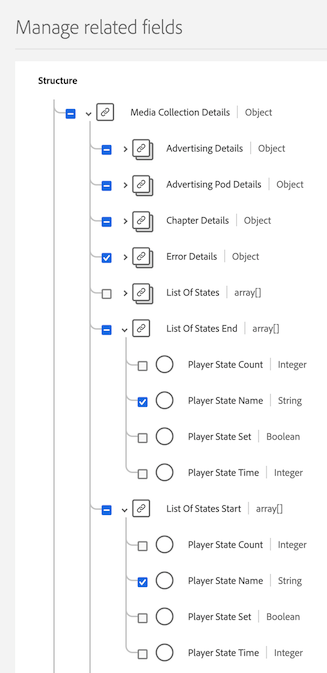
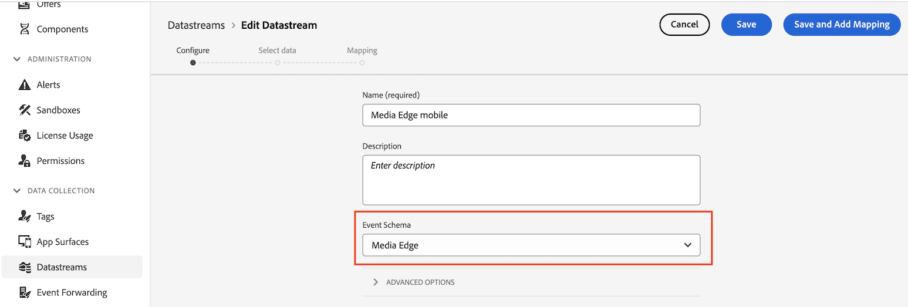

# Experience Platform Edge로 Media Analytics 설치

Adobe Experience Platform Edge를 사용하면 여러 제품을 대상으로 한 데이터를 중앙 위치에 전송할 수 있습니다. Experience Edge는 적절한 정보를 원하는 제품에 전달합니다. 이 개념을 사용하면 특히 여러 데이터 솔루션에 걸쳐 구현 노력을 통합할 수 있습니다.

다음 그래픽은 Media Analytics 구현에서 Experience Platform Edge를 사용하여 Analysis Workspace(Adobe Analytics 또는 Customer Journey Analytics)에서 데이터를 사용할 수 있도록 하는 방법을 보여줍니다.

Experience Platform Edge를 사용하지 않는 구현 방법을 포함한 모든 구현 옵션에 대한 개요는 를 참조하십시오. [Adobe Analytics 또는 Customer Journey Analytics용 Streaming Media 구현](/help/implementation/overview.md).

>[!IMPORTANT]
>
>Streaming Media는 아직 AEP 웹 SDK와 통합되지 않았습니다.

Mobile SDK 또는 API를 사용하여 Experience Edge로 스트리밍 미디어를 구현하는지 여부에 관계없이 먼저 다음 섹션을 완료해야 합니다.

## Adobe Experience Platform에서 스키마 설정

Adobe Experience Platform을 활용하는 애플리케이션 전체에서 사용할 데이터 수집을 표준화하기 위해, Adobe는 개방적이고 공개적으로 문서화된 표준인 XDM(경험 데이터 모델)을 만들었습니다.

스키마를 만들고 설정하려면:

1. Adobe Experience Platform에서에 설명된 대로 스키마 생성을 시작합니다. [UI에서 스키마 만들기 및 편집](https://experienceleague.adobe.com/docs/experience-platform/xdm/ui/resources/schemas.html?lang=en).

   스키마를 생성할 때 다음을 선택합니다 [!UICONTROL **XDM ExperienceEvent**] 다음에서 [!UICONTROL **스키마 만들기**] 드롭다운 메뉴.

1. 다음에서 [!UICONTROL **컴포지션**] 영역, [!UICONTROL **필드 그룹**] 섹션, 선택 [!UICONTROL **추가**]&#x200B;를 검색한 후, 다음 새 필드 그룹을 검색하여 스키마에 추가합니다.
   * `Adobe Analytics ExperienceEvent Template`
   * `Implementation Details`
   * `MediaAnalytics Interaction Details`

   필드 그룹을 추가하면 다음과같이 표시됩니다. [!UICONTROL **필드 그룹**] 섹션, 즉 다음과 같습니다.

   

1. 선택 [!UICONTROL **확인**] 변경 사항을 저장합니다.

1. (선택 사항) Media Edge API에서 사용되지 않는 특정 필드를 숨길 수 있습니다. 이러한 필드를 숨기면 스키마를 읽고 이해하는 것이 쉬워지지만 필수는 아닙니다. 이 필드는 의 필드만 참조합니다. `MediaAnalytics Interaction Details` 필드 그룹입니다.

+++ 숨길 수 있는 필드에 대한 지침을 보려면 여기를 확장하십시오.

   1. 다음에서 [!UICONTROL **구조**] 영역을 선택하고 `Media Collection Details` 필드, 선택 [!UICONTROL **관련 필드 관리**].

      

   1. 옵션을 활성화한 대상 [!UICONTROL **필드에 대한 표시 이름 표시**]&#x200B;를 클릭한 다음 다음과 같이 스키마를 업데이트합니다.

      * 다음에서 `Media Collection Details` > `Advertising Details` 필드, 다음 보고 필드를 숨깁니다. `Ad Completed`, `Ad Started`, 및 `Ad Time Played`.

      * 다음에서 `Media Collection Details` > `Advertising Pod Details` 필드, 다음 보고 필드를 숨깁니다. `Ad Break ID`

      * 다음에서 `Media Collection Details` > `Chapter Details` 필드, 다음 보고 필드를 숨깁니다. `Chapter Completed`, `Chapter ID`, `Chapter Started`, 및 `Chapter Time Played`.

      * 다음에서 `Media Collection Details` 필드, 숨기기 `List Of States` 필드.

        

      * 다음에서 `Media Collection Details` > `List Of States End` 및 `Media Collection Details` > `List Of States Start` 필드, 다음 보고 필드를 숨깁니다. `Player State Count`, `Player State Set`, 및 `Player State Time`.

        

      * 다음에서 `Media Collection Details` > `Qoe Data Details` 필드, 다음 보고 필드를 숨깁니다. `Average Bitrate`, `Average Bitrate Bucket`, `Bitrate Change Impacted Streams`, `Bitrate Changes`, `Buffer Impacted Streams`, `Buffer Events`, `Dropped Frame Impacted Streams`, `Drops Before Starts`, `Errors`, `External Error IDs`, `Error Impacted Streams`, `Media SDK Error IDs`, `Player SDK Error IDs`, `Stalling Impacted Streams`, `Stalling Events`, `Total Buffer Duration`, 및 `Total Stalling Duration`.

      * 다음에서 `Media Collection Details` > `Session Details` 필드, 다음 보고 필드를 숨깁니다. `10% Progress Marker`, `25% Progress Marker`, `50% Progress Marker`, `75% Progress Marker`, `95% Progress Marker`, `Ad Count`, `Average Minute Audience`, `Content Completes`, `Chapter Count`, `Content Starts`, `Content Time Spent`, `Estimated Streams`, `Federated Data`, `Media Segment Views`, `Media Downloaded Flag`, `Media Starts`, `Media Session ID`, `Media Session Server Timeout`, `Media Time Spent`, `Pause Events`, `Pause Impacted Streams`, `Pev3`, `Pccr`, `Total Pause Duration`, `Unique Time Played`, 및 `Video Segment`.

   1. 선택 [!UICONTROL **확인**] 변경 사항을 저장합니다.

   1. 다음에서 [!UICONTROL **구조**] 영역, 옵션을 활성화하여 [!UICONTROL **필드에 대한 표시 이름 표시**]&#x200B;을(를) 선택한 다음 `List Of Media Collection Downloaded Content Events` 필드.

   1. 선택 [!UICONTROL **관련 필드 관리**]&#x200B;를 클릭한 다음 다음과 같이 스키마를 업데이트합니다.

      * 다음에서 `List Of Media Collection Downloaded Content Events` > `Media Details` > `Advertising Details` 필드, 다음 보고 필드를 숨깁니다. `Ad Completed`, `Ad Started`, 및 `Ad Time Played`.

      * 다음에서 `List Of Media Collection Downloaded Content Events` > `Media Details` > `Advertising Pod Details` 필드, 다음 보고 필드를 숨깁니다. `Ad Break ID`

      * 다음에서 `List Of Media Collection Downloaded Content Events` > `Media Details` > `Chapter Details` 필드, 다음 보고 필드를 숨깁니다. `Chapter Completed`, `Chapter ID`, `Chapter Started`, 및 `Chapter Time Played`.

      * 다음에서 `List Of Media Collection Downloaded Content Events` > `Media Details` 필드, 숨기기 `List Of States` 필드.

      * 다음에서 `List Of Media Collection Downloaded Content Events` > `Media Details` > `List Of States End` 및 `Media Collection Details` > `List Of States Start` 필드, 다음 보고 필드를 숨깁니다. `Player State Count`, `Player State Set`, 및 `Player State Time`.

      * 다음에서 `List Of Media Collection Downloaded Content Events` > `Media Details` > `Qoe Data Details` 필드, 다음 보고 필드를 숨깁니다. `Average Bitrate`, `Average Bitrate Bucket`, `Bitrate Change Impacted Streams`, `Bitrate Changes`, `Buffer Events`, `Buffer Impacted Streams`, `Drops Before Starts`, `Dropped Frame Impacted Streams`, `Error Impacted Streams`, `Errors`, `External Error IDs`, `Media SDK Error IDs`, `Player SDK Error IDs`, `Stalling Events`, `Stalling Impacted Streams`, `Total Buffer Duration`, 및 `Total Stalling Duration`.

      * 다음에서 `List Of Media Collection Downloaded Content Events` > `Media Details` > `Session Details` 필드, 다음 보고 필드를 숨깁니다. `10% Progress Marker`, `25% Progress Marker`, `50% Progress Marker`, `75% Progress Marker`, `95% Progress Marker`, `Ad Count`, `Average Minute Audience`, `Chapter Count`, `Content Completes`, `Content Starts`, `Content Time Spent`, `Estimated Streams`, `Federated Data`, `Media Downloaded Flag`, `Media Segment Views`, `Media Session ID`, `Media Session Server Timeout`, `Media Starts`, `Media Time Spent`, `Pause Events`, `Pause Impacted Streams`, `Pccr`, `Pev3`, `Total Pause Duration`, `Unique Time Played`, 및 `Video Segment`.

      * 다음에서 `List Of Media Collection Downloaded Content Events` > `Media Details`  필드, 숨기기 `Media Session ID` 필드.

   1. 선택 [!UICONTROL **확인**] 변경 사항을 저장합니다.

   1. 다음에서 [!UICONTROL **구조**] 영역을 선택하고 `Media Reporting Details` 필드, 선택 [!UICONTROL **관련 필드 관리**].

   1. 옵션을 활성화한 대상 [!UICONTROL **필드에 대한 표시 이름 표시**]&#x200B;를 클릭한 다음 다음과 같이 스키마를 업데이트합니다.

      * 다음에서 `Media Reporting Details` 필드, 다음 필드를 숨깁니다. `Error Details`, `List Of States End`, `List of States Start`, 및 `Media Session ID`.

   1. 선택 [!UICONTROL **확인**] > [!UICONTROL **저장**]  변경 사항을 저장합니다.

1. 계속 [Adobe Experience Platform에서 데이터 세트 만들기](#create-a-dataset-in-adobe-experience-platform).

## Adobe Experience Platform에서 데이터 세트 만들기

1. 에 설명된 대로 스키마를 설정했는지 확인합니다 [Adobe Experience Platform에서 스키마 설정](#set-up-the-schema-in-adobe-experience-platform).

1. Adobe Experience Platform에서에 설명된 대로 데이터 세트 만들기를 시작합니다. [데이터 세트 UI 안내서](https://experienceleague.adobe.com/docs/experience-platform/catalog/datasets/user-guide.html?lang=ko#create).

   데이터 세트에 대한 스키마를 선택할 때에서 설명한 대로 이전에 만든 스키마를 선택합니다 [Adobe Experience Platform에서 스키마 설정](#set-up-the-schema-in-adobe-experience-platform).

1. 계속 [Customer Journey Analytics에서 데이터 스트림 구성](#configure-a-datastream-in-adobe-experience-platform).

## Adobe Experience Platform에서 데이터 스트림 구성

1. 에 설명된 대로 데이터 세트를 만들었는지 확인합니다. [Adobe Experience Platform에서 데이터 세트 만들기](#create-a-dataset-in-adobe-experience-platform).

1. 에 설명된 대로 새 데이터 스트림을 만듭니다. [데이터 스트림 구성](https://experienceleague.adobe.com/docs/experience-platform/edge/datastreams/configure.html?lang=ko).

   데이터 스트림을 생성할 때 다음 구성을 선택해야 합니다.

   * 다음에서 [!UICONTROL **이벤트 스키마**] 데이터 스트림을 생성할 때 생성한 스키마를 선택해야 합니다. [Adobe Experience Platform에서 스키마 설정](#set-up-the-schema-in-adobe-experience-platform). [!UICONTROL **저장**]&#x200B;을 선택합니다.

     >[!IMPORTANT]
     >
         > 선택 안 함 [!UICONTROL **매핑 저장 및 추가**] 타임스탬프 필드에 대해 매핑 오류가 발생합니다.
     
     

   * Adobe Analytics 또는 Customer Journey Analytics 사용 여부에 따라 데이터 스트림에 다음 서비스 중 하나를 추가합니다.

      * [!UICONTROL **Adobe Analytics**] (Adobe Analytics을 사용하는 경우)

        Adobe Analytics을 사용하는 경우 섹션에 설명된 대로 보고서 세트를 정의해야 합니다 [보고서 세트 정의](#define-a-report-suite) 이 문서에서.

      * [!UICONTROL **Adobe Experience Platform**] (Customer Journey Analytics을 사용하는 경우)

     데이터스트림에 서비스를 추가하는 방법에 대한 자세한 내용은 의 &quot;데이터스트림에 서비스 추가&quot; 섹션을 참조하십시오. [데이터 스트림 구성](https://experienceleague.adobe.com/docs/experience-platform/edge/datastreams/configure.html?lang=en#view-details).

     

   * 확장 [!UICONTROL **고급 옵션**]&#x200B;을 클릭한 다음 을(를) 활성화합니다. [!UICONTROL **미디어 분석**] 옵션을 선택합니다.

     

1. 이제 를 구현할 준비가 되었습니다. [Media Edge API](/help/implementation/edge/implementation-edge-api.md) 또는 [Media Edge SDK](/help/implementation/edge/edge-mobile-sdk.md) media analytics 데이터 수집을 시작합니다.

   데이터를 수집했으면 다음을 수행할 수 있습니다. [Customer Journey Analytics에서 연결 만들기](#create-a-connection-in-customer-journey-analytics).

## Customer Journey Analytics에 연결 만들기

>[!NOTE]
>
>다음 절차는 Customer Journey Analytics을 사용하는 경우에만 필요합니다.

1. 에 설명된 대로 데이터 스트림을 생성했는지 확인합니다. [Customer Journey Analytics에서 데이터 스트림 구성](#configure-a-datastream-in-adobe-experience-platform).

1. Customer Journey Analytics에 설명된 대로 연결을 만듭니다. [연결 만들기](https://experienceleague.adobe.com/docs/analytics-platform/using/cja-connections/create-connection.html?lang=ko-KR).

   연결을 만들 때 Streaming Media를 구현하려면 다음 구성 선택이 필요합니다.

   1. 에 설명된 대로 이전에 만든 데이터 세트를 선택합니다 [Adobe Experience Platform에서 데이터 세트 만들기](#create-a-dataset-in-adobe-experience-platform).

   1. 다음을 확인합니다. [!UICONTROL **새 데이터 모두 가져오기**] 설정이 활성화되었습니다.

1. 계속 [Customer Journey Analytics에서 데이터 보기 만들기](#create-a-new-data-view-in-customer-journey-analytics).

## Customer Journey Analytics에서 데이터 보기 만들기

>[!NOTE]
>
>다음 절차는 Customer Journey Analytics을 사용하는 경우에만 필요합니다.

1. 에 설명된 대로 Customer Journey Analytics에서 연결을 만들었는지 확인합니다. [Customer Journey Analytics에서 연결 만들기](#create-a-connection-in-customer-journey-analytics).

1. 고객 여정 분석에 설명된 대로 데이터 보기를 만듭니다. [데이터 보기 만들기 또는 편집](https://experienceleague.adobe.com/docs/analytics-platform/using/cja-dataviews/create-dataview.html?lang=ko-KR).

   데이터 보기를 만들 때 Streaming Media를 구현하려면 다음 구성 선택이 필요합니다.

   1. 다음에서 [!UICONTROL **연결**] 필드에서에 설명된 대로 이전에 생성한 연결을 선택합니다. [Customer Journey Analytics에서 연결 만들기](#create-a-connection-in-customer-journey-analytics).

      생성한 연결을 선택할 수 있을 때까지 최대 15분이 소요될 수 있습니다.

   1. 다음에서 [!UICONTROL **구성 요소**] 탭, [!UICONTROL **스키마 필드**] 섹션에서 아래 표에 나열된 각 구성 요소를 검색하여 [!UICONTROL **지표**] 패널. 동일한 이름의 필드가 여러 개 있는 경우 XDM 경로를 사용하여 필드가 올바른지 확인하십시오.

      **기본 컨텐츠 - 컨텐츠 지표**

      | 구성 요소 이름 | XDM 경로 |
      |----------|---------|
      | 미디어 시작 | mediaReporting.sessionDetails.isViewed |
      | 미디어 세그먼트 보기 수 | mediaReporting.sessionDetails.hasSegmentView |
      | 콘텐츠 시작 | mediaReporting.sessionDetails.isPlayed |
      | 컨텐츠 완료 | mediaReporting.sessionDetails.isCompleted |
      | 콘텐츠 체류 시간 | mediaReporting.sessionDetails.timePlayed |
      | 미디어 사용 시간 | mediaReporting.sessionDetails.totalTimePlayed |
      | 재생된 고유 시간 | mediaReporting.sessionDetails.uniqueTimePlayed |
      | 10% 진행률 마커 | mediaReporting.sessionDetails.hasProgress10 |
      | 대상자 분당 평균 시청 시간 | mediaReporting.sessionDetails.averageMinuteAudience |

      **챕터 및 광고 - 챕터 및 광고 지표**

      | 구성 요소 이름 | XDM 경로 |
      |----------|---------|
      | 챕터 시작됨 | mediaReporting.chapterDetails.isStarted |
      | 챕터 완료됨 | mediaReporting.chapterDetails.isCompleted |
      | 챕터 재생 시간 | mediaReporting.chapterDetails.timePlayed |
      | 광고 시작됨 | mediaReporting.advertisingDetails.isStarted |
      | 광고 완료됨 | mediaReporting.advertisingDetails.isCompleted |
      | 재생된 광고 시간 | mediaReporting.advertisingDetails.timePlayed |

      **QoE - QoE 지표**

      | 구성 요소 이름 | XDM 경로 |
      |----------|---------|
      | 시작 시간 | mediaReporting.qoeDataDetails.timeToStart |
      | 시작 전 드롭 | mediaReporting.qoeDataDetails.isDroppedBeforeStart |
      | 버퍼 영향을 받은 스트림 | mediaReporting.qoeDataDetails.hasBufferImpactedStreams |
      | 비트율 변경의 영향을 받은 스트림 | mediaReporting.qoeDataDetails.hasBitrateChangeImpactedStreams |
      | 비트율 변경 | mediaReporting.qoeDataDetails.bitrateChangeCount |
      | 평균 비트율 | mediaReporting.qoeDataDetails.bitrateAverage |
      | 드롭된 프레임 | mediaReporting.qoeDataDetails.droppedFrames |
      | 오류 | mediaReporting.qoeDataDetails.errorCount |
      | 오류 영향을 받은 스트림 | mediaReporting.qoeDataDetails.hasErrorImpactedStreams |
      | 드롭된 프레임 영향을 받은 스트림 | mediaReporting.qoeDataDetails.hasDroppedFrameImpactedStreams |

      **플레이어 상태 - 플레이어 상태 지표**

      | 구성 요소 이름 | XDM 경로 |
      |----------|---------|
      | 플레이어 상태 집합 | mediaReporting.states.isSet |
      | 플레이어 상태 카운트 | mediaReporting.states.count |
      | 플레이어 상태 시간 | mediaReporting.states.time |

   1. 레이블 업데이트(에서) [!UICONTROL **컨텍스트 레이블**] 드롭다운 메뉴)를 클릭하여 제품에서 사용할 수 있습니다. 지표 패널에 아직 없는 구성 요소를 검색하여 패널로 드래그합니다.

      | 구성 요소 이름 | 컨텍스트 레이블 |
      |---------|----------|
      | 미디어 세션 서버 시간 초과 | 미디어: 마지막 통화 이후 지난 시간(초) |
      | 미디어 사용 시간 | 미디어: 미디어 사용 시간 |
      | 총 버퍼 지속 시간 | 미디어: 총 버퍼 지속 시간 |
      | 시작 시간 | 미디어: 시작 시간 |
      | 총 일시 중지 기간 | 미디어: 총 일시 중단 기간 |

   1. Customer Journey Analytics 프로젝트에 분류를 추가하려면 다음 차원을 [!UICONTROL **Dimension**] 패널:

      | XDM 경로 | 구성 요소 이름 |
      |---------|----------|
      | mediaReporting.states.name | 플레이어 상태 이름 |
      | mediaReporting.sessionDetails.ID | 미디어 세션 ID |

      이 표의 차원 외에도 Customer Journey Analytics 프로젝트에서 데이터를 필터링하는 데 사용할 수 있도록 하려는 다른 차원에 추가할 수 있습니다.

1. 선택 [!UICONTROL **저장 및 계속**] > [!UICONTROL **저장 및 마침**] 변경 사항을 저장합니다.

1. 계속 [Customer Journey Analytics에서 프로젝트 만들기 및 구성](#create-and-configure-a-project-in-customer-journey-analytics).

## Customer Journey Analytics에서 프로젝트 만들기 및 구성

1. 에 설명된 대로 Customer Journey Analytics에서 데이터 보기를 생성했는지 확인합니다. [Customer Journey Analytics에서 데이터 보기 만들기](#create-a-new-data-view-in-customer-journey-analytics).

1. Customer Journey Analytics에서 [!UICONTROL **작업 영역**] 탭, [!UICONTROL **프로젝트**] 영역, 선택 [!UICONTROL **프로젝트 만들기**].

1. 선택 [!UICONTROL **빈 프로젝트**] > [!UICONTROL **만들기**].

1. 새 프로젝트에서 이전에 만든 데이터 보기를 선택합니다.

   프로젝트에서 패널을 만들 때의에 설명된 대로 데이터 보기에 추가한 모든 구성 요소를 사용할 수 있습니다 [Customer Journey Analytics에서 데이터 보기 만들기](#create-a-new-data-view-in-customer-journey-analytics).

   다음 4개의 패널은 만들 수 있는 패널의 예입니다.

   

   

   

   

1. 다음 항목 선택 **패널** 왼쪽 레일에서 아이콘을 클릭한 다음 을(를) 드래그하여 [!UICONTROL **미디어 Concurrent Viewer**] 패널 및 [!UICONTROL **미디어 재생 소요 시간**] 패널.

   2개의 패널은 다음과 같아야 합니다.

   

   

1. 에 설명된 대로 프로젝트를 공유합니다 [프로젝트 공유](https://experienceleague.adobe.com/docs/analytics-platform/using/cja-workspace/curate-share/share-projects.html?lang=en).

   >[!NOTE]
   >
   >   공유하려는 사용자를 사용할 수 없는 경우 사용자에게 Adobe Admin Console의 Customer Journey Analytics에 대한 사용자 및 관리자 액세스 권한이 있는지 확인하십시오.

1. 계속 [Experience Platform 에지로 데이터 보내기](#send-data-to-experience-platform-edge).

## Experience Platform 에지로 데이터 보내기

Experience Platform Edge로 전송할 데이터 유형에 따라 다음 방법 중 하나를 사용할 수 있습니다.

### 모바일: Adobe Experience Platform 모바일 SDK 사용

다음 설명서 리소스를 사용하여 iOS 및 Android 모두에 대한 구현을 완료하십시오.

* [시작하기](https://developer.adobe.com/client-sdks/documentation/media-for-edge-network/)

* [API 참조](https://developer.adobe.com/client-sdks/documentation/media-for-edge-network/api-reference/)

* [Edge Network 확장 기능용 Adobe 스트리밍 미디어로 마이그레이션](https://developer.adobe.com/client-sdks/documentation/adobe-media-analytics/migration-guide/)

### Roku: Adobe Experience Platform Roku SDK

* [시작하기](https://developer.adobe.com/client-sdks/documentation/media-for-edge-network/)

* [Adobe Experience Platform Roku SDK](https://github.com/adobe/aepsdk-roku/tree/main)

* [Edge Network 확장 기능용 Adobe 스트리밍 미디어로 마이그레이션](https://developer.adobe.com/client-sdks/documentation/adobe-media-analytics/migration-guide/) <!-- is the information here also applicable for Roku? -->

### API: 웹 및 기타

API는 현재 웹 데이터를 Experience Platform Edge로 전송하는 유일한 지원 방법입니다.

Edge API의 사용자 지정 구현을 사용하려는 경우에도 API를 사용할 수 있습니다.

Media Edge API에 대한 자세한 내용은 다음 리소스를 참조하십시오.

* [Media Edge API 개요](https://experienceleague.adobe.com/docs/experience-platform/edge-network-server-api/media-edge-apis/overview.html)

* [Media Edge API 시작](https://experienceleague.adobe.com/docs/experience-platform/edge-network-server-api/media-edge-apis/getting-started.html)

* [Media Edge API 문제 해결 안내서](https://experienceleague.adobe.com/docs/experience-platform/edge-network-server-api/media-edge-apis/troubleshooting.html)

* [Media Edge API용 Open API 사양 파일 사용](https://experienceleague.adobe.com/docs/experience-platform/edge-network-server-api/media-edge-apis/swagger.html)
