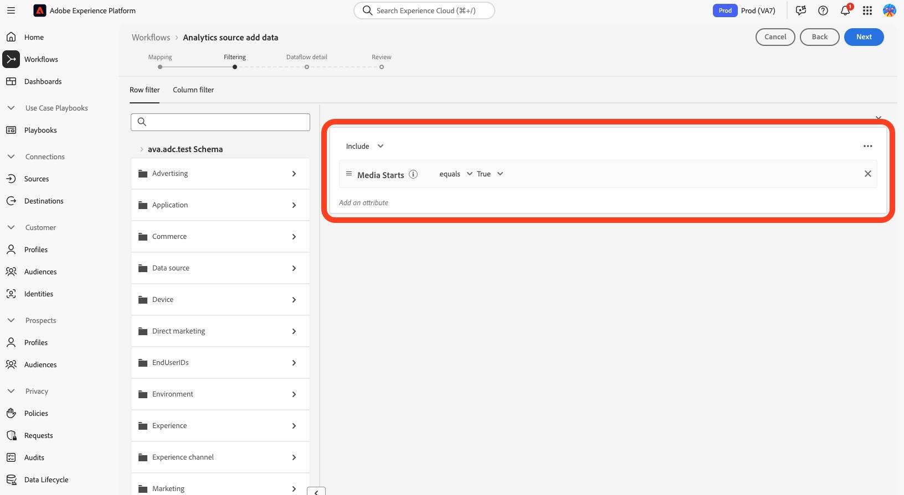

# 프로필을 새 스트리밍 미디어 필드로 마이그레이션

이 문서에서는 스트리밍 미디어용 Adobe Analytics에 대해 활성화된 Adobe 데이터 수집 흐름 위에 존재하는 프로필 필터링 서비스를 마이그레이션하는 프로세스에 대해 설명합니다. 마이그레이션은 프로필 필터링 서비스를 &quot;미디어&quot;라는 Adobe 스트리밍 미디어 서비스 데이터 형식에서 &quot;[미디어 보고 세부 정보](https://experienceleague.adobe.com/en/docs/experience-platform/xdm/data-types/media-reporting-details)&quot;라는 새로운 해당 데이터 형식을 사용하도록 전환합니다.

## 프로필 마이그레이션

프로필 필터링을 이전 데이터 유형인 &quot;Media&quot;에서 새 데이터 유형인 &quot;[미디어 보고 세부 정보](https://experienceleague.adobe.com/en/docs/experience-platform/xdm/data-types/media-reporting-details)&quot;(으)로 마이그레이션하려면 기존 프로필 필터링 규칙을 편집해야 합니다.

1. Adobe Experience Platform의 **[!UICONTROL 소스]** 섹션 아래에서 **[!UICONTROL 데이터 흐름]** 탭으로 이동합니다.

1. Adobe 데이터 수집을 통해 Adobe Analytics에서 Adobe Experience Platform으로 스트리밍 미디어 데이터를 가져오는 역할을 하는 데이터 흐름을 찾습니다.

1. 더 이상 사용되지 않는 필드가 포함된 모든 사용자 지정 규칙을 새 XDM 개체의 새 해당 필드로 대체하여 프로필 필터링 설정을 수정하려면 **[!UICONTROL 데이터 흐름 업데이트]**&#x200B;를 선택하십시오.

1. 더 이상 사용되지 않는 &quot;미디어&quot; 개체에서 필드가 포함된 필터를 찾습니다.

1. 새 &quot;미디어 보고 세부 사항&quot; 개체에서 필드를 추가하여 해당 필터를 추가합니다.

1. 두 필드 사이에 OR 연산자를 사용합니다.

1. 프로필이 여전히 예상대로 작동하는지 확인합니다.

이전 필드와 새 필드 간에 매핑하려면 [콘텐츠 ID](/help/reporting/dimensions/content.md) 매개 변수와 [스트리밍 미디어 서비스](/help/media-overview.md)에 설명된 스트리밍 미디어 변수의 나머지 부분을 참조하십시오. 이전 필드 경로는 &quot;XDM 필드 패스&quot; 속성에서 찾을 수 있고 새 필드 경로는 &quot;보고 XDM 필드 패스&quot; 속성에서 찾을 수 있습니다.

## 예

마이그레이션 지침을 더 쉽게 따르려면 단일 프로필 필터링 규칙이 포함된 다음 예제 데이터 흐름을 고려하십시오. 이 경우 단일 규칙만 있으므로 마이그레이션 지침을 한 번만 적용해야 합니다.

1. Adobe Experience Platform의 **[!UICONTROL 소스]** 섹션 아래에서 **[!UICONTROL 데이터 흐름]** 탭으로 이동합니다.

&#x200B;1. Adobe Analytics을 통해 Adobe Analytics에서 Adobe Experience Platform으로 스트리밍 미디어 데이터를 가져오는 역할을 하는 데이터 흐름을 찾습니다.

1. 아래 이미지에 표시된 대로 편집 UI를 입력하려면 **[!UICONTROL 데이터 흐름 업데이트]**&#x200B;를 선택하십시오.

   

1. **[!UICONTROL 다음]**&#x200B;을 선택하여 필터링 탭으로 이동합니다.

   

1. **[!UICONTROL 필터링]** 탭에서 `media.mediaTimed` 필드를 사용하는 필터링 규칙을 식별합니다.

   

   media.mediaTimed 개체를 사용하는 각 필터에 대해 [스트리밍 미디어 서비스](/help/media-overview.md)에 설명된 스트리밍 미디어 변수를 사용하여 `mediaReporting` 개체에서 해당 응답자를 찾아 이전 필드와 새 필드 사이를 매핑합니다. 이전 필드 경로는 &quot;XDM 필드 패스&quot; 속성에서 찾을 수 있고 새 필드 경로는 &quot;보고 XDM 필드 패스&quot; 속성에서 찾을 수 있습니다. 예를 들어 [미디어 시작](/help/reporting/metrics/media-starts.md)의 경우 `media.mediaTimed.impressions.value`에 대한 받는 사람은 `xdm.mediaReporting.sessionDetails.isViewed`입니다.

   

1. 관련 `mediaReporting` 필드를 필터링 규칙으로 드래그하고 두 규칙 사이에 OR 연산자를 사용하십시오. 새 필드를 사용할 때 기존 규칙과 동일한 규칙을 추가합니다.

   

1. **[!UICONTROL 다음]**&#x200B;을(를) 선택하여 변경 내용을 저장합니다.
