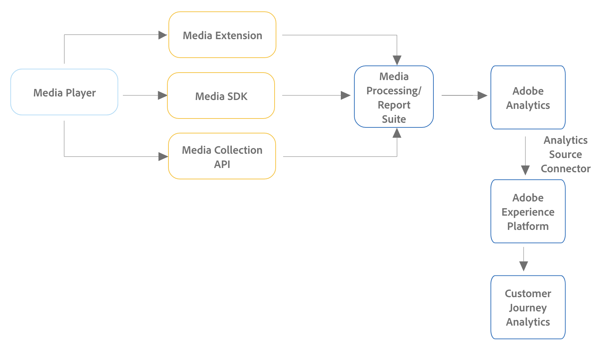

# 스트리밍 미디어 컬렉션 추가 기능 구현

Adobe 스트리밍 미디어 컬렉션 추가 기능을 구현하는 방법에는 여러 가지가 있습니다. 이 페이지에 설명된 구현 방법에 대해 지원되는 디바이스 및 플랫폼에 대한 자세한 비교는 [지원되는 디바이스 및 플랫폼](/help/getting-started/supported-devices.md)을 참조하십시오.

## Edge 구현 방법

모든 신규 Adobe Analytics 또는 Customer Journey Analytics 고객을 위해 스트리밍 미디어 컬렉션 추가 기능을 구현할 때 Edge을 사용하는 것이 좋습니다.

* **Edge Network SDK/확장 기능용 미디어:** 웹, iOS 및 Android 장치 또는 Roku 장치에서 데이터를 수집하여 Edge Network으로 보냅니다. 그런 다음 데이터를 Customer Journey Analytics 또는 Adobe Analytics로 전송할 수 있습니다.

  Edge Network SDK/확장용 Media에 대한 자세한 내용은 [Edge Network을 사용하여 Streaming Media Collection 추가 기능 구현](/help/implementation/edge/implementation-edge.md)을 참조하십시오.

* **Media Edge API:** Edge Network을 사용하여 모든 장치 또는 형식(모바일, 웹 및 OTT 장치 포함)에서 데이터를 수집하고 데이터를 전송할 수 있습니다. 그런 다음 데이터를 Customer Journey Analytics 또는 Adobe Analytics로 전송할 수 있습니다.

  Media Edge API에 대한 자세한 내용은 [Media Edge API 개요](https://developer.adobe.com/cja-apis/docs/endpoints/media-edge/)를 참조하십시오.

## Adobe Analytics 전용 구현 방법

위에서 설명한 Edge 구현 방법은 Customer Journey Analytics와 Adobe Analytics, 특히 새로운 구현의 경우 권장됩니다.

Edge 구현 방법 외에도 다른 구현 방법을 사용할 수 있습니다. 이러한 구현 방법은 Adobe Analytics와 함께 사용하도록 설계되었습니다. 그러나 다음 구현 방법을 사용하는 기존 고객은 [Analytics 소스 연결](https://experienceleague.adobe.com/docs/experience-platform/sources/ui-tutorials/create/adobe-applications/analytics.html)을 생성하여 Customer Journey Analytics에서 데이터를 계속 사용할 수 있습니다.

* **태그가 포함된 미디어 확장:** 오디오 및 비디오용 Adobe Media Analytics 확장 기능은 태그 활성화 사이트 또는 프로젝트에 미디어 추적기 인스턴스를 추가하는 기능을 제공합니다. 데이터는 Adobe Analytics로 전송됩니다.

  태그가 포함된 미디어 확장 설치, 구성 및 구현에 대한 자세한 내용은 [오디오 및 비디오 확장 기능용 Adobe Media Analytics(3.x SDK) 개요](https://experienceleague.adobe.com/docs/experience-platform/tags/extensions/client/media-analytics-3x/overview.html)를 참조하십시오.

* **Media SDK:** Media SDK를 사용하면 웹 사이트, 휴대폰, 연결된 TV, 태블릿, OTT 디바이스, 셋톱 박스 및 게임 콘솔을 포함한 여러 미디어 플랫폼을 측정할 수 있습니다. (자세한 내용은 [지원되는 디바이스 및 플랫폼](/help/getting-started/supported-devices.md)을 참조하십시오.)

  Media SDK는 추적을 위해 Media Collection API를 사용합니다. 데이터는 Adobe Analytics로 전송됩니다.

  Media SDK 및 확장 기능 다운로드 및 설치에 대한 자세한 내용은 [Media SDK, 태그를 사용한 확장 기능 및 OTT SDK 가져오기](/help/getting-started/download-sdks.md)를 참조하십시오.

* **Media Collection API:** Media Collection API는 사용자 정의가 가능하므로 사용자 정의 추적 기능이 필요한 애플리케이션과 Media SDK에서 지원되지 않는 디바이스에 사용할 수 있습니다. Media Collection API는 RESTful HTTP 호출을 사용하여 오디오 및 비디오 이벤트를 추적합니다. 데이터는 Adobe Analytics로 전송됩니다.

  Media Collection API 사용에 대한 자세한 내용은 [Media Collection API](media-collection-api/mc-api-overview.md)를 참조하십시오.

<!--
(Not sure if we need the following paragraph and graphic. Paragraph is somewhat redundant with the intro paragraph of this article)
Choose the implementation method depending on the supported platforms. Some players are not supported by the Media SDKs or the Adobe Experience Platform Media Extensions. The Media Collection APIs provide a way to support those players. For information on supported devices, see [Supported devices and platforms](/help/getting-started/supported-devices.md).

-->
