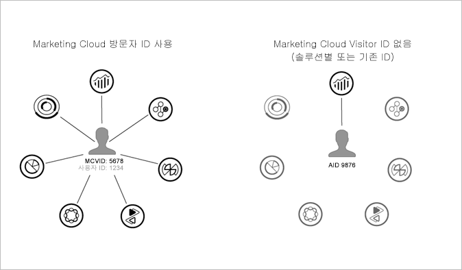

# 전제 조건{#prerequisites}

## 결정 {#decision}

추적 구현을 시작하기 전에 사용자의 상황에 가장 적합한 구현에 대해 몇 가지 결정을 미리 내려야 합니다.

* **Media Analytics -** 최신 Media SDK(표준, 권장 구현) 및/또는 Media Collection API(RESTful) 사용
* **이정표 -** 이전의 Adobe 추적 구현
* **Data Insertion API -** Media SDK를 사용하지 않고 추적 구현

## 작업 {#prereq-tasks}

시작하기 전에 완료해야 하는 작업은 *Media Analytics* 구현의 경우 다음과 같습니다.

1. **Experience Cloud를 사용할 수 있도록 설정.**

   Adobe Experience Platform ID 서비스를 구현해야 합니다.

    Identity 서비스를 통해 사용자 핵심 서비스의 Experience Cloud 핵심 서비스, 솔루션, 고객 속성 및 대상에 공통된 ID 프레임워크를 사용할 수 있습니다. 이는 영구적인 고유 ID를 사이트 방문자에게 할당하여 작동됩니다. 조직에서 ID 서비스를 구현하면 이 ID를 통해 다른 Experience Cloud 솔루션에서 동일한 사이트 방문자와 해당 데이터를 식별할 수 있습니다.

   

   ID 서비스는 다른 솔루션별 ID(예: Analytics AID)를 대체할 수도 있습니다. [고객 ID 및 인증 상태](https://docs.adobe.com/content/help/ko-KR/id-service/using/reference/authenticated-state.html) 기능을 통해 ID 서비스를 사용하여 고유한 고객 ID를 Experience Cloud에 전달할 수 있습니다. 하지만 ID 서비스는 이미 구독한 솔루션에서만 작동합니다. 다른 제품에 액세스하기 위해 등록되어 있지 않은 경우 ID 서비스를 통해 액세스할 수 없습니다.

   나아가 ID 서비스는 현재 및 미래의 수 많은 Experience Cloud 기능, 개선 사항 및 서비스의 필수 구성 요소입니다. 현재 ID 서비스는 [Analytics](https://www.adobe.com/kr/marketing-cloud/web-analytics.html), [Audience Manager](https://www.adobe.com/kr/marketing-cloud/data-management-platform.html) 및 [Target](https://www.adobe.com/kr/marketing-cloud/testing-targeting.html)을 지원합니다.

   >[!IMPORTANT]
   >
   >Adobe Experience Cloud Device Co-op에 참여하려면 Experience Cloud ID 서비스가 필요합니다.

   ID 서비스를 구현하지 않았다면 지금이 바로 마이그레이션 전략을 시작할 적기입니다. ID 서비스의 중요성과 역할에 대한 자세한 내용은 [Identity 서비스가 나의 레이더가 되어야 하는 이유](https://blogs.adobe.com/digitalmarketing/analytics/why-new-adobe-marketing-cloud-id-service-should-be-on-your-radar/)를 참조하십시오.

   >[!IMPORTANT]
   >
   >미디어별 호출에 사용자 ID 정보가 없는 경우 기본 분석 [대체 ID 메서드](https://docs-author.corp.adobe.com/content/help/en/analytics/implementation/javascript-implementation/unique-visitors/visid-fallback.html)가 적용됩니다.

   Experience Cloud ID에 대한 자세한 내용은 [Experience Cloud ID 개요](https://docs.adobe.com/content/help/ko-KR/id-service/using/intro/overview.html) 및 [Adobe Experience Platform ID 서비스](https://docs.adobe.com/content/help/ko-KR/id-service/using/home.html)를 참조하십시오.

1. **Adobe Analytics 보고서를 사용할 수 있도록 설정.**

   Analytics에서 보고서를 사용할 수 있도록 설정하고, 수집 중인 컨텐츠 및 광고 데이터를 보려면 [미디어 보고서 지원](/help/media-reports/media-reports-enable.md)을 참조하십시오.

