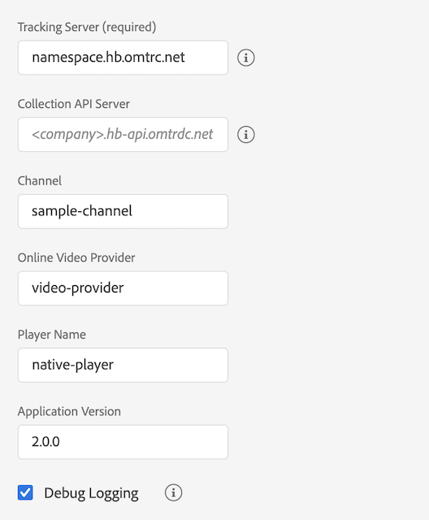

# 독립형 Media SDK에서 Adobe Launch로 마이그레이션 - iOS

>[!NOTE]
>Adobe Experience Platform Launch는 Experience Platform의 데이터 수집 기술군으로 새롭게 브랜딩되었습니다. 그 결과로 제품 설명서 전반에서 몇 가지 용어 변경이 있었습니다. 용어 변경에 대한 통합 참고 자료는 다음 [문서](https://experienceleague.adobe.com/docs/experience-platform/tags/term-updates.html?lang=ko-KR)를 참조하십시오.

## 구성

### 독립형 Media SDK

독립형 Media SDK에서는 앱에서 추적 구성을 지정하고 추적기를 만들 때 이를 SDK에 전달합니다.

```objective-c
ADBMediaHeartbeatConfig *config =
  [[ADBMediaHeartbeatConfig alloc] init];

config.trackingServer = @"namespace.hb.omtrdc.net";
config.channel = @"sample-channel";
config.appVersion = @"v2.0.0";
config.ovp = @"video-provider";
config.playerName = @"native-player";
config.ssl = YES;
config.debugLogging = YES;

ADBMediaHeartbeat* tracker =
  [[ADBMediaHeartbeat alloc] initWithDelegate:self config:config];
```

### Launch 확장

1. Experience Platform Launch에서 모바일 속성에 대한 [!UICONTROL 확장] 탭을 클릭합니다.
1. [!UICONTROL 카탈로그] 탭에서 오디오 및 비디오 확장용 Adobe Media Analytics 확장 프로그램을 찾은 후 [!UICONTROL 설치]를 클릭합니다.
1. 확장 설정 페이지에서 추적 매개 변수를 구성합니다.
Media 확장은 추적을 위해 구성된 매개 변수를 사용합니다.

   

[Media Analytics 확장 구성](https://developer.adobe.com/client-sdks/documentation/adobe-media-analytics/)

## 추적기 만들기

### 독립형 Media SDK

독립형 Media SDK에서는 `ADBMediaHeartbeatConfig` 개체를 수동으로 만들고 추적 매개 변수를 구성합니다. `getQoSObject()` 및 `getCurrentPlaybackTime()functions.`를 노출하는 위임 인터페이스 구현

추적할 MediaHeartbeat 인스턴스를 만듭니다.

```objective-c
@interface PlayerDelegate : NSObject<ADBMediaHeartbeatDelegate>
@end

@implementation PlayerDelegate {
}

- (NSTimeInterval) getCurrentPlaybackTime {
    // When called should return the current player time in seconds.
    return playhead_;
}

- (nonnull ADBMediaObject*) getQoSObject {
    // When called should return the latest qos values.
    return qosObject_;
}
@end

ADBMediaHeartbeatConfig *config = [[ADBMediaHeartbeatConfig alloc] init];

config.trackingServer = @"namespace.hb.omtrdc.net";
config.channel = @"sample-channel";
config.appVersion = @"app-version";
config.ovp = @"video-provider";
config.playerName = @"native-player";
config.ssl = YES;
config.debugLogging = YES;
ADBMediaHeartbeatDelegate* delegate = [[PlayerDelegate alloc] init];

ADBMediaHeartbeat* tracker =
  [[ADBMediaHeartbeat alloc] initWithDelegate:delegate config:config];
```

### Launch 확장

[Media API 참조 - 미디어 추적기 만들기](https://developer.adobe.com/client-sdks/documentation/adobe-media-analytics/api-reference/#createtracker)

추적기를 만들기 전에 Media 확장 및 종속 확장을 모바일 코어에 등록합니다.

```objective-c
// Register the extension once during app launch
#import <ACPCore.h>
#import <ACPAnalytics.h>
#import <ACPMedia.h>
#import <ACPIdentity.h>

- (BOOL)application:(UIApplication *)application didFinishLaunchingWithOptions:(NSDictionary *)launchOptions {
    [ACPCore setLogLevel:ACPMobileLogLevelDebug];
    [ACPCore configureWithAppId:@"your-launch-app-id"];
    [ACPMedia registerExtension];
    [ACPAnalytics registerExtension];
    [ACPIdentity registerExtension];
    [ACPCore start:nil];
    return YES;
}
```

Media 확장이 등록되면 다음 API를 사용하여 추적기를 만들 수 있습니다.
추적기는 구성된 실행 속성에서 구성을 자동으로 선택합니다.

```objective-c
[ACPMedia createTracker:^(ACPMediaTracker * _Nullable mediaTracker) {
    // Use the instance for tracking media.
}];
```

## 플레이헤드 및 경험 품질 값 업데이트.

### 독립형 Media SDK

독립형 Media SDK에서는 추적기를 만드는 동안 `ADBMediaHeartbeartDelegate` 프로토콜을 구현하는 위임 개체가 전달됩니다.
이 구현은 추적기가 `getQoSObject()` 및 `getCurrentPlaybackTime()` 인터페이스 메서드를 호출할 때마다 최신 QoE 플레이헤드를 반환해야 합니다.

### Launch 확장

이 구현은 추적기에 의해 노출된 `updateCurrentPlayhead` 메서드를 호출하여 현재 플레이어 플레이헤드를 업데이트해야 합니다. 정확한 추적을 위해 이 메서드를 초당 한 번 이상 호출해야 합니다.

[Media API 참조 - 현재 플레이헤드 업데이트](https://developer.adobe.com/client-sdks/documentation/adobe-media-analytics/api-reference/#updatecurrentplayhead)

이 구현은 추적기에 의해 노출된 `updateQoEObject` 메서드를 호출하여 QoE 정보를 업데이트해야 합니다. 품질 지표가 변경될 때마다 이 메서드를 호출해야 합니다.

[Media API 참조 - QoE 개체 업데이트](https://developer.adobe.com/client-sdks/documentation/adobe-media-analytics/api-reference/#createqoeobject)

## 표준 미디어/광고 메타데이터 전달

### 독립형 Media SDK

* 표준 미디어 메타데이터:

   ```objective-c
   ADBMediaObject *mediaObject =
     [ADBMediaHeartbeat createMediaObjectWithName:@"media-name"
                        mediaId:@"media-id"
                        length:60
                        streamType:ADBMediaHeartbeatStreamTypeVod
                        mediaType:ADBMediaTypeVideo];
   
   // Standard metadata keys provided by adobe.
   NSMutableDictionary *standardMetadata = [[NSMutableDictionary alloc] init];
   [standardMetadata setObject:@"Sample show" forKey:ADBVideoMetadataKeySHOW];
   [standardMetadata setObject:@"Sample season" forKey:ADBVideoMetadataKeySEASON];
   [mediaObject setValue:standardMetadata forKey:ADBMediaObjectKeyStandardMediaMetadata];
   
   //Attaching custom metadata
   NSMutableDictionary *videoMetadata = [[NSMutableDictionary alloc] init];
   [mediaMetadata setObject:@"false" forKey:@"isUserLoggedIn"];
   [mediaMetadata setObject:@"Sample TV station" forKey:@"tvStation"];
   
   [tracker trackSessionStart:mediaObject data:mediaMetadata];
   ```

* 표준 광고 메타데이터:

   ```objective-c
   ADBMediaObject* adObject =
     [ADBMediaHeartbeat createAdObjectWithName:[adData objectForKey:@"name"]
                        adId:[adData objectForKey:@"id"]
                        position:[[adData objectForKey:@"position"] doubleValue]
                        length:[[adData objectForKey:@"length"] doubleValue]];
   
   // Standard metadata keys provided by adobe.
   NSMutableDictionary *standardMetadata =
     [[NSMutableDictionary alloc] init];
   [standardMetadata setObject:@"Sample Advertiser"
                     forKey:ADBAdMetadataKeyADVERTISER];
   [standardMetadata setObject:@"Sample Campaign"
                     forKey:ADBAdMetadataKeyCAMPAIGN_ID];
   [adObject setValue:standardMetadata
                     forKey:ADBMediaObjectKeyStandardAdMetadata];
   
   //Attaching custom metadata
   NSMutableDictionary *adDictionary = [[NSMutableDictionary alloc] init];
   [adDictionary setObject:@"Sample affiliate" forKey:@"affiliate"];
   
   [tracker trackEvent:ADBMediaHeartbeatEventAdStart
            mediaObject:adObject
            data:adDictionary];
   ```

### Launch 확장

* 표준 미디어 메타데이터:

   ```objective-c
   NSDictionary *mediaObject =
     [ACPMedia createMediaObjectWithName:@"media-name"
               mediaId:@"media-id"
               length:60
               streamType:ACPMediaStreamTypeVod
               mediaType:ACPMediaTypeVideo];
   
   NSMutableDictionary *mediaMetadata =
     [[NSMutableDictionary alloc] init];
   
   // Standard metadata keys provided by adobe.
   [mediaMetadata setObject:@"Sample show" forKey:ACPVideoMetadataKeyShow];
   [mediaMetadata setObject:@"Sample season" forKey:ACPVideoMetadataKeySeason];
   
   // Custom metadata keys
   [mediaMetadata setObject:@"false" forKey:@"isUserLoggedIn"];
   [mediaMetadata setObject:@"Sample TV station" forKey:@"tvStation"];
   [_tracker trackSessionStart:mediaObject data:mediaMetadata];
   ```

* 표준 광고 메타데이터:

   ```objective-c
   NSDictionary* adObject =
     [ACPMedia createAdObjectWithName:@"ad-name"
               adId:@"ad-id"
               position:1
               length:15];
   
   NSMutableDictionary* adMetadata =
     [[NSMutableDictionary alloc] init];
   
   // Standard metadata keys provided by adobe.
   [adMetadata setObject:@"Sample Advertiser" forKey:ACPAdMetadataKeyAdvertiser];
   [adMetadata setObject:@"Sample Campaign" forKey:ACPAdMetadataKeyCampaignId];
   
   // Custom metadata keys
   [adMetadata setObject:@"Sample affiliate" forKey:@"affiliate"];
   
   [tracker trackEvent:ACPMediaEventAdStart mediaObject:adObject data:adMetadata];
   ```
