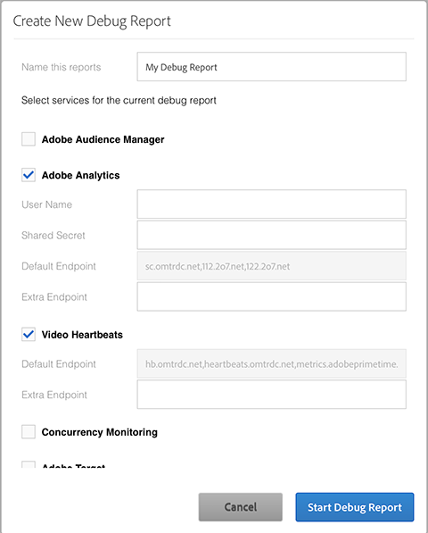

# 새 디버그 보고서 만들기{#create-a-new-debug-report}

새 디버그 보고서를 만들려면 다음을 수행하십시오.

1. [!UICONTROL 새 디버그 보고서 만들기]에서 다음을 선택합니다.

   

1. 다음 정보로 필드를 작성합니다.

   * **보고서 이름 지정** - 인증 중에 플레이어를 쉽게 추적하고 브랜드와 플랫폼을 별도로 유지할 수 있도록 플레이어 이름과 날짜를 입력합니다.
   * **Adobe Analytics**

      * [!UICONTROL 사용자 이름] 및 [!UICONTROL 공유 암호] - 이러한 필드는 선택 사항이지만 웹 서비스 API 자격 증명을 Adobe Debug에 추가하여 보고서 세트에 대한 변수 이름과 변수 설정을 표시할 수 있습니다.

        다음 방법 중 하나로 액세스할 수 있습니다.

         * [!UICONTROL Analytics > 관리자 > 회사 설정 > 웹 서비스]
         * [!UICONTROL 분석 > 관리 > 사용자 관리 > 사용자 > 개별 사용자 설정] 새 사용자에 대한 웹 서비스 API 자격 증명을 만들려면 [!UICONTROL 사용자 관리]에서 사용자를 **웹 서비스 액세스** 사용자 그룹에 추가하십시오.

      * [!UICONTROL 기본 엔드포인트] - 이 필드의 데이터는 Adobe에서 제공하며, 변경할 수 없습니다.
      * [!UICONTROL 추가 엔드포인트] – `metrics.companyname.com`과 같은 추적 서버에 사용할 수 있는 경우 `CNAMES`를 추가합니다.

   * **비디오 하트비트(Media Analytics)**

      * [!UICONTROL 기본 엔드포인트] - 이 필드의 데이터는 Adobe에서 제공하며, 변경할 수 없습니다.
      * [!UICONTROL 추가 엔드포인트] – `metrics.companyname.com`과 같은 추적 서버에 사용할 수 있는 경우 `CNAMES`를 추가합니다.
