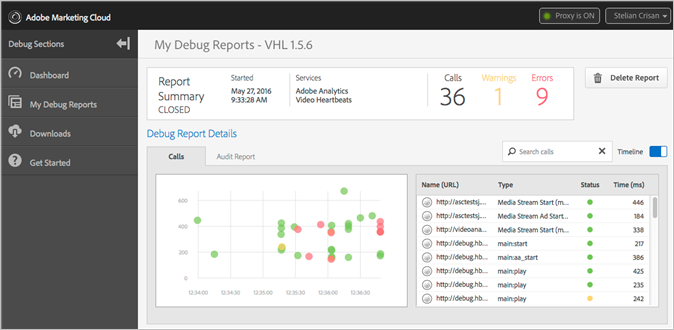

# 디버그 대시보드 및 보고서{#debug-dashboards-and-reports}

Adobe Debug는 실시간으로 보고를 제공하므로 비디오 재생 중에 전송되는 히트 및 메타데이터를 볼 수 있습니다. 이러한 각 보고서는 디버그 내에 저장할 수 있습니다.

인증을 위해 URL을 복사하고 링크를 보내면 이러한 보고서를 공유할 수 있습니다(예: ZenDesk 티켓 내에서).

>[!NOTE]
>
>한 번에 하나의 세션만 활성화할 수 있습니다. 활성 세션은 대시보드에서 열 수 있습니다.

