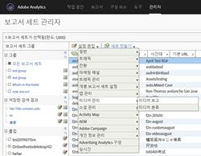
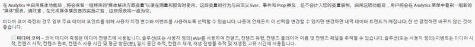
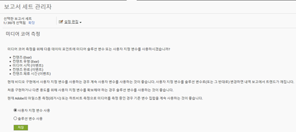
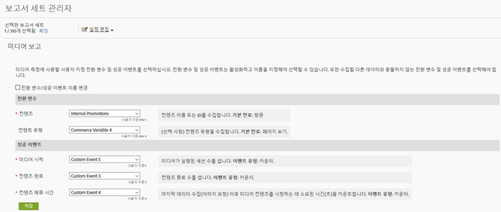

# 이정표 개요{#milestone-overview}

>[!CAUTION]
>
>이 측정 선택 사항은 더 이상 사용되지 않습니다.

[이전 이정표 설명서](milestone_analytics_video.pdf)

## 구성 {#configuration}

### 이정표 비디오 구성

비디오를 추적하려면 일련의 *사용자 지정 전환 변수*(eVar)와 *사용자 지정 이벤트*&#x200B;를 추적 및 보고에 사용하도록 지정합니다. 또한 하나의 *사용자 지정 통찰력* 변수()가 경로 지정에 사용됩니다.`s.prop`

각 지표에 대해 선택한 변수는 비디오 구성 페이지에 추가됩니다. 이 경우 시스템에서 표준 비디오 보고서를 자동으로 생성하고 형식을 지정할 수 있습니다. *비디오 이름* evar 및 *비디오 보기 횟수* 카운터는 둘 다 필수입니다. 기타 변수는 선택 사항이지만, 완벽한 측정을 위해 권장됩니다. 비디오 추적이 활성화되면 비디오 추적을 사용하여 보고한 비디오 데이터에서 생성된 보고서를 볼 수 있습니다.

비디오에 대해 여러 추가 지표를 추적할 수도 있습니다. 예를 들어 사이트에 여러 개의 비디오 플레이어를 사용하는 경우 evar를 플레이어 이름으로 채울 수 있습니다. 선택한 변수 중 일부를 사이트의 다른 영역에서 사용할 수도 있습니다. 예를 들어 *컨텐츠 유형* 변수를 사이트에서 사용하는 경우 해당 변수를 사용하여 비디오로부터 페이지 보기 횟수 비율을 측정하고, 전환 이벤트를 비디오에 연결할 수 있습니다.

### 이정표 보고 구성

이정표 구현에 대한 비디오 보고를 설정하려면 로 **[!UICONTROL Admin > Report Suite Manager]이동하십시오.**보고서 세트를 선택한 다음**[!UICONTROL Video Management > Video Reporting]다음을 선택합니다.**

<!--
{width="248"}
-->


첫 번째 화면에서는 이정표 데이터로 비디오 코어만 작동됩니다. 을 선택하고 **[!UICONTROL Video Core]** 클릭합니다 **[!UICONTROL Save].**



다음 화면에서 **[!UICONTROL Use Custom Variables]선택합니다.**

<!--
{width="470"}
-->



마지막 화면에서는 비디오 측정에 사용할 2개의 eVar와 3개의 이벤트를 선택하십시오.

<!--

-->



## 비디오 변수 참조 {#video-variable-reference}

다음 표에는 비디오에 대한 상거래 변수 및 사용자 지정 이벤트에 대한 추가 세부 사항이 나와 있습니다.

| 비디오 지표 | 변수 유형 | 설명 |
| --- | --- | --- |
| 컨텐츠 | eVar <br/>기본 만료: 방문 | (필수) 구현에 지정된 대로 비디오의 이름을 수집합니다. |
| 컨텐츠 유형 | eVar <br/>기본 만료: 페이지 보기 | 방문자가 본 컨텐츠 유형에 대한 데이터를 수집합니다. 비디오 측정에 의해 전송된 히트에 `video.` 컨텐츠 유형이 할당됩니다. <br/>이 변수는 비디오 추적에 대해서만 예약할 필요가 없습니다. 이와 동일한 변수를 사용하는 다른 컨텐츠 보고서 컨텐츠 유형이 있으면 다른 컨텐츠 유형에 대해 방문자 분포를 분석할 수 있습니다. 예를 들어 이 변수를 사용하여 `article` 또는 `product page`와 같은 값을 사용하는 다른 컨텐츠 유형에 태그를 지정할 수 있습니다. <br/>비디오 측정 관점에서 *컨텐츠 유형*&#x200B;을 사용하면 비디오 방문자를 식별할 수 있고 비디오 전환율을 계산할 수 있습니다. |
| 컨텐츠 체류 시간 | 이벤트 <br/>유형: 카운터 | 마지막 데이터 컬렉션 처리(이미지 요청) 이후 비디오를 시청하는 데 걸린 시간(초)을 계산합니다. |
| 비디오 시작 | 이벤트 <br/>유형: 카운터 | 방문자가 비디오를 일정 부분 보았음을 나타냅니다. 그러나 방문자가 비디오에서 본 내용이나 분량에 대한 정보는 제공하지 않습니다. |
| 비디오 완료 | 이벤트 <br/>유형: 카운터 | 사용자가 비디오 전체를 보았음을 의미합니다. 기본적으로 완료 이벤트는 비디오 종료 1초 전에 측정됩니다.  <br/>구현 중에 비디오 종료 몇 초 전을 보기 완료로 고려할 것인지 지정할 수 있습니다. 정의된 끝이 없는 라이브 비디오 및 기타 스트림의 경우 완료를 측정할 사용자 지정 지점을 지정할 수 있습니다. 예를 들어 특정 시간을 시청한 후로 지정할 수 있습니다. |

## 미디어 모듈 변수 {#media-module-variables}

다음 변수를 사용하여 비디오 측정을 구성할 수 있습니다. 필수 변수 테이블에서 변수에 대한 값을 정의해야 합니다. 또한 비디오 플레이어에서 이벤트를 추적하려면 자동 추적(지원되는 플레이어에 대해)을 활성화하거나 열기, 재생, 중지 또는 닫기 메서드를 사용하여 사용자 지정 플레이어 이벤트 추적을 구현해야 합니다.

| 변수    | 설명 |
| --- | --- |
| `Media.trackUsingContextData` | **구문:** <br/><br/> `s.Media.trackUsingContextData = true;` <br/>이 옵션은 통합된 비디오 추적을 활성화합니다. 참으로 설정하면 미디어 모듈은 기존 `pev3` 대신 미디어 추적을 위한 컨텍스트 데이터를 생성합니다. <br/>`Media.contextDataMapping`을 사용하여 컨텍스트 데이터를 선택한 eVar와 이벤트에 매핑합니다.<br/>기본값: `false` |
| `Media.contextDataMapping` | **구문:** <br/><br/> `s.Media.contextDataMapping = {`<br/>      `"a.media.name":"eVar2, prop2",` <br/>     `"a.media.segment":"eVar3",` <br/>     `"a.contentType":"eVar1",` <br/>     `"a.media.timePlayed":"event3",` <br/>     `"a.media.view":"event1",` <br/>     `"a.media.segmentView":"event2",` <br/>     `"a.media.complete":"event7",` <br/>     `"a.media.milestones":{` <br/>         `25:"event4",` <br/>         `50:"event5",` <br/>         `75:"event6"` <br/>     ` }` <br/> `};` <br/><br/>비디오 측정에 사용할 eVar와 이벤트에 대한 변수 매핑을 정의하는 개체입니다. 이 개체는 다음 필드에 매핑해야 합니다. <br/><br/> **a.media.name:** (필수) 변수를 비디오 이름으로 채웁니다. 비디오 이름을 저장하기 위해 선택한 eVar와 비디오 경로 지정에 사용할 사용자 지정 통찰력 비디오 변수(`s.prop`)를 제공합니다. 쉼표로 구분된 목록으로 값을 제공합니다. <br/><br/> **a.media.segment:** (선택 사항) 미디어 세그먼트 이름을 저장할 eVar입니다. a.contentType: (선택 사항) 비디오 값을 저장할 eVar로, 비디오 방문 횟수 및 방문자 보고를 생성하기 위해 활성화된 방문 횟수 및 방문자 추적을 포함합니다. 선택한 변수는 문서 슬라이드 쇼 또는 제품 페이지와 같은 데이터를 저장하는 데 이미 사용되었을 수 있습니다.<br/><br/> **a.media.view:** (필수) 미디어 보기를 카운트할 이벤트입니다. <br/><br/> **a.media.segmentView:** (선택 사항) 세그먼트 보기를 카운트할 이벤트입니다. <br/><br/> **a.media.complete:** (선택 사항) 완료 보기를 카운트할 이벤트입니다. <br/><br/> **a.media.timePlayed:** (선택 사항, 권장) 비디오 재생 시간(초)을 저장할 숫자 이벤트입니다. <br/><br/> **a.media.milestones:** (선택 사항) s.Media.trackMilestones 이정표를 카운터 이벤트에 매핑하는 개체입니다. 이정표를 정의하는 경우 Media.segmentByMilestones을 true로 설정해야 합니다. <br/><br/> **광고 추적** 광고를 추적하려면 다음 컨텍스트 데이터 변수를 사용합니다. <br/> **a.media.ad.name:** (필수) 변수를 광고 이름으로 채웁니다. 광고 이름을 저장하기 위해 선택한 eVar와 경로 지정에 사용할 사용자 지정 통찰력 비디오 변수(`s.prop`)를 제공합니다. 쉼표로 구분된 목록으로 값을 제공합니다. <br/><br/> **a.media.ad.pod:** 기본 컨텐츠에서 광고가 재생되는 위치입니다. <br/><br/> **a.media.ad.podPosition**: Pod 내에서 광고가 재생되는 위치입니다. <br/><br/> **a.media.ad.CPM**: 이 재생에 적용되는 CPM 또는 암호화된 CPM(앞에 &quot;~&quot;가 붙음)입니다. <br/><br/> **a.media.ad.view:** `a.media.view`와 동일하게 작동합니다. <br/><br/> **a.media.ad.clicked**: 광고 클릭 수를 카운트합니다(`Media.click` 호출) <br/><br/> **a.media.ad.timePlayed:** `a.media.timePlayed`와 동일하게 작동합니다. <br/><br/> **a.media.ad.complete:** `a.media.complete`와 동일하게 작동합니다. a.media.ad.segment: `a.media.segment`와 동일하게 작동합니다. <br/><br/> **a.media.ad.segmentView:** `a.media.segmentView`와 동일하게 작동합니다. <br/><br/> **a.media.ad.milestones:** `a.media.milestones`와 동일하게 작동합니다. <br/><br/> **a.media.ad.offsetMilestones:** `a.media.offsetMilestones`와 동일하게 작동합니다. |
| `Media.trackVars` | **구문:** <br/><br/> `s.Media.trackVars =` <br/>    `"events,` `prop2,` `eVar1,` `eVar2,` `eVar3";` <br/><br/>비디오 추적 코드에 설정되어 있으며, 쉼표로 구분된 모든 변수의 목록입니다. |
| `Media.trackEvents` | **구문:** <br/><br/> `s.Media.trackEvents =` <br/>    `"event1,` `event2,` `event3,` `event4,` `event5,` `event6,` `event7"` <br/><br/>비디오 추적 코드에 설정되어 있으며, 쉼표로 구분된 모든 이벤트의 목록입니다. |

## 선택 사항 변수 {#optional-variables}

|  변수    | 설명 |
| --- | --- |
| `Media.autoTrack` | **구문:** <br/><br/> `s.Media.autoTrack = true` <br/><br/>지원되는 플레이어에 대해 자동 추적을 활성화합니다. 지원되는 플레이어는 다음과 같습니다. <ul> <li> OSMF(Open Source Media Framework) </li> <li> FLVPlayback(Flash Professional의 비디오 가져오기 마법사로 작성된 비디오 플레이어) </li> <li> Silverlight </li> <li> MediaDisplay </li> <li> MediaPlayback </li> <li> Brightcove API 버전 2 및 3([Brightcove](https://marketing.adobe.com/resources/help/ko_KR/sc/appmeasurement/video/video_other_players.html) 참조) </li> <li> Windows Media Player, Quicktime 또는 Real Player(JavaScript 사용) </li> </ul> <br/><br/>위의 플레이어를 사용하지 않는 경우 `Media.open` `Media.play` `Media.stop` `Media.close`를 사용하여 플레이어 이벤트를 추적할 수 있습니다. |
| `Media.autoTrackNetStreams` | **구문:** <br/><br/> `s.Media.autoTrackNetStreams = true` <br/><br/>Flash 10.3에는 NetStream 구성 요소에 향상된 비디오 추적을 활성화하는 새로운 기능이 도입되었습니다. 사용자 지정 Flash NetStream 플레이어를 사용 중인 경우 자동 추적과 비슷한 기능을 사용하도록 이 변수를 활성화할 수 있습니다. 이 메서드를 사용하려면 Flash 10.3 이상에서 비디오를 볼 수 있어야 합니다. |
| `Media.completeByCloseOffset` | **구문:** <br/><br/> <br/><br/>`s.Media.completeByCloseOffset = true` <br/><br/>이 설정을 사용하여 실제 비디오가 종료되기 전에 몇 초 전 비디오 보기 완료를 카운트할 수 있습니다.  <br/><br/>이 이벤트는 `completeCloseOffsetThreshold`에 지정된 초 수를 기반으로 하여 전송됩니다. 이를 통해 오프셋이 비디오 길이와 같다고 보고하지 않는 비디오 플레이어에서 완료를 측정할 수 있습니다.<br/><br/>기본적으로 이 값은 true로 설정되고, 임계값은 1초로 설정됩니다. 이러한 기본값을 사용하여 완료 이벤트는 비디오 종료 1초 전에 전송됩니다. |
| `Media.completeCloseOffsetThreshold` | **구문:** <br/><br/> `s.Media.completeCloseOffsetThreshold = 1` <br/><br/>이 임계값을 사용하여 실제 비디오가 종료되기 몇 초 전에 비디오 보기 완료를 카운트할 수 있습니다.  이 임계값을 사용하려면 `Media.completeByCloseOffset`을 true로 설정해야 합니다.<br/><br/>제공한 정수 값은 종료 시 비디오 길이에서 오프셋하고 완료로 카운트할 수 있는 시간(초)을 결정합니다. 이를 통해 오프셋이 비디오 길이와 같다고 보고하지 않는 비디오 플레이어에서 완료를 측정할 수 있습니다.  <br/><br/>기본 임계값은 1초입니다. |
| `Media.playerName` | **구문:** <br/><br/> `s.Media.playerName = "Custom Player Name"` <br/><br/>사용자 지정 비디오 플레이어 이름을 지정합니다. |
| `Media.trackSeconds` | **구문:** <br/><br/> `s.Media.trackSeconds = 15` <br/><br/>비디오가 재생되는 동안 비디오 추적 데이터를 Adobe 데이터 컬렉션 서버로 전송하는 간격(초)을 정의합니다. 이 값은 5초 단위로 증가하도록 설정해야 합니다. <br/><br/> `Media.trackSeconds`를 활성화하면 `Media.contextDataMapping`에 정의된 이벤트만 트리거합니다. 비디오 측정에 대해 지정된 변수 외에 추가 변수를 전송하려면 Media.monitor를 사용해야 합니다. |
| `Media.trackMilestones` | 비디오 길이 비율로 이정표를 추적합니다.  <br/><br/> **구문:** <br/><br/> `s.Media.trackMilestones = "25, 50, 75";` <br/><br/>비디오 추적 데이터를 Adobe 데이터 컬렉션 서버로 전송할 간격을 비디오 길이의 비율로 정의합니다. 쉼표로 구분한 정수 목록으로 이정표를 지정합니다. 예: 10 = 10%, 23 = 23%.  <br/><br/>이러한 이정표는 비디오에서 고정된 지점이므로 방문자가 10% 이정표를 지나서 시청한 경우 10% 이정표를 다시 되감고 지나가면 미디어 모듈이 추적 데이터가 여러 번 전송됩니다. 마찬가지로, 방문자가 이정표를 지나서 빨리 감으면 미디어 모듈이 해당 이정표에 대한 추적 데이터를 전송하지 않습니다.  <br/><br/> `Media.trackMilestones`를 활성화하면 `Media.contextDataMapping`에 정의된 이벤트만 트리거합니다. 비디오 측정에 대해 지정된 변수 외에 추가 변수를 전송하려면 Media.monitor를 사용해야 합니다. |
| `Media.trackOffsetMilestones` | 비디오 시작부터 경과된 시간(초)으로 이정표를 추적합니다.  <br/><br/> **구문:** <br/><br/> `s.Media.trackOffsetMilestones = "20, 40, 60";` <br/><br/>비디오 추적 데이터를 Adobe 데이터 컬렉션 서버로 전송할 간격을 비디오 시작부터 경과된 시간(초)으로 정의합니다. 쉼표로 구분한 정수 목록으로 이정표를 지정합니다. 예: 20 = 20초, 40 = 40초).  <br/><br/>이러한 이정표는 비디오에서 고정된 지점이므로 방문자가 20초 이정표를 지나서 본 경우 20초 이정표를 다시 되감고 지나가면 미디어 모듈이 추적 데이터를 여러 번 전송합니다. 마찬가지로, 방문자가 이정표를 지나서 빨리 감으면 미디어 모듈이 해당 이정표에 대한 추적 데이터를 전송하지 않습니다.  <br/><br/> `Media.trackOffsetMilestones`를 활성화하면 `Media.contextDataMapping`에 정의된 이벤트만 트리거합니다. 비디오 측정에 대해 지정된 변수 외에 추가 변수를 전송하려면 Media.monitor를 사용해야 합니다. |
| `Media.segmentByMilestones` | **구문:** <br/><br/> `s.Media.segmentByMilestones = true;` <br/><br/>미디어의 길이와 `Media.trackMilestones`에 지정된 마일스톤을 기반으로 하여 세그먼트 이름, 세그먼트 번호 및 세그먼트 길이 데이터를 자동으로 생성합니다. <br/><br/>마일스톤별 세그먼트화는 `autoTrack` 사용 시 세그먼트를 정의하는 유일한 방법입니다. <br/><br/>기본값: `false` |
| `Media.segmentByOffsetMilestones` | **구문:** <br/><br/> `s.Media.segmentByOffsetMilestones = true;` <br/><br/>미디어의 길이와 `Media.trackOffsetMilestones`에 지정된 마일스톤을 기반으로 하여 세그먼트 이름, 세그먼트 번호 및 세그먼트 길이 데이터를 자동으로 생성합니다. <br/><br/>마일스톤별 세그먼트화는 `autoTrack` 사용 시 세그먼트를 정의하는 유일한 방법입니다. <br/><br/>기본값: `false` |

## 광고 추적 변수 {#ad-tracking-variables}

이러한 변수는 openAd 메서드와 함께 광고 정보를 전송하는 데 사용됩니다. [VAST 비디오 광고 추적](https://marketing.adobe.com/resources/help/ko_KR/sc/appmeasurement/video/video_ads.html)을 참조하십시오.

| 변수    | 설명 |
| --- | --- |
| `Media.adTrackSeconds` | **구문:** <br/><br/> `s.Media.adTrackSeconds = 15;` <br/><br/>비디오가 재생되는 동안 비디오 광고 추적 데이터를 Adobe 데이터 컬렉션 서버로 전송하는 간격(초)을 정의합니다. 이 값은 5초 단위로 증가하도록 설정해야 합니다.  <br/><br/> `Media.adTrackSeconds`를 활성화하면 `Media.contextDataMapping`에 정의된 이벤트만 트리거합니다. 비디오 측정에 대해 지정된 변수 외에 추가 변수를 전송하려면 `Media.monitor`를 사용해야 합니다. |
| `Media.adTrackMilestones` | 광고 길이 비율로 광고 이정표를 추적합니다.  <br/><br/> **구문:** <br/><br/> `s.Media.adTrackMilestones = "25, 50, 75";` <br/><br/>광고 추적 데이터를 Adobe 데이터 컬렉션 서버로 전송할 간격을 광고 길이의 비율로 정의합니다. 쉼표로 구분한 정수 목록으로 이정표를 지정합니다. 예: 10 = 10%, 23 = 23%).  <br/><br/>이러한 이정표는 광고에서 고정된 지점이므로 방문자가 10% 이정표를 지나서 본 경우 10% 이정표를 다시 되감고 지나하면 미디어 모듈이 추적 데이터를 여러 번 전송합니다. 마찬가지로, 방문자가 이정표를 지나서 빨리 감으면 미디어 모듈이 해당 이정표에 대한 추적 데이터를 전송하지 않습니다.  <br/><br/> `Media.adTrackMilestones`를 활성화하면 `Media.contextDataMapping`에 정의된 이벤트만 트리거합니다. 비디오 측정에 대해 지정된 변수 외에 추가 변수를 전송하려면 `Media.monitor`를 사용해야 합니다. |
| `Media.adTrackOffsetMilestones` | 광고 시작부터 경과된 시간(초)으로 광고 이정표를 추적합니다.  <br/><br/> **구문:** <br/><br/> `s.Media.adTrackOffsetMilestones = "20, 40, 60";` <br/><br/>광고 추적 데이터를 Adobe 데이터 컬렉션 서버로 전송할 간격을 광고 시작부터 경과된 시간(초)으로 정의합니다. 쉼표로 구분한 정수 목록으로 이정표를 지정합니다. 예: 20 = 20초, 40 = 40초).  <br/><br/>이러한 이정표는 광고에서 고정된 지점이므로 방문자가 20초 이정표를 지나서 본 경우 20초 이정표를 다시 되감고 지나하면 미디어 모듈이 추적 데이터를 여러 번 전송합니다. 마찬가지로, 방문자가 이정표를 지나서 빨리 감으면 미디어 모듈이 해당 이정표에 대한 추적 데이터를 전송하지 않습니다.  <br/><br/> `Media.adTrackOffsetMilestones`를 활성화하면 `Media.contextDataMapping`에 정의된 이벤트만 트리거합니다. 비디오 측정에 대해 지정된 변수 외에 추가 변수를 전송하려면 `Media.monitor`를 사용해야 합니다. |
| `Media.adSegmentByMilestones` | **구문:** <br/><br/> `s.Media.adSegmentByMilestones = true;` <br/><br/>미디어의 길이와 `Media.adTrackMilestones`에 지정된 마일스톤을 기반으로 하여 세그먼트 이름, 세그먼트 번호 및 세그먼트 길이 데이터를 자동으로 생성합니다. <br/><br/>마일스톤별 세그먼트화는 `autoTrack` 사용 시 세그먼트를 정의하는 유일한 방법입니다. <br/><br/>기본값: `false` |
| `Media.adSegmentByOffsetMilestones` | **구문:** <br/><br/> `s.Media.adSegmentByOffsetMilestones = true;` <br/><br/>미디어의 길이와 `Media.adTrackOffsetMilestones`에 지정된 마일스톤을 기반으로 하여 세그먼트 이름, 세그먼트 번호 및 세그먼트 길이 데이터를 자동으로 생성합니다. <br/><br/>마일스톤별 세그먼트화는 `autoTrack` 사용 시 세그먼트를 정의하는 유일한 방법입니다. <br/><br/>기본값: `false` |

## 미디어 모듈 메서드 {#media-module-methods}

미디어 모듈 메서드는 플레이어 이벤트를 수동으로 추적하고 표준 비디오 보고서에 포함되지 않은 추가 지표를 추적하는 데 사용됩니다.

`Media.autoTrack`을 사용 중이며, 추가 지표를 추적하지 않는 경우 이러한 메서드를 직접 호출하지 않아도 됩니다. 모든 인수를 옵션으로 지정하지 않은 경우 필수입니다.

| 메서드    | 설명 |
| --- | --- |
| `Media.open` | **구문:** <br/><br/> `s.Media.open(mediaName, mediaLength, mediaPlayerName)` <br/><br/>비디오 추적 데이터를 수집하도록 미디어 모듈을 준비합니다. 이 메서드는 다음 매개 변수를 사용합니다. <ul><li> **mediaName:** (필수) 비디오 보고서에 나타낼 비디오 이름입니다. </li><li>  **mediaLength:** (필수) 비디오 길이(초)입니다.  </li><li> **mediaPlayerName:** (필수) 비디오를 보는 데 사용되는 미디어 플레이어의 이름으로 비디오 보고서에 나타나도록 할 이름입니다. </li></ul> |
| `Media.openAd` | **구문:** <br/><br/> `s.Media.openAd(name, length, playerName, parentName,`<br/>   `parentPod, parentPodPosition, CPM)` <br/><br/>광고 추적 데이터를 수집하도록 미디어 모듈을 준비합니다. 이 메서드는 다음 매개 변수를 사용합니다. <ul> <li> **name:** (필수) 광고 이름 또는 ID입니다.  </li> <li> **length:** (필수) 광고 길이입니다.  </li> <li> **playerName:** (필수) 광고를 보는 데 사용되는 미디어 플레이어의 이름입니다.  </li> <li> **parentName:** 광고가 포함된 기본 컨텐츠의 이름 또는 ID입니다.  </li> <li> **parentPod:** 기본 컨텐츠에서 광고가 재생되는 위치입니다.  </li> <li> **parentPodPosition:** Pod 내에서 광고가 재생되는 위치입니다.  </li> <li> **CPM:** 이 재생에 적용되는 CPM 또는 암호화된 CPM(앞에 &quot;~&quot;가 붙음)입니다.  </li> </ul> |
| `Media.click` | **구문:** <br/><br/> `s.Media.click(name, offset)` <br/><br/>비디오에서 광고를 클릭할 때 추적합니다. 이 메서드는 다음 매개 변수를 사용합니다. <ul> <li> **name:** 광고 이름입니다. 이 이름은 Media.openAd에 사용된 이름과 일치해야 합니다.  </li> <li> **offset:** 클릭이 발생했을 때 광고에 대한 오프셋입니다.  </li> </ul> |
| `Media.close` | **구문:** <br/><br/> `s.Media.close(mediaName)` <br/><br/>비디오 데이터 컬렉션을 종료하고 정보를 Adobe 데이터 컬렉션 서버로 전송합니다. 비디오 종료 시 이 메서드를 호출합니다. 이 메서드는 다음 매개 변수를 사용합니다. <br/><br/> **mediaName:** 비디오 이름입니다. 이 이름은 `Media.open`에 사용된 이름과 일치해야 합니다. |
| `Media.complete` | **구문:** <br/><br/> `s.Media.complete(name, offset)` <br/><br/>이 메서드는 완료 이벤트를 수동으로 추적합니다. 이 메서드는 `Media.completeByCloseOffset`을 사용하여 처리할 수 없는 특수한 논리를 사용하여 이벤트를 트리거해야 하는 경우에 사용됩니다. <br/><br/>예를 들어 정의된 끝이 없는 라이브 스트림을 측정하는 경우 사용자가 X초 동안 라이브 스트림을 시청한 후 완료를 트리거할 수 있습니다. 컨텐츠 길이 및 유형을 기반으로 한 비율 계산을 사용하여 완료를 측정할 수 있습니다. 이 메서드는 다음 매개 변수를 사용합니다. <ul> <li> **mediaName:** 비디오 이름입니다. 이 이름은 Media.open에 사용된 이름과 일치해야 합니다.  </li> <li> **mediaOffset:** 비디오에 완료 이벤트를 전송해야 하는 시간(초 수)입니다. 두 번째 0에서 시작하는 비디오를 기반으로 하여 오프셋을 지정합니다. <br/><br/>미디어 플레이어가 밀리초를 사용하여 추적하는 경우 Media.complete를 호출하기 전에 값이 초로 변환되었는지 확인하십시오.  </li> </ul> 수동으로 전체 호출을 하려면 <br/><br/>을 설정합니다. `s.Media.completeByCloseOffset = false`를 참조하십시오. |
| `Media.play` | **구문:** <br/><br/> `s.Media.play(name, offset, segmentNum, segment, segmentLength)` <br/><br/>비디오가 재생을 시작할 때 언제든지 이 메서드를 호출합니다. 수동 비디오 측정 사용 시 비디오 측정 데이터를 전송할 때 현재 세그먼트 데이터를 제공할 수 있습니다.  <br/><br/>어떤 이유로든 플레이어가 한 세그먼트에서 다른 세그먼트로 변경되면 `Media.stop` `Media.play`를 호출해야 합니다. <br/><br/> 이 메서드는 다음 매개 변수를 사용합니다. <br/><br/> **mediaName:** 비디오 이름입니다. 이 이름은 Media.open에 사용된 이름과 일치해야 합니다.  <br/><br/> **mediaOffset:** 비디오에 재생이 시작되는 초 수입니다. 두 번째 0에서 시작하는 비디오를 기반으로 하여 오프셋을 지정합니다. 미디어 플레이어가 밀리초를 사용하여 추적하는 경우 Media.play를 호출하기 전에 값이 초로 변환되었는지 확인하십시오.  <br/><br/> **segmentNum:** (선택 사항) 마케팅 보고서에서 보고서에 세그먼트 표시 순서를 지정하는 데 사용하는 현재 세그먼트 번호입니다. segmentNum 매개 변수는 0보다 커야 합니다.  <br/><br/> **segment:** (선택 사항) 현재 세그먼트 이름입니다.  <br/><br/> **segmentLength:** (선택 사항) <br/><br/>현재 세그먼트 길이(초)입니다. <br/><br/>예: <br/><br/> `s.Media.play("My Video", 1800, 2,"Second Quarter", 1800)` <br/><br/> `s.Media.play("My Video", 0, 1,"Preroll", 30)` |
| `Media.stop` | **구문:** <br/><br/> `s.Media.stop(mediaName, mediaOffset)`<br/><br/>지정된 비디오에 대한 중지 이벤트(중지, 일시 중지 등)를 추적합니다. 이 메서드는 다음 매개 변수를 사용합니다. <ul> <li> **mediaName:** 비디오 이름입니다. 이 이름은 `Media.open`에 사용된 이름과 일치해야 합니다.  </li> <li> **mediaOffset:** 비디오에 중지 또는 일시 중지 이벤트가 발생하는 초 수입니다. 두 번째 0에서 시작하는 비디오를 기반으로 하여 오프셋을 지정합니다.   </li> </ul> |
| `Media.monitor` | **구문:** <br/><br/> `s.Media.monitor(s, media)` <br/><br/> **Silverlight 구문:** <br/><br/> `s.Media.monitor =` <br/>   `new AppMeasurement_Media_Monitor(myMediaMonitor);` <br/><br/>Silverlight 앱 미디어 모니터는 Objective-C 위임 디자인 패턴을 구현합니다. `myMediaMonitor` 클래스 메서드는 `s` 및 `media` 매개 변수를 사용합니다. <br/><br/>이 메서드를 사용하여 추가 비디오 지표를 전송합니다. 추가 변수(Prop, eVar, Event)를 설정하고, 재생 중인 비디오의 현재 상태에 따라 `Media.track`을 사용하여 전송할 수 있습니다. <br/><br/>Media.monitor를 사용하여 추가 지표 측정을참조[하십시오.](https://marketing.adobe.com/resources/help/ko_KR/sc/appmeasurement/video/video_mediamonitor.html) <br/><br/>이 메서드는 다음 매개 변수를 사용합니다. <br/><br/>  **s:** `AppMeasurement` 인스턴스(또는 JavaScript `s` 개체)입니다. <br/><br/> **media:** 구성원이 비디오의 상태를 제공하는 개체입니다. 이러한 구성원은 다음과 같습니다.  <ul><li> `media.name:` 비디오의 이름입니다. 이 이름은 `Media.open`에 사용된 이름과 일치해야 합니다. </li><li> `media.length:` `Media.open` 호출에 제공된 비디오의 길이(초)입니다. </li><li> `media.playerName:` `Media.open` 호출에 제공된 미디어 플레이어의 이름입니다. </li><li> `media.openTime:` `Media.open`이 호출되는 시기에 대한 데이터가 포함된 NSDate 개체입니다. </li><li> `media.offset:` 비디오의 현재 오프셋(초)(비디오의 실제 지점)입니다. 오프셋은 0에서 시작합니다(비디오의 시작 초는 0초임); </li><li> `media.percent:` 비디오 길이 및 현재 오프셋을 기반으로 한, 재생된 비디오의 현재 비율입니다.;  </li><li> `media.timePlayed:` 지금까지 재생된 총 시간(초 수)입니다;  </li><li> `media.eventFirstTime:` 이 비디오에 대해 이 미디어 이벤트가 처음 호출되었는지를 나타냅니다; </li><li> `media.mediaEvent:` 모니터 호출을 발생시킨 이벤트 이름이 들어 있는 문자열입니다. </li></ul> |
|  | `media.mediaEvent` events: <ul><li> `OPEN:` `Media.autoTrack`를 통해 또는 `Media.play` 호출을 통해 재생이 처음 관찰되는 때입니다. </li><li> `CLOSE:` `Media.autoTrack`을 통해 또는 `Media.close` 호출을 통해 비디오 완료 시 재생이 종료되는 때입니다.</li><li> `PLAY:` `Media.autoTrack`을 통해 또는 `Media.play` 재호출을 통해 일시 중지되었거나 스크러빙된 후 재생이 다시 시작되는 때입니다.</li><li> `STOP:` `Media.autoTrack`을 통해 또는 `Media.stop` 호출을 통해 스크러빙 시작의 일시 중지로 재생이 중지되는 경우입니다.</li><li> `MONITOR:` 자동 모니터링에서 비디오가 재생되는 동안 비디오의 상태를 확인하는 때(매 초)입니다.</li><li> `SECONDS:` `Media.trackSeconds` 변수에 정의된 간격(초)입니다.</li><li> `MILESTONE:` `Media.trackMilestones` 변수에 의해 정의된 이정표입니다. </li></ul> |
| `Media.track` | **구문:** <br/><br/> `s.Media.track(mediaName)` <br/><br/>정의한 `Media.trackVars` 및 Media.trackEvents와 함께 현재 비디오 상태를 즉시 전송합니다. 이 메서드는 `Media.monitor` 내에서 사용됩니다. <br/><br/>Media.monitor를 사용하여 추가 지표 측정을참조[하십시오.](https://marketing.adobe.com/resources/help/ko_KR/sc/appmeasurement/video/video_mediamonitor.html) <br/><br/>이 메서드가 호출되기 전에 비디오에서 `Media.open` 및 `Media.play`를 호출합니다. 이 메서드는 다음 매개 변수를 사용합니다. <ul> <li> **mediaName**: 비디오 이름입니다. 이 이름은 `Media.open`에 사용된 이름과 일치해야 합니다.</li> </ul> 이 메서드는 비디오가 재생되는 동안 추가 변수를 전송하는 유일한 방법입니다. 이 메서드는 초 간격 및 비율 이정표 카운터를 0으로 재설정하여 여러 추적 히트를 방지합니다. |


## 비디오 플레이어 이벤트 추적 {#track-video-player-events}

비디오 플레이어 이벤트 핸들러에 첨부된 함수를 생성하여 미디어 플레이어를 추적할 수 있습니다. 그러면 `Media.open`, `Media.play`, `Media.stop` 및 `Media.close`를 적시에 호출할 수 있습니다. 예:

* **로드:** `Media.open` 및 `Media.play` 호출
* **일시 정지:** `Media.stop`을 호출합니다. 예를 들어 사용자가 15초 후에 비디오를 일시 중지하는 경우 `s.Media.stop("Video1", 15)`)를 호출합니다.
* **버퍼:** 비디오가 버퍼링하는 동안 `Media.stop`을 호출합니다. 재생이 다시 시작될 때 `Media.play`를 호출합니다.
* **다시 시작:** `Media.play`를 호출합니다. 예를 들어 사용자가 처음에 비디오를 15초 동안 재생한 후 비디오를 재시작하는 경우에는 `s.Media.play("Video1", 15)`)를 호출합니다.
* **스크러빙(슬라이더):** 사용자가 비디오 슬라이더를 드래그하면 `Media.stop`을 호출합니다. 사용자가 비디오 슬라이더를 놓으면 `Media.play`를 호출합니다.
* **종료:** `Media.stop`을 호출한 다음 `Media.close`를 호출합니다. 예를 들어 100초 길이의 비디오가 끝나면 `s.Media.stop("Video1", 100)`과 `s.Media.close("Video1")`를 차례로 호출합니다.

이러한 경우 미디어 플레이어의 이벤트 핸들러에서 호출할 수 있는 네 개 사용자 지정 함수를 정의할 수 있습니다. 플레이어에서 `Media.open`, `Media.play`, `Media.stop` 및 `Media.close`에 전달되는 다양한 매개 변수가 옵니다. 다음 의사 코드 예제는 이 방법을 보여줍니다.

```javascript
/* Call on video load */ 
function startMovie() { 
    s.Media.open(mediaName, mediaLength, mediaPlayerName); 
    playMovie(); 
} 
 
/* Call on video resume from pause and slider release */ 
function playMovie() { 
    s.Media.play(mediaName, 
                 mediaOffset,  
                 segmentNum,  
                 segment,  
                 segmentLength); 
} 
/* Call on video pause and slider grab */ 
function stopMovie() { 
    s.Media.stop(mediaName, mediaOffset); 
} 
 
/* Call on video end */ 
/* Measuring Video for Developers 43 */ 
function endMovie() { 
    stopMovie(); 
    s.Media.close(mediaName); 
} 
```

## JavaScript 자동 추적 {#javascript-autotrack}

JavaScript 미디어 모듈은 HTML 페이지에서 모든 `<embed>` 또는 `<object>` 태그를 식별합니다. 그런 다음 각 태그의 데이터를 검색하여 사용 중인 미디어 플레이어가 있는 경우 확인합니다. 플레이어가 Windows Media Player, Quicktime 또는 Real Player인 경우 `autoTrack`을 사용할 수 있지만 Windows 미디어 플레이어에 대한 `autoTrack`은 Internet Explorer에서만 작동합니다. 다른 모든 브라우저를 지원하려면 Windows Media Player에 대한 수동 추적 기능이 필요합니다.

추적할 개체에 `classid` 속성을 설정해야 합니다. 미디어 모듈에서 비디오를 자동으로 추적하는 데 사용한 이벤트 핸들러를 노출하려면 `classid`가 필요합니다.

```javascript
s.Media.autoTrack = true
```

## JavaScript 샘플 코드 {#javascript-sample-code}

```javascript
// Sample implementation 
s.usePlugins=true 
function s_doPlugins(s) { 
    /* Add manual calls to modules and plugins here */ 
} 
 
s.doPlugins=s_doPlugins 
 
/*********Media Module Calls**************/ 
s.loadModule("Media") 
 
/*Configure Media Module Functions */ 
s.Media.autoTrack= true; 
s.Media.trackVars="events, prop2, eVar1, eVar2, eVar3"; 
s.Media.trackEvents="event1, event2, event3, event4, event5, event6, event7" 
s.Media.trackMilestones="25, 50, 75"; 
s.Media.playerName="My Media Player"; 
s.Media.segmentByMilestones = true; 
s.Media.trackUsingContextData = true; 
s.Media.contextDataMapping = { 
    "a.media.name":"eVar2, prop2", 
    "a.media.segment":"eVar3", 
    "a.contentType":"eVar1", 
    "a.media.timePlayed":"event3", 
    "a.media.view":"event1", 
    "a.media.segmentView":"event2", 
    "a.media.complete":"event7", 
    "a.media.milestones":{ 
        25:"event4", 
        50:"event5", 
        75:"event6" 
    } 
} 
 
s.Media.monitor = function (s, media) { } //If Needed

/* Turn on and configure debugging here */ 
s.debugTracking = true; 
s.trackLocal = true; 
 
/* WARNING: Changing any of the below variables will cause drastic changes to how your visitor 
data is collected. Changes should only be made when instructed to do so by your account 
manager.*/ 
s.visitorNamespace = "yourNamespace"; 
s.trackingServer="metrics.mysite.com" //Use only if using first party cookies 
s.trackingServerSecure="smetrics.mysite.com" // Use only if using first party cookies in  
                                             // conjunction with SSL 
s.dc = '122'; 
 
/************************** PLUGINS SECTION *************************/ 
/* Insert any plugins code you want to use here. */ 
 
/****************************** MODULES *****************************/ 
/* Insert the media module tracking code here. */ 
```

