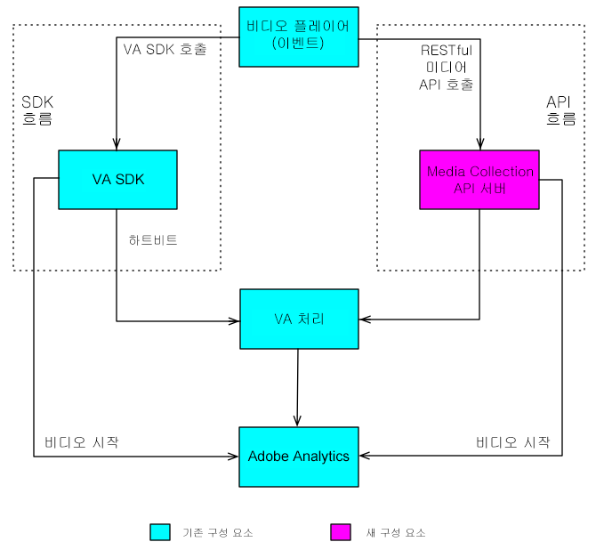

# 개요{#overview}

Media Collection API는 고객 측 Media SDK에 대한 Adobe의 RESTful 대안입니다. Media Collection API를 사용하면 플레이어에서 RESTful HTTP 호출을 사용하여 오디오 및 비디오 이벤트를 추적할 수 있습니다.

Media Collection API는 본질적으로 Media SDK의 서버 측 버전 역할을 하는 어댑터입니다. 즉, Media SDK 설명서의 일부 측면이 Media Collection API와 관련되어 있습니다. 예를 들어, 두 솔루션은 동일한 [오디오 및 비디오 매개 변수](/help/metrics-and-metadata/audio-video-parameters.md)를 사용하고, 수집된 오디오 및 비디오 추적 데이터는 동일한 [보고 및 분석](/help/media-reports/media-reports-enable.md)으로 이어집니다.

## 미디어 추적 데이터 흐름 {#media-tracking-data-flows}

Media Collection API를 구현하는 미디어 플레이어는 미디어 추적 백 엔드 서버에 직접 RESTful API 추적 호출을 수행하지만, Media SDK를 구현하는 플레이어는 플레이어 앱 내의 SDK API에 대한 추적 호출을 수행합니다. 웹을 통해 호출하면 Media Collection API를 구현하는 플레이어가 Media SDK에서 자동으로 처리하는 과정의 일부를 처리해야 합니다. ([Media Collection 구현](mc-api-impl/mc-api-quick-start.md)의 세부 사항)

Media Collection API로 캡처된 추적 데이터는 전송되고 Media SDK 플레이어에서 캡처된 추적 데이터와 처음에는 다르게 처리되지만, 백 엔드에서 동일한 처리 엔진이 두 솔루션에 모두 사용됩니다.



## API 개요 {#api-overview}

**URI:** Adobe 담당자에게서 얻습니다.

**HTTP 메서드:** JSON 요청 본문이 있는 POST

### API 호출 {#mc-api-calls}

* **`sessions`-**서버의 세션을 설정하고, 후속`events`호출에 사용된 세션 ID를 반환합니다. 앱에서 추적 세션이 시작될 때 이 ID를 한 번 호출합니다.

   ```
   {uri}/api/v1/sessions
   ```

* **`events`-**미디어 추적 데이터를 보냅니다.

   ```
   {uri}/api/v1/sessions/{session-id}/events
   ```

### 요청 본문 {#mc-api-request-body}

```
{
    "playerTime": {
        "playhead": {playhead position in seconds},
        "ts": {timestamp in milliseconds}
    },
    "eventType": {event-type},
    "params": {
        {parameter-name}: {parameter-value},
        ...
        {parameter-name}: {parameter-value}
    },
    "qoeData" : {
        {parameter-name}: {parameter-value},
        ...
        {parameter-name}: {parameter-value}
    },
    "customMetadata": {
        {parameter-name}: {parameter-value},
        ...
        {parameter-name}: {parameter-value}
    }
}
```

* `playerTime` - 모든 요청에 필수입니다.
* `eventType` - 모든 요청에 필수입니다.
* `params` - 특정 `eventTypes`에 필수입니다. [JSON 유효성 검사 스키마](mc-api-ref/mc-api-json-validation.md)에서 필수 eventTypes과 옵션 eventTypes를 확인합니다.

* `qoeData` - 모든 요청에 선택 사항입니다.
* `customMetadata` - 모든 요청에 선택 사항이지만, `sessionStart`, `adStart` 및 `chapterStart` 이벤트 유형과 함께 전송됩니다.

각 `eventType`의 경우 매개 변수 유형을 확인하고 매개 변수가 특정 이벤트에 필수인지 또는 선택 사항인지 확인하는 데 사용해야 하는 [JSON 유효성 검사 스키마](mc-api-ref/mc-api-json-validation.md)가 있으며, 이 스키마는 공개적으로 제공됩니다.

### 이벤트 유형을 참조하십시오 {#mc-api-event-types}

* `sessionStart`
* `play`
* `ping`
* `pauseStart`
* `bufferStart`
* `adStart`
* `adComplete`
* `adSkip`
* `adBreakStart`
* `adBreakComplete`
* `chapterStart`
* `chapterSkip`
* `chapterComplete`
* `sessionEnd`
* `sessionComplete`
