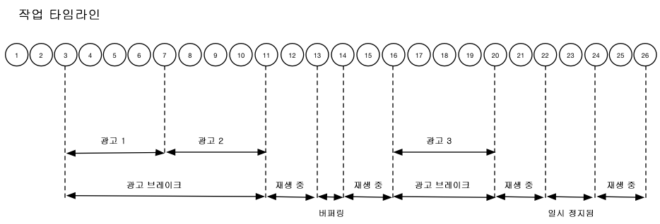

# 타임라인 1 - 컨텐츠 끝까지 보기{#timeline-view-to-end-of-content}

## VOD, 프리롤 광고, 일시 정지, 버퍼링, 컨텐츠 끝까지 보기

다음 다이어그램에서는 사용자의 동작에 대한 재생 헤드 타임라인과 코믹한 타임라인을 보여줍니다. 각 작업에 대한 세부 사항과 그에 수반되는 요청이 아래에 나와 있습니다.





## 작업 세부 사항

### Action 1 - Start session {#Action-1}

| Action | 작업 타임라인(초) | 플레이헤드 위치(초) | 클라이언트 요청 |
| --- | :---: | :---: | --- |
| 자동 재생 또는 재생 단추를 누르면 비디오가 로드되기 시작합니다. | 0 | 0 | `/api/v1/sessions` |

**구현 세부 사항**

이 호출은 비디오를 _재생하도록 사용자에게 신호_&#x200B;를 보냅니다. <br/><br/>세션 내의 모든 후속 추적 호출을 식별하는 데 사용되는 클라이언트에 세션 ID ( `{sid}`) 를 반환합니다. 플레이어 상태가 아직 "재생 중"이 아니라 "시작 중"입니다. <br/><br/>[필수 세션 매개 변수](/help/media-collection-api/mc-api-ref/mc-api-sessions-req.md)는 요청 본문의 `params` 맵에 포함해야 합니다. <br/><br/>백엔드에서 이 호출은 Adobe Analytics 시작 호출을 생성합니다.

**샘플 요청 본문**

```
{
    playerTime: {
        playhead: 0, ts: <timestamp>
    },
    eventType:sessionStart, params: {
        "media.playerName": "sample-html5-api-player",
        "analytics.trackingServer": "[ _YOUR_TS_ ]",
        "analytics.reportSuite": "[ _YOUR_RSID_ ]",
        "analytics.visitorId": "[ _YOUR_VISITOR_ID_ ]",
        "media.contentType": "VOD",
        "media.length": 60.3333333333333,
        "media.id": "VA API Sample Player",
        "visitor.marketingCloudOrgId": "[YOUR_MCID]",
        "media.name": "ClickMe",
        "media.channel": "sample-channel",
        "media.sdkVersion": "va-api-0.0.0",
        "analytics.enableSSL": false
    }
}
```

### Action 2 - Ping timer start {#Action-2}

| Action | 작업 타임라인(초) | 플레이헤드 위치(초) | 클라이언트 요청 |
| --- | :---: | :---: | --- |
| 앱이 ping 이벤트 타이머 시작 | 0 | 0 | `/api/v1/sessions/{sid}/events` |  |

**구현 세부 정보**

앱의 Ping 타이머를 시작합니다. 사전 롤 광고가 있는 경우 첫 번째 ping 이벤트가 1 초 이내에 실행되고 그렇지 않으면 10 초가 발생합니다.

### Action 3 - Ad break start {#Action-3}

| Action | 작업 타임라인(초) | 플레이헤드 위치(초) | 클라이언트 요청 |
| --- | :---: | :---: | --- |
| 프리롤 광고 브레이크 추적 시작 | 0 | 0 | `/api/v1/sessions/{sid}/events` |

**구현 세부 사항**

광고는 광고 브레이크 내에서만 추적할 수 있습니다.

**샘플 요청 본문**

```
{
    playerTime: {
        playhead: 0,
        ts: <timestamp>
    },
    eventType:adBreakStart, params: {
        "media.ad.podFriendlyName": "ad_pod1",
        "media.ad.podIndex": 0,
        "media.ad.podSecond": 0
    }
}
```

### Action 4 - Ad start {#Action-4}

| Action | 작업 타임라인(초) | 플레이헤드 위치(초) | 클라이언트 요청 |
| --- | :---: | :---: | --- |
| 프리롤 광고 1 시작 | 0 | 0 | `/api/v1/sessions/{sid}/events` |

**구현 세부 사항**

첫 번째 프리롤 광고 추적을 시작합니다(15초). 이 `adStart`에 사용자 지정 메타데이터를 포함합니다.

**샘플 요청 본문**

```
{
    playerTime: {
        playhead: 0,
        ts: &lt;timestamp&gt;
    },
    eventType:adStart,
    params: {
        "media.ad.podFriendlyName": "ad_pod1",
        "media.ad.name": "Ad 1",
        "media.ad.id": "001",
        "media.ad.length": 15,
        "media.ad.podPosition": 1,
        "media.ad.playerName": "Sample Player",
        "media.ad.advertiser": "Ad Guys",
        "media.ad.campaignId": "1",
        "media.ad.creativeId": "42",
        "media.ad.siteId": "XYZ",
        "media.ad.creativeURL": "https://xyz_creative.com",
        "media.ad.placementId": "sample_placement"
    },
    customMetadata: {
        "myCustomData1": "CustomData1",
        "myCustomData2": "CustomData2"
    }
}
```

### Action 5 - Ad pings {#Action-5}

#### Action 5.1 - Ad ping 1 {#Action-5-1}

| Action | 작업 타임라인(초) | 플레이헤드 위치(초) | 클라이언트 요청 |
| --- | :---: | :---: | --- |
| 앱에서 ping 이벤트 보내기 | 1 | 0 | `/api/v1/sessions/{sid}/events` |

**구현 세부 사항**

광고 내에서 1 초 간격으로 백엔드를 ping 합니다.

**샘플 요청 본문**

```
{
    playerTime: {
        playhead: 0,
        ts: <timestamp>
    },
    eventType:ping
}
```

#### Action 5.2 - Ad ping 2 {#Action-5-2}

| Action | 작업 타임라인(초) | 플레이헤드 위치(초) | 클라이언트 요청 |
| --- | :---: | :---: | --- |
| 앱에서 ping 이벤트 보내기 | 2 | 0 | `/api/v1/sessions/{sid}/events` |

**구현 세부 사항**

광고 내에서 1 초 간격으로 백엔드를 ping 합니다.

**샘플 요청 본문**

```
{
    playerTime: {
        playhead: 0,
        ts: <timestamp>
    },
    eventType:ping
}
```

#### Action 5.3 - Ad ping 3 {#Action-5-3}


| Action | 작업 타임라인(초) | 플레이헤드 위치(초) | 클라이언트 요청 |
| --- | :---: | :---: | --- |
| 앱에서 ping 이벤트 보내기 | 3 | 0 | `/api/v1/sessions/{sid}/events` |

**구현 세부 사항**

광고 내에서 1 초 간격으로 백엔드를 ping 합니다.

>[!NOTE]
>
>타임라인의 후속 광고는 1 초 ping 시리즈 표시 생략
>편리성

**샘플 요청 본문**

```
{
    playerTime: {
        playhead: 0,
        ts: <timestamp>
    },
    eventType:ping
}
```

### Action 6 - Ad complete {#Action-6}

| Action | 작업 타임라인(초) | 플레이헤드 위치(초) | 클라이언트 요청 |
| --- | :---: | :---: | --- |
| 프리롤 광고 1 추적 완료 | 15 | 0 | `/api/v1/sessions/{sid}/events` |

**구현 세부 사항**

첫 번째 프리롤 광고의 끝을 추적합니다.

**샘플 요청 본문**

```
{
    playerTime: {
        playhead: 0,
        ts: <timestamp>
    },
    eventType:adComplete
}
```

### Action 7 - Ad start {#Action-7}

| Action | 작업 타임라인(초) | 플레이헤드 위치(초) | 클라이언트 요청 |
| --- | :---: | :---: | --- |
| 프리롤 광고 2 추적 시작 | 15 | 0 | `/api/v1/sessions/{sid}/events` |

**구현 세부 사항**

두 번째 프리롤 광고의 시작을 추적합니다(7초).

**샘플 요청 본문**

```
{
    playerTime: {
        playhead: 0,
        ts: <timestamp>
    },
    eventType:adStart, params: {
        "media.ad.podFriendlyName": "ad_pod1",
        "media.ad.name": "Ad 2",
        "media.ad.id": "002",
        "media.ad.length": 7,
        "media.ad.podPosition": 1,
        "media.ad.playerName": "Sample Player",
        "media.ad.advertiser": "Ad Guys",
        "media.ad.campaignId": "2",
        "media.ad.creativeId": "44",
        "media.ad.siteId": "XYZ",
        "media.ad.creativeURL": "https://xyz_creative.com",
        "media.ad.placementId": "sample_placement2"
    },
}
```

### Action 8 - Ad pings {#Action-8}

| Action | 작업 타임라인(초) | 플레이헤드 위치(초) | 클라이언트 요청 |
| --- | :---: | :---: | --- |
| 앱에서 ping 이벤트 보내기 | 20 | 0 | `/api/v1/sessions/{sid}/events` |

**구현 세부 사항**

1 초 간격으로 백엔드를 ping 합니다.

**샘플 요청 본문**

```
{
    playerTime: {
        playhead: 0,
        ts: <timestamp>
    },
    eventType:ping
}
```

### Action 9 - Ad complete {#Action-9}

| Action | 작업 타임라인(초) | 플레이헤드 위치(초) | 클라이언트 요청 |
| --- | :---: | :---: | --- |
| 프리롤 광고 2 추적 완료 | 22 | 0 | `/api/v1/sessions/{sid}/events` |

**구현 세부 사항**

두 번째 프리롤 광고의 끝을 추적합니다.

**샘플 요청 본문**

```
{
    playerTime: {
        playhead: 0,
        ts: <timestamp>
    },
    eventType:adComplete
}
```

### Action 10 - Ad break complete {#Action-10}

| Action | 작업 타임라인(초) | 플레이헤드 위치(초) | 클라이언트 요청 |
| --- | :---: | :---: | --- |
| 프리롤 광고 브레이크 추적 완료 | 22 | 0 | `/api/v1/sessions/{sid}/events` |

**구현 세부 사항**

광고 브레이크가 끝났습니다. 광고 브레이크 전 기간 동안 재생 상태가 "재생 중"으로 남아 있습니다.

**샘플 요청 본문**

```
{
    playerTime: {
        playhead: 0,
        ts: <timestamp>
    },
    eventType:adBreakComplete
}
```

### Action 11 - Play content {#Action-11}

| Action | 작업 타임라인(초) | 플레이헤드 위치(초) | 클라이언트 요청 |
| --- | :---: | :---: | --- |
| 재생 이벤트 추적 | 22 | 0 | `/api/v1/sessions/{sid}/events` |

**구현 세부 사항**

`adBreakComplete` 이벤트 다음에 `play` 이벤트를 사용하여 플레이어를 "재생 중" 상태에 둡니다.

**샘플 요청 본문**

```
{
    playerTime: {
        playhead: 0,
        ts: <timestamp>
    },
    eventType:play
}
```

### Action 12 - Ping {#Action-12}

| Action | 작업 타임라인(초) | 플레이헤드 위치(초) | 클라이언트 요청 |
| --- | :---: | :---: | --- |
| 앱에서 ping 이벤트 보내기 | 30 | 8 | `/api/v1/sessions/{sid}/events` |

**구현 세부 사항**

10초마다 백엔드를 ping합니다.

**샘플 요청 본문**

```
{
    playerTime: {
        playhead: 8,
        ts: <timestamp>
    },
    eventType:ping
}
```

### Action 13 - Buffer start {#Action-13}

| Action | 작업 타임라인(초) | 플레이헤드 위치(초) | 클라이언트 요청 |
| --- | :---: | :---: | --- |
| 버퍼 시작 이벤트 발생 | 33 | 11 | `/api/v1/sessions/{sid}/events` |

**구현 세부 사항**

플레이어의 "버퍼링" 상태 이동을 추적합니다.

**샘플 요청 본문**

```
{
    playerTime: {
        playhead: 11,
        ts: <timestamp>
    }, eventType:bufferStart
}
```

### Action 14 - Buffer end {#Action-14}

| Action | 작업 타임라인(초) | 플레이헤드 위치(초) | 클라이언트 요청 |
| --- | :---: | :---: | --- |
| 버퍼링이 종료되면 앱이 컨텐츠 재개를 추적합니다. | 36 | 11 | `/api/v1/sessions/{sid}/events` |

**구현 세부 사항**

버퍼링은 3초 후에 종료되므로 플레이어를 "재생 중" 상태로 되돌려 놓습니다. 버퍼링에서 나온 다른 추적 재생 이벤트를 보내야 합니다.  **After After`play``bufferStart`A는 백엔드에 대한 "bufferend" 호출을 호출하므로** `bufferEnd` 이벤트를 할 필요가 없습니다.

**샘플 요청 본문**

```
{
    playerTime: {
        playhead: 11,
        ts: <timestamp>
    },
    eventType:play
}
```

### Action 15 - Ping {#Action-15}

| Action | 작업 타임라인(초) | 플레이헤드 위치(초) | 클라이언트 요청 |
| --- | :---: | :---: | --- |
| 앱에서 ping 이벤트 보내기 | 40 | 15 | `/api/v1/sessions/{sid}/events` |

**구현 세부 사항**

10초마다 백엔드를 ping합니다.

**샘플 요청 본문**

```
{
    playerTime: {
        playhead: 15,
        ts: <timestamp>
    }, eventType:ping
}
```

### Action 16 - Ad break start {#Action-16}

| Action | 작업 타임라인(초) | 플레이헤드 위치(초) | 클라이언트 요청 |
| --- | :---: | :---: | --- |
| 미드롤 광고 브레이크 추적 시작 | 46 | 21 | `/api/v1/sessions/{sid}/events` |

**구현 세부 사항**

8초 동안의 미드롤 광고: `adBreakStart`를 보냅니다.

**샘플 요청 본문**

```
{
    playerTime: {
        playhead: 21,
        ts: <timestamp>
    },
    eventType:adBreakStart,
    params: {
        "media.ad.podFriendlyName": "ad_pod2",
        "media.ad.podIndex": 1,
        "media.ad.podSecond": 21
    }
}
```

### Action 17 - Ad start {#Action-17}

| Action | 작업 타임라인(초) | 플레이헤드 위치(초) | 클라이언트 요청 |
| --- | :---: | :---: | --- |
| 미드롤 광고 3 추적 시작 | 46 | 21 | `/api/v1/sessions/{sid}/events` |

**구현 세부 사항**

미드롤 광고를 추적합니다.

**샘플 요청 본문**

```
{
    playerTime: {
        playhead: 21,
        ts: <timestamp>
    },
    eventType:adStart, params: {
        "media.ad.podFriendlyName": "ad_pod2",
        "media.ad.name": "Ad 3",
        "media.ad.id": "003",
        "media.ad.length": 8,
        "media.ad.podPosition": 2,
        "media.ad.playerName": "Sample Player",
        "media.ad.advertiser": "Ad Guys",
        "media.ad.campaignId": "7",
        "media.ad.creativeId": "40",
        "media.ad.siteId": "XYZ",
        "media.ad.creativeURL": "https://xyz_creative.com",
        "media.ad.placementId": "sample_placement2"
    },
}
```

### Action 18 - Ad ping {#Action-18}

| Action | 작업 타임라인(초) | 플레이헤드 위치(초) | 클라이언트 요청 |
| --- | :---: | :---: | --- |
| 앱에서 ping 이벤트 보내기 | 50 | 21 | `/api/v1/sessions/{sid}/events` |

**구현 세부 사항**

10초마다 백엔드를 ping합니다.

**샘플 요청 본문**

```
{
    playerTime: {
        playhead: 21,
        ts: <timestamp>
    }, eventType:ping
}
```

### Action 19 - Ad complete {#Action-19}

| Action | 작업 타임라인(초) | 플레이헤드 위치(초) | 클라이언트 요청 |
| --- | :---: | :---: | --- |
| 미드롤 광고 1 추적 완료 | 54 | 21 | `/api/v1/sessions/{sid}/events` |

**구현 세부 사항**

미드롤 광고가 완료되었습니다.

**샘플 요청 본문**

```
{
    playerTime: {
        playhead: 21,
        ts: <timestamp>
    },
    eventType:adComplete
}
```

### Action 20 - Ad break complete {#Action-20}

| Action | 작업 타임라인(초) | 플레이헤드 위치(초) | 클라이언트 요청 |
| --- | :---: | :---: | --- |
| 미드롤 광고 브레이크 추적 완료 | 54 | 21 | `/api/v1/sessions/{sid}/events` |

**구현 세부 사항**

광고 브레이크가 완료되었습니다.

**샘플 요청 본문**

```
{
    playerTime: {
        playhead: 21,
        ts: <timestamp>
    },
    eventType:adBreakComplete
}
```

### Action 21 - Ping {#Action-21}

| Action | 작업 타임라인(초) | 플레이헤드 위치(초) | 클라이언트 요청 |
| --- | :---: | :---: | --- |
| 앱에서 ping 이벤트 보내기 | 60 | 27 | `/api/v1/sessions/{sid}/events` |

**구현 세부 사항**

10초마다 백엔드를 ping합니다.

**샘플 요청 본문**

```
{
    playerTime: {
        playhead: 27,
        ts: <timestamp>
    },
    eventType:ping
}
```

### Action 22 - Pause {#Action-22}

| Action | 작업 타임라인(초) | 플레이헤드 위치(초) | 클라이언트 요청 |
| --- | :---: | :---: | --- |
| 사용자가 일시 정지를 누름 | 64 | 31 | `/api/v1/sessions/{sid}/events` |

**구현 세부 사항**

사용자의 작업이 재생 상태를 "일시 정지됨"으로 이동합니다.

**샘플 요청 본문**

```
{
    playerTime: {
        playhead: 31,
        ts: <timestamp>
    },
    eventType:pauseStart
}
```

### Action 23 - Ping {#Action-23}

| Action | 작업 타임라인(초) | 플레이헤드 위치(초) | 클라이언트 요청 |
| --- | :---: | :---: | --- |
| 앱에서 ping 이벤트 보내기 | 70 | 31 | `/api/v1/sessions/{sid}/events` |

**구현 세부 사항**

10초마다 백엔드를 ping합니다. 플레이어가 여전히 "버퍼링" 상태이므로, 사용자 작업이 20초 동안 중단됩니다. 퍼밍...

**샘플 요청 본문**

```
{
    playerTime: {
        playhead: 31,
        ts: <timestamp>
    }, eventType:ping
}
```

### Action 24 - Play {#Action-24}

| Action | 작업 타임라인(초) | 플레이헤드 위치(초) | 클라이언트 요청 |
| --- | :---: | :---: | --- |
| 사용자가 재생을 눌러 기본 컨텐츠를 재개함 | 74 | 31 | `/api/v1/sessions/{sid}/events` |

**구현 세부 사항**

재생 상태를 "재생 중"으로 이동합니다.  **a`play`call after a`pauseStart`infers a "resume" call to the back end,** so there is no `resume` need.

**샘플 요청 본문**

```
{
    playerTime: {
        playhead: 31,
        ts: <timestamp>
    }, eventType:play
}
```

### Action 25 - Ping {#Action-25}

| Action | 작업 타임라인(초) | 플레이헤드 위치(초) | 클라이언트 요청 |
| --- | :---: | :---: | --- |
| 앱에서 ping 이벤트 보내기 | 80 | 37 | `/api/v1/sessions/{sid}/events` |

**구현 세부 사항**

10초마다 백엔드를 ping합니다.

**샘플 요청 본문**

```
{
    playerTime: {
        playhead: 37,
        ts: <timestamp>
    }, eventType:ping
}
```

### Action 26 - Session complete {#Action-26}

| Action | 작업 타임라인(초) | 플레이헤드 위치(초) | 클라이언트 요청 |
| --- | :---: | :---: | --- |
| 사용자가 컨텐츠 보기를 끝까지 완료합니다. | 88 | 45 | `/api/v1/sessions/{sid}/events` |

**구현 세부 사항**

`sessionComplete`를 백엔드에 보내어 사용자가 전체 컨텐츠 보기를 완료했음을 나타냅니다.

**샘플 요청 본문**

```
{
    playerTime: {
        playhead: 45,
        ts: <timestamp>
    }, eventType:sessionComplete
}
```

>[!NOTE]
>
>**이벤트를 찾을 수 없습니까?**- `seekStart` 또는 `seekComplete` 이벤트에 대한 Media Collection API에 명시적인 지원이 없습니다. 최종 사용자가 스크럽할 때 특정 플레이어가 그러한 수많은 이벤트를 생성하므로 수많은 사용자가 백엔드 서비스의 네트워크 대역폭을 쉽게 병목 현상이 발생하기 때문입니다. Adobe는 플레이헤드 위치가 아닌 장치 타임스탬프를 기반으로 한 하트비트 기간을 계산하여 찾기 이벤트에 대한 명시적인 지원을 제공합니다.

