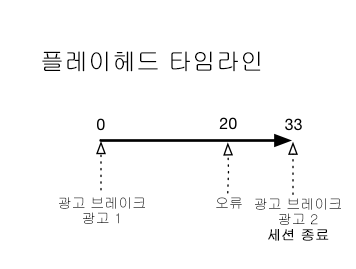
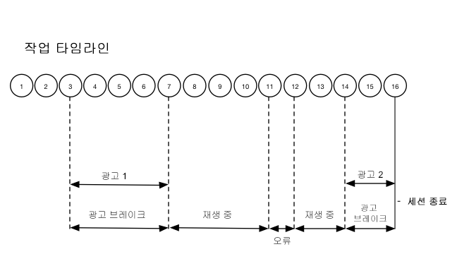

# 타임라인 2 - 사용자가 세션을 중단함 {#timeline--2-user-abandons-session}

## VOD, 프리롤 광고, 미드롤 광고, 사용자가 일찍 컨텐츠를 중단함

다음 다이어그램에서는 재생 헤드 타임라인과 사용자 동작의 해당 타임라인을 보여 줍니다. 각 작업에 대한 세부 사항과 그에 수반되는 요청이 아래에 나와 있습니다.








## 작업 세부 사항

### Action 1 - Start session {#Action-1}

| Action | 작업 타임라인(초) | 플레이헤드 위치(초) | 클라이언트 요청 |
| --- | :---: | :---: | --- |
| 자동 재생 또는 [재생] 단추 누름 | 0 | 0 | `/api/v1/sessions` |

**구현 세부 정보**

이 호출은 비디오를 _재생하도록 사용자에게 신호_&#x200B;를 보냅니다. It returns a Session ID ( `{sid}` ) to the client that is used to identify all subsequent tracking calls within the session. 플레이어 상태가 아직 "재생 중"이 아니라 "시작 중"입니다. [필수 세션 매개 변수](/help/media-collection-api/mc-api-ref/mc-api-sessions-req.md)는 요청 본문의 `params` 맵에 포함해야 합니다.  백엔드에서 이 호출은 Adobe Analytics 시작 호출을 생성합니다.

**샘플 요청 본문**

```
{
    playerTime: {
        playhead: 0,
        ts: <timestamp>
    },
    eventType:sessionStart, params: {
        "media.playerName": "sample-html5-api-player",
        "analytics.trackingServer": "[ _YOUR-TS_ ]",
        "analytics.reportSuite": "[ _YOUR-RSID_ ]",
        "analytics.visitorId": "[ _YOUR-VISITOR-ID_ ]",
        "media.contentType": "VOD",
        "media.length": 60.3333333333333,
        "media.id": "VA API Sample Player",
        "visitor.marketingCloudOrgId": "[YOUR-MCID]",
        "media.name": "ClickMe",
        "media.channel": "sample-channel",
        "media.sdkVersion": "va-api-0.0.0",
        "analytics.enableSSL": false
    }
}
```

### Action 2 - Ping timer start {#Action-2}

| Action | 작업 타임라인(초) | 플레이헤드 위치(초) | 클라이언트 요청 |
| --- | :---: | :---: | --- |
| 앱이 ping 이벤트 타이머 시작 | 0 | 0 |  |

**구현 세부 정보**

앱의 Ping 타이머를 시작합니다. 사전 롤 광고가 있는 경우 첫 번째 ping 이벤트가 1 초 이내에 실행되고 그렇지 않으면 10 초가 발생합니다.

### Action 3 - Ad break start {#Action-3}

| Action | 작업 타임라인(초) | 플레이헤드 위치(초) | 클라이언트 요청 |
| --- | :---: | :---: | --- |
| 프리롤 광고 브레이크 추적 시작 | 0 | 0 | `/api/v1/sessions/{sid}/events` |

**구현 세부 정보**

프리롤 광고를 추적해야 합니다. 광고는 광고 브레이크 내에서만 추적할 수 있습니다.

**샘플 요청 본문**

```
{
    playerTime: {
        playhead: 0,
        ts: <timestamp>
    },
    eventType:adBreakStart, params: {
        "media.ad.podFriendlyName": "ad_pod1",
        "media.ad.podIndex": 0,
        "media.ad.podSecond": 0
    }
}
```

### Action 4 - Ad start {#Action-4}

| Action | 작업 타임라인(초) | 플레이헤드 위치(초) | 클라이언트 요청 |
| --- | :---: | :---: | --- |
| 프리롤 광고 1 시작 | 0 | 0 | `/api/v1/sessions/{sid}/events` |

**구현 세부 정보**

12초 광고가 시작됩니다.

**샘플 요청 본문**

```
{
    playerTime: {
        playhead: 0,
        ts: <timestamp>
    },
    eventType:adStart, params: {
        "media.ad.podFriendlyName": "ad_pod1",
        "media.ad.name": "Ad 1",
        "media.ad.id": "002",
        "media.ad.length": 7,
        "media.ad.podPosition": 1,
        "media.ad.playerName": "Sample Player",
        "media.ad.advertiser": "Ad Guys",
        "media.ad.campaignId": "1",
        "media.ad.creativeId": "42",
        "media.ad.siteId": "XYZ",
        "media.ad.creativeURL": "https://xyz-creative.com",
        "media.ad.placementId": "sample-placement2"
    },
}
```

### Action 5 - Ad pings {#Action-5}

| Action | 작업 타임라인(초) | 플레이헤드 위치(초) | 클라이언트 요청 |
| --- | :---: | :---: | --- |
| 앱에서 ping 이벤트 보내기 | 1 | 0 | `/api/v1/sessions/{sid}/events` |

**구현 세부 정보**

1 초 간격으로 백엔드를 ping 합니다. (편의상 표시되지 않는 후속 광고 ping.)

**샘플 요청 본문**

```
{
    playerTime: {
        playhead: 0,
        ts: <timestamp>
    },
    eventType:ping
}
```

### Action 6 - Ad complete {#Action-6}

| Action | 작업 타임라인(초) | 플레이헤드 위치(초) | 클라이언트 요청 |
| --- | :---: | :---: | --- |
| 프리롤 광고 1 추적 완료 | 12 | 0 | `/api/v1/sessions/{sid}/events` |

**구현 세부 정보**

첫 번째 프리롤 광고가 끝났습니다.

**샘플 요청 본문**

```
{
    playerTime: {
        playhead: 0,
        ts: <timestamp>
    },
    eventType:adComplete
}
```

### Action 7 - Ad break complete {#Action-7}

| Action | 작업 타임라인(초) | 플레이헤드 위치(초) | 클라이언트 요청 |
| --- | :---: | :---: | --- |
| 프리롤 광고 브레이크 추적 완료 | 12 | 0 | `/api/v1/sessions/{sid}/events` |

**구현 세부 정보**

광고 브레이크가 끝났습니다. 광고 프레이크 전체에서 플레이어가 "재생 중" 상태에 남아 있습니다.

**샘플 요청 본문**

```
{
    playerTime: {
        playhead: 0,
        ts: <timestamp>
    },
    eventType:adBreakComplete
}
```

### Action 8 - Play content {#Action-8}

| Action | 작업 타임라인(초) | 플레이헤드 위치(초) | 클라이언트 요청 |
| --- | :---: | :---: | --- |
| 재생 이벤트 추적 | 12 | 0 | `/api/v1/sessions/{sid}/events` |

**구현 세부 정보**

플레이어를 "재생 중" 상태로 이동하고, 컨텐츠 재생 시작을 추적하기 시작합니다.

**샘플 요청 본문**

```
{
    playerTime: {
        playhead: 0,
        ts: <timestamp>
    },
    eventType:play,
    qoeData: { bitrate: 10000 }
}
```

### Action 9 - Ping {#Action-9}

| Action | 작업 타임라인(초) | 플레이헤드 위치(초) | 클라이언트 요청 |
| --- | :---: | :---: | --- |
| 앱에서 ping 이벤트 보내기 | 20 | 8 | `/api/v1/sessions/{sid}/events` |

**구현 세부 정보**

10초마다 백엔드를 ping합니다.

**샘플 요청 본문**

```
{
    playerTime: {
        playhead: 8ß,
        ts: <timestamp>
    },
    eventType:ping
}
```

### Action 10 - Ping {#Action-10}

| Action | 작업 타임라인(초) | 플레이헤드 위치(초) | 클라이언트 요청 |
| --- | :---: | :---: | --- |
| 앱에서 ping 이벤트 보내기 | 30 | 18 | `/api/v1/sessions/{sid}/events` |

**구현 세부 정보**

10초마다 백엔드를 ping합니다.

**샘플 요청 본문**

```
{
    playerTime: {
        playhead: 18,
        ts: <timestamp>
    },
    eventType:ping
}
```

### Action 11 - Error {#Action-11}

| Action | 작업 타임라인(초) | 플레이헤드 위치(초) | 클라이언트 요청 |
| --- | :---: | :---: | --- |
| 오류가 발생하여, 앱에서 오류 정보를 보냅니다. | 32 | 20 | `/api/v1/sessions/{sid}/events` |

**구현 세부 정보**


**샘플 요청 본문**

```
{
    playerTime: {
        playhead: 20,
        ts: <timestamp>
    },
    eventType:error
}
```

### Action 12 - Play content {#Action-12}

| Action | 작업 타임라인(초) | 플레이헤드 위치(초) | 클라이언트 요청 |
| --- | :---: | :---: | --- |
| 앱이 오류에서 복구되어 사용자가 재생을 누름 | 37 | 20 | `/api/v1/sessions/{sid}/events` |

**구현 세부 정보**


**샘플 요청 본문**

```
{
    playerTime: {
        playhead: 18,
        ts: <timestamp>
    },
    eventType:play, qoeData: { bitrate: 10000 }
}
```

### Action 13 - Ping {#Action-13}

| Action | 작업 타임라인(초) | 플레이헤드 위치(초) | 클라이언트 요청 |
| --- | :---: | :---: | --- |
| 앱에서 ping 이벤트 보내기 | 40 | 28 | `/api/v1/sessions/{sid}/events` |

**구현 세부 정보**

10초마다 백엔드를 ping합니다.

**샘플 요청 본문**

```
{
    playerTime: {
        playhead: 28,
        ts: <timestamp>
    },
    eventType:ping
}
```

### Action 14 - Ad break start {#Action-14}

| Action | 작업 타임라인(초) | 플레이헤드 위치(초) | 클라이언트 요청 |
| --- | :---: | :---: | --- |
| 미드롤 광고 브레이크 추적 시작 | 45 | 33 | `/api/v1/sessions/{sid}/events` |

**구현 세부 정보**

8초 동안의 미드롤 광고: `adBreakStart`를 보냅니다.

**샘플 요청 본문**

```
{
    playerTime: {
        playhead: 33,
        ts: <timestamp>
    },
    eventType:adBreakStart, params: {
        "media.ad.podFriendlyName": "ad_pod2",
        "media.ad.podIndex": 1,
        "media.ad.podSecond": 33
    }
}
```

### Action 15 - Ad start {#Action-15}

| Action | 작업 타임라인(초) | 플레이헤드 위치(초) | 클라이언트 요청 |
| --- | :---: | :---: | --- |
| 미드롤 광고 1 추적 시작 | 45 | 33 | `/api/v1/sessions/{sid}/events` |

**구현 세부 정보**

미드롤 광고를 추적합니다.

**샘플 요청 본문**

```
{
    playerTime: { playhead: 33, ts: <timestamp>
    },
    eventType:adStart, params: {
        "media.ad.podFriendlyName": "ad_pod1",
        "media.ad.name": "Ad 1",
        "media.ad.id": "002",
        "media.ad.length": 8,
        "media.ad.podPosition": 1,
        "media.ad.playerName": "Sample Player",
        "media.ad.advertiser": "Ad Guys",
        "media.ad.campaignId": "7",
        "media.ad.creativeId": "40",
        "media.ad.siteId": "XYZ",
        "media.ad.creativeURL": "https://xyz_creative.com",
        "media.ad.placementId": "sample_placement2"
    },
}
```

### Action 16 - Close app {#Action-16}

| Action | 작업 타임라인(초) | 플레이헤드 위치(초) | 클라이언트 요청 |
| --- | :---: | :---: | --- |
| 사용자가 앱을 닫습니다. 앱에서 사용자가 보기를 중단하고 이 세션으로 돌아가지 않았음을 확인했습니다. | 48 | 33 | `/api/v1/sessions/{sid}/events` |

**구현 세부 정보**

`sessionEnd`를 VA 백엔드에 보내어 추가 처리 없이 세션을 즉시 닫아야 한다는 것을 나타냅니다.

**샘플 요청 본문**

```
{
    playerTime: {
        playhead: 33,
        ts: <timestamp>
    },
    eventType:sessionEnd
}
```


