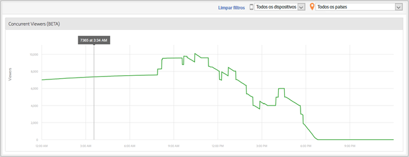

# 미디어 Concurrent Viewer{#media-concurrent-viewers}

미디어 Concurrent Viewer 대시보드는 하루 동안의 동시 뷰어를 표시합니다. 데이터는 컨텐츠, 장치 유형, 국가별로 필터링됩니다.

>[!TIP]
>
> 이 보고서는 동시 활성 미디어 세션을 기반으로 합니다.  세그먼트를 적용하고 분류하고 비교할 수 있는 추가 기능과 함께 고유 방문자별로 동시 뷰어를 보려면 [Analysis Workspace의 미디어 동시 뷰어 패널](https://docs.adobe.com/content/help/ko-KR/analytics/analyze/analysis-workspace/panels/media-concurrent-viewers.html)을 사용하십시오.

## 보고서 기능 {#report-features}

다음은 이 보고서의 몇 가지 기능입니다.

* 실시간으로 표시되지 않습니다. 일반적인 Adobe Analytics 지연이 있습니다.
* 보고서는 24시간 시간 프레임을 다룹니다. x축은 보고서 세트 시간대를 기반으로 하는 시각입니다.
* 이는 분 단위의 세부 기간으로 Concurrent Viewer를 표시합니다.
* 모든 콘텐츠를 보거나 듣는 뷰어 수를 표시하는 *미디어 Concurrent Viewer 보고서*&#x200B;가 있습니다.
* *미디어 세부 사항* 보고서 내에는 하나의 특정 미디어 항목을 보거나 듣는 뷰어 수를 표시하는 Concurrent Viewer 보고서가 있습니다.
* 보고서는 하루 동안만 적용됩니다.
* 고객은 이전 Concurrent Viewer 보고서(하루로 제한됨)를 볼 수 있습니다.

## 제한 사항 {#limitations}

다음은 이 보고서에 대한 몇 가지 제한 사항입니다.

* 선택한 간격이 하루가 아니면 데이터가 표시되지 않습니다.
* ReportBuilder와 같은 데이터는 내보낼 수 없습니다.
* 테이블 형식으로 데이터를 표시할 수 없습니다.
* 보고서를 이메일로 보낼 수 없습니다.
* 광고를 추적하지 않더라도 미디어 추적을 다시 활성화하고 미디어 광고 모듈을 선택해야 합니다.
* 이 기능은 일시 정지 추적 기능이 있는 하트비트 라이브러리를 사용할 때 정확한 데이터를 제공합니다.
