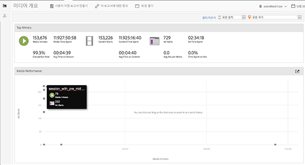
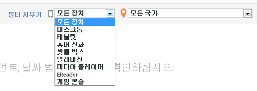
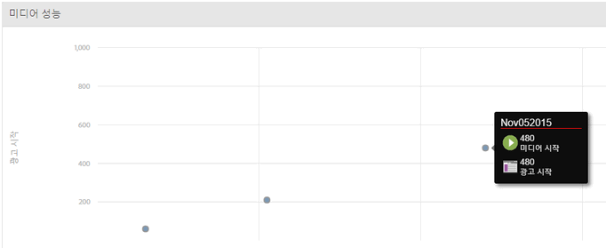

# 미디어 개요{#media-overview}

미디어 개요 대시보드는 사이트에서 미디어를 모니터링할 수 있도록 디자인되었습니다. 미디어 개요 화면은 미디어의 성과가 예상대로인지 신속히 모니터링할 수 있도록 몇 가지 집계 측정을 표시합니다. 각 미디어 항목에 대해 이러한 지표를 빠르게 볼 수 있도록 그래프에서 광고 시작 옆에 컨텐츠 시작이 표시됩니다.

{width="672px"}

## 빠른 필터 {#quick-filters}

장치 또는 지역(국가)별로 미디어 지표를 빠르게 표시합니다.

{width="400px"}

## 미디어 성능 {#media-performance}

클릭하고 드래그하여 확대한 다음 가리키면 특정 미디어에 대한 세부 지표를 볼 수 있습니다. 클릭  

을 클릭하여 확대/축소 후 보기를 재설정합니다.

{width="400px"}

