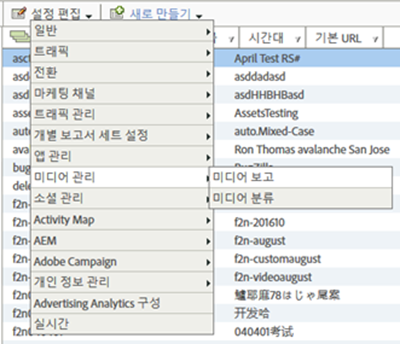

# 미디어 보고서 지원{#media-reports-enablement}

미디어 지표를 수집하는 각 보고서 세트는 미디어 데이터를 보내기 전에 구성해야 합니다.

>[!TIP]
>
>새로운 기능을 활용하려면 기존 Media Analytics 고객은 RSID에 대한 미디어 추적을 다시 활성화해야 합니다.

1. In [Reports &amp; Analytics](https://my.omniture.com/login/) click **[!UICONTROL Admin &gt; Report Suites].**
1. Select the report suite(s) where you are collecting media data and click **[!UICONTROL Edit Settings &gt; Media Management &gt; Media Reporting].**

   {width="400px"}

1. On the **[!UICONTROL Media Reporting]** page, enable **[!UICONTROL Media Core],** and optionally enable **[!UICONTROL Media Ads],** **[!UICONTROL Media Chapters],** and **[!UICONTROL Media Quality].**

   미디어 측정에는 다음 모듈이 포함되어 있습니다.

   * **미디어 코어**

      핵심 미디어 측정은 미디어 컨텐츠에 사용됩니다.솔루션(또는 사용자 지정) eVar를 사용하여 컨텐츠, 컨텐츠 유형, 컨텐츠 플레이어 이름 및 컨텐츠 채널을 추적합니다. 솔루션(또는 사용자 지정) 이벤트는 미디어 시작, 컨텐츠 시작, 컨텐츠 완료 및 컨텐츠 체류 시간에 사용됩니다.

   * **미디어 광고**

      미디어 광고 측정은 미디어 컨텐츠 내의 광고를 측정하는 데 사용됩니다. 이 광고는 솔루션 eVars를 사용하여 광고, 광고 플레이어 이름, 광고 Pod 및 Pod의 광고 위치를 측정합니다. 솔루션 이벤트는 광고 시작, 광고 완료, 광고 체류 시간 및 비디오 체류 시간에 사용됩니다.

   * **미디어 챕터**

      장 측정은 장 측정에 사용됩니다. 장은 단일 미디어 내의 컨텐츠의 하위 분할입니다. 이 챕터는 솔루션 eVar를 사용하여 챕터 ID를 저장합니다. 솔루션 이벤트는 챕터 시작, 챕터 완료 및 챕터 체류 시간에 사용됩니다. 챕터 이름 및 챕터 위치의 추가 챕터 메타데이터는 챕터 ID의 분류로 제공됩니다.

   * **미디어 품질**

      비디오 품질 측정은 컨텐츠 재생 품질을 측정하는 데 사용됩니다. 이 품질은 솔루션 eVar를 사용하여 시작 시간, 버퍼 이벤트, 총 버퍼 지속 시간, 비트율 스위치, 평균 비트율, 오류 및 드롭된 프레임을 저장합니다. 솔루션 이벤트는 시작 시간, 시작 전 드롭, 버퍼 영향을 받은 스트림, 버퍼 이벤트, 총 버퍼 지속 시간, 비트율 변경의 영향을 받은 스트림, 비트율 변경, 평균 비트율, 오류 영향을 받은 스트림, 오류 이벤트, 드롭된 프레임 영향을 받은 스트림 및 드롭된 프레임에 사용됩니다.

   * **비디오 및 비디오 광고 메타데이터**

      메타데이터를 미디어 및/또는 광고에 연결하여 해당 미디어/광고를 자세히 설명하고 분류할 수 있습니다. 표준화된 미디어 및 광고 메타데이터는 솔루션 변수 및 분류를 통해 수집됩니다. 포함할 값은 Show, Season, Episode, Asset ID, Genre, First Air Date, First Digital Date, Content Rating, Originator, Network, Show Type, Ad Loads, MVPD, Authorized, Day Part, Media Session ID, Advertiser, Campaign ID 및 Creative ID입니다.

   * **오디오 및 오디오 광고 메타데이터**

      메타데이터를 오디오 및/또는 광고에 연결하여 해당 오디오/광고에 대해 추가 설명하거나 분류할 수 있습니다. 표준화된 오디오 및 광고 메타데이터는 솔루션 변수 및 분류를 통해 수집됩니다. 해당 값에는 아티스트, 앨범, 레이블, 작가, 게시자, 방송국, 표시, 시즌, 에피소드, 자산 ID, 장르, 최초 방송 날짜, 최초 디지털 날짜, 컨텐츠 등급, 작성자, 표시 유형, 광고 로드, 방송 시간대, 미디어 세션 ID, 광고주, 캠페인 ID 및 크리에이티브 ID가 포함됩니다.
   각 모듈을 활성화하면 변수 세트가 예약되고 새로운 보고서 세트가 생성됩니다. 품질 예외를 사용할 경우 해당 구현이 완료되지 않으면 보고서에 데이터가 없습니다. 코어 모듈을 구현하면 품질 모듈을 활성화한 경우 품질 모듈도 구현됩니다.

   광고, 챕터 또는 재생 품질을 아직 추적하지 않은 경우 언제든지 추가 옵션을 활성화할 수 있습니다.

1. **[!UICONTROL 저장을 클릭합니다].**

   If this report suite is already configured to collect media data, after you click **[!UICONTROL Save]**, an additional configuration page is displayed. **[!UICONTROL 미디어 코어 측정]페이지가 표시되면 다음 단계를 계속 진행합니다.**

1. (Conditional) On the **[!UICONTROL Media Core measurement]** page, choose to continue using custom variables or choose to use solution variables.

   | 옵션 | 참고 |
   | --- | --- |
   | 사용자 지정 변수를 계속 사용 | 장점:<ul> <li> **Pros**: 마이그레이션 후에도 컨텐츠 트렌드가 계속 작동합니다. </li> <li> **** 반대:2개의 사용자 지정 eVar 및 3개의 사용자 지정 이벤트를 미디어에 할당해야 합니다. 사용자 지정 eVar 1개와 사용자 지정 이벤트 1개를 다시 사용할 수 있습니다. </li> </ul> 사용자 지정 변수를 계속 사용하려면: <ol> <li>Select **[!UICONTROL Use Custom Variables,]** then click **[!UICONTROL Save.]** </li> <li>When prompted, map your current custom eVars and events and then click **[!UICONTROL Save:]** </li> </ol> |
   | 솔루션 변수로 마이그레이션 | 장점:<ul> <li> **Pros**: 사용자 지정 eVar 3개와 사용자 지정 이벤트 4개를 다시 사용할 수 있습니다. </li> <li> **Cons**: 미디어 보고서에 대한 **모든** 기록 트렌드와 비교가 손실됩니다. 즉, 하트비트로 마이그레이션하기 전에 모든 날짜에 대해 재생되는 컨텐츠 보기 또는 컨텐츠 시간의 트렌드를 파악할 수 없습니다. </li> </ul> **제한 사항:** 이 트렌드를 유지하지 않아도 된다고 확신하지 않는 한 솔루션 변수로 마이그레이션하지 마십시오! 모든 고객은 기록 연속성을 유지해야 하는 경우에만 솔루션 변수를 사용하고 처리 규칙을 사용하여 미디어 데이터를 기존 prop 및 eVar에 지정하는 것이 좋습니다. 솔루션 변수로 마이그레이션하려면솔루션 **[!UICONTROL 변수 사용을]** 선택하고 저장을 **[!UICONTROL 클릭합니다].** 중요    사항:솔루션 변수로 마이그레이션하면 미디어 보고서에 대한 **모든** 내역 트렌드 및 비교가 손실됩니다. |

>[!IMPORTANT]
>
>지표 및 메타데이터 테이블(예: 오디오 및 비디오 매개 변수)에 나열되는 변수에 대한 분류 이름을 [변경하지 마십시오](/help/metrics-and-metadata/audio-video-parameters.md). 이 변수에는 보고/예약 변수가 "분류"로 설명되어 있습니다. 미디어 분류는 보고서 세트가 미디어 추적을 활성화될 때 정의됩니다. Adobe는 수시로 새 속성을 추가하며, 이 경우 고객은 보고서 세트를 다시 활성화하여 새로운 미디어 속성에 액세스해야 합니다. 업데이트 프로세스 동안 Adobe는 변수의 이름을 확인하여 분류를 사용할지 여부를 결정합니다. 누락된 항목이 있으면 Adobe는 누락된 항목을 다시 추가합니다.
