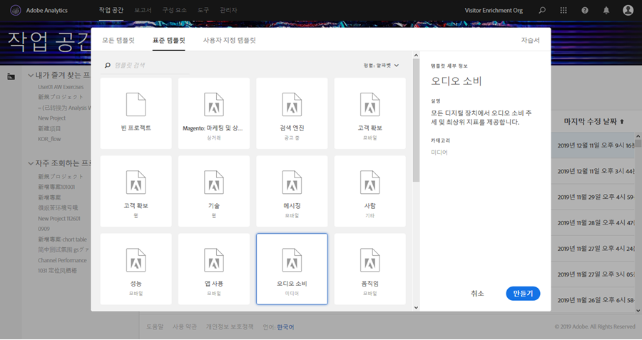
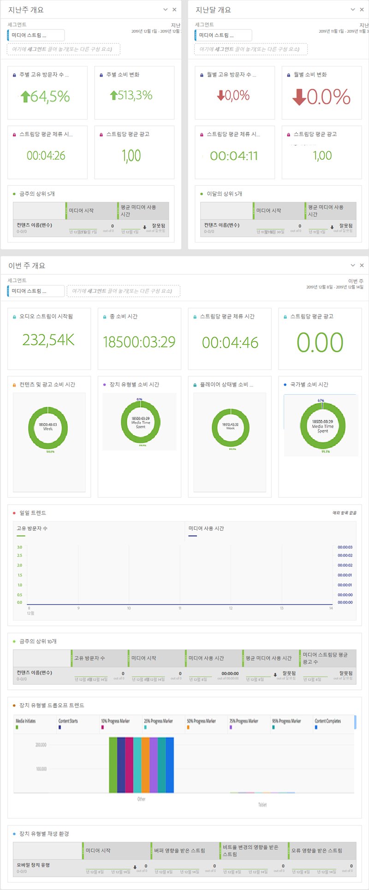

# 미디어 작업 공간 템플릿{#media-workspace-templates}

Adobe Analytics Workspace는 추적 데이터를 분석할 수 있도록 대시보드를 빠르게 설정할 수 있는 기능을 제공합니다. 새 프로젝트를 생성하거나 작업 공간으로 이동하여 기존 프로젝트를 관리하는 경우, 고객 확보, 오디오 및 비디오 이용 등과 같은 일반적인 추적 시나리오에 적용되는 표준 템플릿 중에서 선택할 수 있습니다. 자신만의 사용자 지정 템플릿을 작성, 수정 및 저장할 수도 있습니다.

프로젝트를 작성하거나 관리할 때에는 Adobe Analytics의 [작업 공간] 탭의 템플릿으로 작업합니다. 처음 [작업 공간]으로 이동할 때에는 새 프로젝트를 작성하거나 기존 프로젝트를 여는 선택 사항이 표시됩니다.

* **새 프로젝트 만들기 -** [작업 공간]에서 **[!UICONTROL 새 프로젝트 만들기]단추를 클릭하면 템플릿 컬렉션([표준] 및 [사용자 지정] 포함)에서 선택할 수 있는 대화 상자가 표시됩니다.**

   

   For example, if you choose the **[!UICONTROL Audio Consumption]** template, a project with the following audio-oriented dashboard is presented:

   

* **프로젝트 관리 -** 기존 프로젝트에서 데이터 프레젠테이션을 수정하고 [다른 이름으로 저장]하여 자신만의 사용자 지정 템플릿 컬렉션을 만들 수 있습니다.

