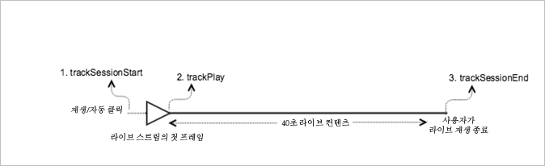

# 라이브 주요 콘텐츠{#live-main-content}

## 시나리오 {#scenario}

이 시나리오에는 라이브 스트림에 참여한 후 40초 동안 광고가 재생되지 않은 라이브 에셋이 한 개 있습니다.

| 트리거 | 하트비트 메서드 | 네트워크 호출 | 참고   |
|---|---|---|---|
| 사용자가 **[!UICONTROL 재생]** 클릭 | `trackSessionStart` | Analytics 콘텐츠 시작, 하트비트 콘텐츠 시작 | **[!UICONTROL 재생]**&#x200B;을 클릭하는 사용자 또는 자동 재생 이벤트일 수 있습니다. |
| 미디어 플레이어의 첫 번째 프레임입니다. | `trackPlay` | 하트비트 콘텐츠 재생 | 이 메서드는 타이머를 트리거합니다. 재생이 계속되는 한 10초마다 하트비트가 전송됩니다. |
| 콘텐츠가 재생됩니다. |  | 콘텐츠 하트비트 |  |
| 세션이 끝남. | `trackSessionEnd` |  | `SessionEnd`는 보고 있는 세션의 종료를 의미합니다. 이 API는 사용자가 미디어를 끝까지 시청하지 않은 경우에도 호출해야 합니다. |

## 매개 변수 {#parameters}

Adobe Analytics 콘텐츠 시작 호출 시 표시되는 같은 값의 대부분이 하트비트 콘텐츠 시작 호출 시에도 표시됩니다. 또한 Adobe에서 Adobe Analytics의 여러 미디어 보고서를 채울 때 사용하는 다른 여러 매개 변수도 표시됩니다. 여기서 그러한 모든 내용을 다루지는 않으며, 실제로 중요한 내용만 다룹니다.

### 하트비트 콘텐츠 시작

| 매개 변수 | 값 | 참고 |
|---|---|---|
| `s:sc:rsid` | &lt;Adobe 보고서 세트 ID> |  |
| `s:sc:tracking_serve` | &lt;Analytics 추적 서버 URL> |  |
| `s:user:mid` | `s:user:mid` | Adobe Analytics 콘텐츠 시작 호출 시 mid 값과 일치해야 함 |
| `s:event:type` | &quot;start&quot; |  |
| `s:asset:type` | &quot;main&quot; |  |
| `s:asset:mediao_id` | &lt;미디어 이름> |  |
| `s:stream:type` | live |  |
| `s:meta:*` | 옵션 | 미디어에서 설정된 사용자 지정 메타데이터 |

## 콘텐츠 하트비트 {#content-heartbeats}

미디어 재생 중에 10초마다(기본 콘텐츠의 경우) 또는 매초마다(광고의 경우) 하나 이상의 하트비트(또는 Ping)를 전송하는 타이머가 있습니다. 이러한 하트비트에 재생, 광고, 버퍼링 및 기타 많은 정보가 포함됩니다. 각 하트비트의 정확한 콘텐츠는 이 문서의 범위를 벗어나며, 유효성을 확인하기 위해 중요한 사항은 재생이 계속되는 동안 하트비트가 일관되게 트리거된다는 것입니다.

콘텐츠 하트비트에서 다음 몇 가지 특정 사항을 찾습니다.

| 매개 변수 | 값 | 참고 |
|---|---|---|
| `s:event:type` | &quot;play&quot; |  |
| `l:event:playhead` | &lt;playhead position> 예: 50, 60, 70 | 플레이헤드의 현재 위치를 반영해야 합니다. |

## 하트비트 콘텐츠 완료 {#heartbeat-content-complete}

라이브 스트림이 완료되지 않았으므로 이 시나리오에는 완료 호출이 없습니다.

## 플레이헤드 값 설정

라이브 스트림의 경우 보고에서 사용자가 24시간 보기 내에서 라이브 스트림에 참여하고 종료하는 시점을 분석가가 결정할 수 있도록 재생 헤드 값을 당일 자정(UTC) 이후 경과된 시간(초 수)으로 설정해야 합니다.

### 시작 시

라이브 미디어의 경우 사용자가 스트림 재생을 시작할 때 `l:event:playhead`를 해당 날짜 자정(UTC) 이후 초 수로 설정해야 합니다. 이는 플레이헤드를 &quot;0&quot;으로 설정한 VOD와 대조적입니다. 참고: 진행률 마커를 사용할 경우 콘텐츠 지속 시간이 필요하며 플레이헤드는 0부터 시작하여 미디어 항목의 시작부터 초 단위로 업데이트해야 합니다.

예를 들어 라이브 스트리밍 이벤트는 자정에 시작해서 24시간 동안 실행된다고 가정합니다(`a.media.length=86400`; `l:asset:length=86400`). 그런 다음 사용자가 오후 12시에 해당 라이브 스트림 재생을 시작한다고 가정합니다. 이 시나리오에서는 `l:event:playhead`를 43200(당일의 자정 UTC 이후 12시간(초 수))으로 설정해야 합니다.

### 일시 중지 시

사용자가 재생을 일시 중지할 때 재생 시작 시 적용된 것과 동일한 &quot;라이브 플레이헤드&quot; 논리를 적용해야 합니다. 사용자가 라이브 스트림을 다시 재생하면 라이브 스트림이 일시 중지된 시점이 _아니라_ 자정(UTC) 이후의 시간(초 수)에 따라 `l:event:playhead` 값을 설정해야 합니다.

## 샘플 코드 {#sample-code}



### Android

다음은 예상 API 호출 순서입니다.

```java
// Set up mediaObject 
MediaObject mediaInfo = MediaHeartbeat.createMediaObject( 
  Configuration.MEDIA_NAME,  
  Configuration.MEDIA_ID,  
  Configuration.MEDIA_LENGTH,  
  MediaHeartbeat.StreamType.LIVE 
); 

HashMap<String, String> mediaMetadata = new HashMap<String, String>(); 
mediaMetadata.put(CUSTOM_VAL_1, CUSTOM_KEY_1); 
mediaMetadata.put(CUSTOM_VAL_2, CUSTOM_KEY_2); 

// 1. Call trackSessionStart() when the user clicks Play or if autoplay is used,  
//    i.e., there is an intent to start playback.  
_mediaHeartbeat.trackSessionStart(mediaInfo, mediaMetadata); 

...... 
...... 

// 2. Call trackPlay() when the playback actually starts, i.e., when the first  
//    frame of main content is rendered on the screen. 
_mediaHeartbeat.trackPlay(); 

....... 
....... 

// 3. Call trackSessionEnd() when user ends the playback session.  
//    Since the user does not watch live media to completion, there  
//    is no need to call trackComplete().  
_mediaHeartbeat.trackSessionEnd(); 
....... 
....... 
```

### iOS

다음은 예상 API 호출 순서입니다.

```
// Set up mediaObject 
ADBMediaObject *mediaObject =  
[ADBMediaHeartbeat createMediaObjectWithName:MEDIA_NAME  
                   length:MEDIA_LENGTH  
                   streamType:ADBMediaHeartbeatStreamTypeLIVE]; 
 
NSMutableDictionary *mediaContextData = [[NSMutableDictionary alloc] init]; 
[mediaContextData setObject:CUSTOM_VAL_1 forKey:CUSTOM_KEY_1]; 
[mediaContextData setObject:CUSTOM_VAL_2 forKey:CUSTOM_KEY_2]; 
 
// 1. Call trackSessionStart when the user clicks Play or if autoplay is used,  
//    i.e., there is an intent to start playback. 
[_mediaHeartbeat trackSessionStart:mediaObject data:mediaContextData]; 
...... 
...... 
 
// 2. Call trackPlay when the playback actually starts, i.e., when the first  
//    frame of the main content is rendered on the screen. 
[_mediaHeartbeat trackPlay]; 
....... 
....... 
 
// 3. Call trackSessionEnd when user ends the playback session. Since the user  
//    does not watch live media to completion, there is no need to call  
//    trackComplete. 
[_mediaHeartbeat trackSessionEnd]; 
........ 
........ 
```

### JavaScript

다음은 예상 API 호출 순서입니다.

```js
// Set up mediaObject 
var mediaInfo =  
MediaHeartbeat.createMediaObject(Configuration.MEDIA_NAME,  
                                 Configuration.MEDIA_ID,  
                                 Configuration.MEDIA_LENGTH,  
                                 MediaHeartbeat.StreamType.VOD); 

var mediaMetadata = { 
  CUSTOM_KEY_1 : CUSTOM_VAL_1,  
  CUSTOM_KEY_2 : CUSTOM_VAL_2,  
  CUSTOM_KEY_3 : CUSTOM_VAL_3 
}; 

// 1. Call trackSessionStart() when Play is clicked or if autoplay  
//    is used, i.e., there's an intent to start playback. 
this._mediaHeartbeat.trackSessionStart(mediaInfo, mediaMetadata); 

...... 
...... 

// 2. Call trackPlay() when the playback actually starts, i.e., when the  
//    first frame of media is rendered on the screen. 
this._mediaHeartbeat.trackPlay(); 

....... 
....... 

// 3. Call trackSessionEnd() when user ends the playback session.  
//    Since user does not watch live media to completion, there is  
//    no need to call trackComplete(). 
this._mediaHeartbeat.trackSessionEnd(); 

........ 
........ 
```
