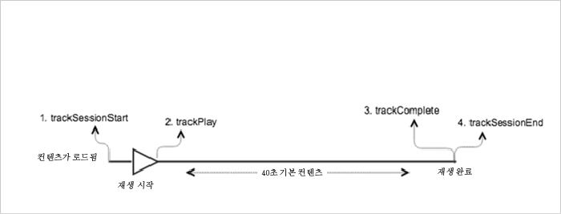

# 광고가 없는 VOD 재생{#vod-playback-with-no-ads}

## 시나리오 {#section_E4B558253AD84ED59256EDB60CED02AE}

이 시나리오에는 광고가 없는 한 개의 VOD 자산이 있으며, 이 VOD는 처음부터 끝까지 한 번 재생됩니다.

| 트리거 | 하트비트 메서드 | 네트워크 호출 | 참고   |
|---|---|---|---|
| User clicks **[!UICONTROL Play]** | `trackSessionStart` | Analytics 컨텐츠 시작, 하트비트 컨텐츠 시작 | [재생]을 클릭하는 사용자 또는 자동 재생 이벤트일 수 있습니다. |
| 미디어의 첫 번째 프레임 | `trackPlay` | 하트비트 컨텐츠 재생 | 이 메서드는 타이머를 트리거하며, 이 시점부터 재생 기간 동안 10초마다 하트비트가 전송됩니다. |
| 컨텐츠 재생 |  | 컨텐츠 하트비트 |  |
| 컨텐츠가 완료됨 | `trackComplete` | 하트비트 컨텐츠 완료 | *완료*&#x200B;란 플레이헤드의 끝에 도달했음을 의미합니다. |

## 매개 변수 {#section_45D7B10031524411B91E2C569F7818B0}

Many of the same values that you see on Heartbeat Content Start Calls are also seen on Adobe Analytics `Content Start` Calls. Adobe에서 다양한 미디어 보고서를 채우는 데 사용하는 매개 변수가 많이 있지만 다음 표에는 가장 중요한 매개 변수만 나열되어 있습니다.

### 하트비트 컨텐츠 시작

| 매개 변수 | 값 | 참고   |
|---|---|---|
| `s:sc:rsid` | &lt;Adobe 보고서 세트 ID&gt; |  |
| `s:sc:tracking_server` | &lt;Analytics 추적 서버 URL&gt; |  |
| `s:user:mid` | 설정해야 함 | 호출의 중간 값과 일치해야 `Adobe Analytics Content Start` 합니다. |
| `s:event:type` | `"start"` |  |
| `s:asset:type` | `"main"` |  |
| `s:asset:media_id` | &lt;미디어 이름&gt; |  |
| `s:meta:*` | 옵션 | 미디어에 설정된 사용자 정의 메타데이터 |

## 하트비트 컨텐츠 재생 {#section_2ABBD51D3A6D45ABA92CC516E414417A}

These parameters should look nearly identical to the `Heartbeat Content Start` call, but the key difference is the `s:event:type` parameter. 다른 매개 변수도 모두 있어야 합니다.

| 매개 변수 | 값 | 참고   |
|---|---|---|
| `s:event:type` | `"play"` |  |
| `s:asset:type` | `"main"` |  |

## 컨텐츠 하트비트 {#section_3B5945336E464160A94518231CEE8F53}

미디어 재생 중에 타이머는 10초마다 최소한 하나의 하트비트를 전송합니다. 이러한 하트비트에는 재생, 광고, 버퍼링 등에 대한 정보가 들어 있습니다. 각 하트비트에 대한 정확한 내용은 이 문서 범위를 벗어나지만, 중요한 문제는 재생이 계속되는 동안 하트비트가 일관되게 트리거되는지 여부입니다.

컨텐츠 하트비트에서 다음 매개 변수를 찾아보십시오.

| 매개 변수 | 값 | 참고   |
|---|---|---|
| `s:event:type` | `"play"` |  |
| `l:event:playhead` | &lt;playhead position&gt; 예: 50,60,70 | 이 매개 변수는 플레이헤드의 현재 위치를 반영합니다. |

## 하트비트 컨텐츠 완료 {#section_33BCC4C3181940C39446A57C25D82179}

When playback has completed, which means that the end of the playhead is reached, a `Heartbeat Content Complete` call is sent. 이 호출은 다른 하트비트 호출과 비슷하지만 몇 가지 특정 매개 변수를 포함합니다.

| 매개 변수 | 값 | 참고   |
|---|---|---|
| `s:event:type` | `"complete"` |  |
| `s:asset:type` | `"main"` |  |

## 샘플 코드 {#section_glq_vw3_x2b}

이 시나리오에서 컨텐츠 길이는 40초이며, 중단 없이 끝까지 재생됩니다.



### Android

```java
// Set up  mediaObject 
MediaObject mediaInfo = MediaHeartbeat.createMediaObject( 
  Configuration.MEDIA_NAME,  
  Configuration.MEDIA_ID,  
  Configuration.MEDIA_LENGTH,  
  MediaHeartbeat.StreamType.VOD 
); 

HashMap<String, String> mediaMetadata = new HashMap<String, String>(); 
mediaMetadata.put(CUSTOM_VAL_1, CUSTOM_KEY_1); 
mediaMetadata.put(CUSTOM_VAL_2, CUSTOM_KEY_2); 

// 1. Call trackSessionStart() when the user clicks Play or if autoplay  
//    is used, i.e., there's an intent to start playback.  
_mediaHeartbeat.trackSessionStart(mediaInfo, mediaMetadata); 

...... 
...... 

// 2. Call trackPlay() when the playback actually starts,  
//    i.e., the first frame of media is rendered on the screen.  
_mediaHeartbeat.trackPlay(); 

....... 
....... 

// 3. Call trackComplete() when the playback reaches the end,  
//    i.e., when the media completes and finishes playing.  
_mediaHeartbeat.trackComplete(); 

........ 
........ 

// 4. Call trackSessionEnd() when the playback session is over.  
//    This method must be called even if the user does not watch  
//    the media to completion.  
_mediaHeartbeat.trackSessionEnd(); 

........ 
........ 
```

### iOS

```
when the user clicks Play 
ADBMediaObject *mediaObject =  
[ADBMediaHeartbeat createMediaObjectWithName:MEDIA_NAME  
                   length:MEDIA_LENGTH  
                   streamType:ADBMediaHeartbeatStreamTypeVOD]; 

NSMutableDictionary *mediaContextData = [[NSMutableDictionary alloc] init]; 
[mediaContextData setObject:CUSTOM_VAL_1 forKey:CUSTOM_KEY_1]; 
[mediaContextData setObject:CUSTOM_VAL_2 forKey:CUSTOM_KEY_2]; 

// 1. Call trackSessionStart when the user clicks Play or if autoplay is used,  
//    i.e., there's an intent to start playback. 
[_mediaHeartbeat trackSessionStart:mediaObject data:mediaContextData]; 
...... 
...... 

// 2. Call trackPlay when the playback actually starts, i.e., when the  
//    first frame of main content is rendered on the screen. 
[_mediaHeartbeat trackPlay]; 
....... 
....... 

// 3. Call trackComplete when the playback reaches the end, i.e.,  
//    when the media completes and finishes playing. 
[_mediaHeartbeat trackComplete]; 
........ 
........ 

// 4. Call trackSessionEnd when the playback session is over. This method  
//    must be called even if the user does not watch the media to completion. 
[_mediaHeartbeat trackSessionEnd]; 
........ 
........ 
```

### JavaScript

```js
// Set up mediaObject 

var mediaInfo = MediaHeartbeat.createMediaObject(Configuration.MEDIA_NAME, Configuration.MEDIA_ID,  
Configuration.MEDIA_LENGTH,MediaHeartbeat.StreamType.VOD); 
var mediaMetadata = { 
  CUSTOM_KEY_1 : CUSTOM_VAL_1,  
  CUSTOM_KEY_2 : CUSTOM_VAL_2,  
  CUSTOM_KEY_3 : CUSTOM_VAL_3 

}; 

// 1. Call trackSessionStart() when the user clicks play, or when autoplay is used,  
//    i.e., there's an intent to start playback. 
this._mediaHeartbeat.trackSessionStart(mediaInfo, mediaMetadata); 

...... 
...... 

// 2. Call trackPlay() when the main content starts, i.e.,  
//    the first frame of the media content is rendered on the screen. 
this._mediaHeartbeat.trackPlay(); 

....... 
....... 

// 3. Call trackComplete() when the playback reaches the end,  
    i.e., the media completes and finishes playing. 
this._mediaHeartbeat.trackComplete(); 

........ 
........ 

// 4. Call trackSessionEnd() when the playback session is over.  
//    This method must be called even if the user does not  
//    watch the media to completion. 
this._mediaHeartbeat.trackSessionEnd(); 

........ 
........
```

