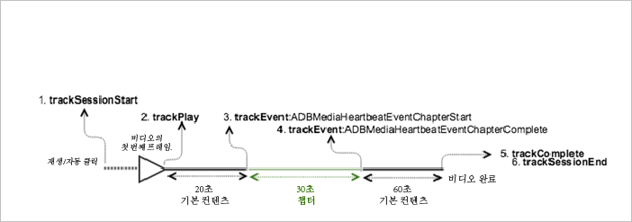
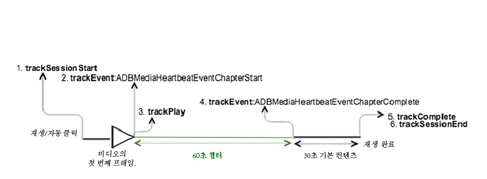

# 한 개의 챕터가 있는 VOD 재생{#vod-playback-with-one-chapter}

## 시나리오 {#section_E4B558253AD84ED59256EDB60CED02AE}

이 시나리오에서는 VOD 컨텐츠 부분이 챕터로 표시됩니다.

명시하지 않은 경우, 이 시나리오의 네트워크 호출은 [광고 없이 VOD 재생](/help/sdk-implement/tracking-scenarios/vod-no-intrs-details.md) 시나리오의 호출과 동일합니다. 네트워크 호출이 동시에 발생하지만 페이로드가 다릅니다.

| 트리거   | 하트비트 메서드   | 네트워크 호출   | 참고   |
|---|---|---|---|
| User clicks **[!UICONTROL Play]** | `trackSessionStart` | Analytics 컨텐츠 시작, 하트비트 컨텐츠 시작 | 측정 라이브러리에 프리롤 광고가 있음을 아직 알리지 않았으므로 이러한 네트워크 호출은 여전히 단일 VOD와 동일합니다. |
| 챕터가 시작됨. | `trackEvent:ChapterStart` | 하트비트 챕터 시작 |  |
| 챕터의 첫 번째 프레임이 재생됨. | `trackPlay` | 하트비트 컨텐츠 재생 | 챕터 컨텐츠가 주 컨텐츠보다 먼저 재생되는 경우 챕터가 시작될 때 하트비트가 시작됩니다. |
| 챕터가 재생됨. |  | 챕터 하트비트 |  |
| 챕터가 완료됨. | `trackEvent:trackChapterComplete` | 하트비트 챕터 완료 | 이는 챕터의 끝에 도달한 때입니다. |
| 컨텐츠가 재생됨. |  | 컨텐츠 하트비트 | 이 네트워크 호출은 [광고 없이 VOD 재생](/help/sdk-implement/tracking-scenarios/vod-no-intrs-details.md) 시나리오와 동일합니다. |
| 컨텐츠가 완료됨. | `trackComplete` | 하트비트 컨텐츠 완료 | 이 네트워크 호출은 [광고 없이 VOD 재생](/help/sdk-implement/tracking-scenarios/vod-no-intrs-details.md) 시나리오와 동일합니다. |
| 세션이 끝남. | `trackSessionEnd` |  | `SessionEnd`는 보고 있는 세션의 끝에 도달했음을 의미합니다. 이 API는 사용자가 완료할 미디어를 보지 않는 경우에도 호출해야 합니다. |

## 매개 변수 {#section_869319D99A474FEA8EA840415EA97FBD}

장 재생이 시작되면 `Heartbeat Chapter Start` 호출이 전송됩니다. If the beginning of the chapter does not coincide with the 10-second timer, the `Heartbeat Chapter Start` call is delayed by a few seconds, and the call goes to the next 10-second interval.

When this happens, a `Content Heartbeat` call goes out in the same interval. 이벤트 유형과 자산 유형을 검사하여 두 호출을 구별할 수 있습니다.

### 하트비트 챕터 시작

| 매개 변수 | 값 | 참고 |
|---|---|---|
| `s:event:type` | `"chapter_start"` |  |
| `s:asset:type` | `"main"` |  |
| `s:stream:chapter_*` |  | 챕터 데이터와 관련된 스트림 정보입니다. |
| `s:meta:*` |  | 특정 컨텍스트 데이터가 있는 챕터입니다. |

## 샘플 코드, 중간에 있는 챕터 {#section_icd_5bj_x2b}

이 시나리오에서는 VOD 컨텐츠의 일부가 챕터입니다.



### Android

Android에서 이 시나리오를 보려면 다음 코드를 설정합니다.

```java
// Set up mediaObject 
MediaObject mediaInfo = MediaHeartbeat.createMediaObject( 
  Configuration.MEDIA_NAME,  
  Configuration.MEDIA_ID,  
  Configuration.MEDIA_LENGTH,  
  MediaHeartbeat.StreamType.VOD 
); 

HashMap<String, String> mediaMetadata = new HashMap<String, String>(); 
mediaMetadata.put(CUSTOM_KEY_1, CUSTOM_VAL_1); 
mediaMetadata.put(CUSTOM_KEY_2, CUSTOM_VAL_2); 

// 1. Call trackSessionStart() when the user clicks Play or if autoplay is used,  
//    i.e., there is an intent to start playback.  
_mediaHeartbeat.trackSessionStart(mediaInfo, mediaMetadata); 

...... 
...... 

// 2. Call trackPlay() when the playback actually starts, i.e., first frame of the  
//    ad media is rendered on the screen. 
_mediaHeartbeat.trackPlay(); 

....... 
....... 

// Chapter 
HashMap<String, String> chapterMetadata = new HashMap<String, String>(); 
chapterMetadata.put(CUSTOM_KEY_1, CUSTOM_VAL_1); 
MediaObject chapterDataInfo =  
MediaHeartbeat.createChapterObject(CHAPTER_NAME,  
                                   CHAPTER_POSITION,  
                                   CHAPTER_LENGTH,  
                                   CHAPTER_START_TIME); 

// 3. Track the MediaHeartbeat.Event.ChapterStart event when the chapter starts to play.  
_mediaHeartbeat.trackEvent(MediaHeartbeat.Event.ChapterStart, chapterDataInfo, chapterMetadata); 

....... 
....... 

// 4. Track the MediaHeartbeat.Event.ChapterComplete event when the chapter finishes playing. 
_mediaHeartbeat.trackEvent(MediaHeartbeat.Event.ChapterComplete, null, null); 

....... 
....... 

// 5. Call trackComplete() when the playback reaches the end, i.e., completes and finishes playing. 
_mediaHeartbeat.trackComplete(); 

........ 
........ 

// 6. Call trackSessionEnd() when the playback session is over. This method must be called even  
//    if the user does not watch the media to completion.  
_mediaHeartbeat.trackSessionEnd(); 

........ 
........ 
```

### iOS

iOS에서 이 시나리오를 보려면 다음 코드를 설정합니다.

```
when the user clicks Play 
ADBMediaObject *mediaObject =  
[ADBMediaHeartbeat createMediaObjectWithName:MEDIA_NAME  
                   length:MEDIA_LENGTH  
                   streamType:ADBMediaHeartbeatStreamTypeVOD]; 
  
NSMutableDictionary *mediaContextData = [[NSMutableDictionary alloc] init]; 
[mediaContextData setObject:CUSTOM_VAL_1 forKey:CUSTOM_KEY_1]; 
[mediaContextData setObject:CUSTOM_VAL_2 forKey:CUSTOM_KEY_2]; 
 
// 1. Call trackSessionStart when the user clicks Play or if autoplay is used,  
//    i.e., when there is an intent to start playback. 
[_mediaHeartbeat trackSessionStart:mediaObject data:mediaContextData]; 
....... 
....... 

// 2. Call trackPlay when the playback actually starts, i.e., when the  
//    first frame of the main content is rendered on the screen. 
[_mediaHeartbeat trackPlay]; 
....... 
....... 

// Chapter 
NSMutableDictionary *chapterContextData = [[NSMutableDictionary alloc] init]; 
[chapterContextData setObject:CONTEXT_DATA_VALUE forKey:CONTEXT_DATA_KEY]; 

id chapterInfo =  
[ADBMediaHeartbeat createChapterObjectWithName:CHAPTER_NAME  
                   position:CHAPTER_POSITION  
                   length:CHAPTER_LENGTH  
                   startTime:CHAPTER_START_TIME]; 
    
// 3. Track the ADBMediaHeartbeatEventChapterStart event when the chapter  
//    starts to play. 
[_mediaHeartbeat trackEvent:ADBMediaHeartbeatEventChapterStart  
               mediaObject:chapterInfo  
               data:chapterContextData]; 
....... 
....... 

// 4. Track the ADBMediaHeartbeatEventChapterComplete event when the chapter  
//    finishes playing. 
[_mediaHeartbeat trackEvent:ADBMediaHeartbeatEventChapterComplete  
               mediaObject:nil  
               data:nil];  
....... 
....... 
// 5. Call trackComplete when the playback reaches the end, i.e., when the  
//    media completes and finishes playing. 
[_mediaHeartbeat trackComplete]; 
....... 
....... 
// 6. Call trackSessionEnd when the playback session is over. This method must  
//    be called even if the user does not watch the media to completion. 
[_mediaHeartbeat trackSessionEnd]; 
....... 
....... 
```

### JavaScript

JavaScript에서 이 시나리오를 보려면 다음 텍스트를 입력하십시오.

```js
// Set up mediaObject 
var mediaInfo = MediaHeartbeat.createMediaObject( 
 Configuration.MEDIA_NAME,  
 Configuration.MEDIA_ID,  
 Configuration.MEDIA_LENGTH,  
 MediaHeartbeat.StreamType.VOD 

); 

var mediaMetadata = { 
  CUSTOM_KEY_1 : CUSTOM_VAL_1,  
  CUSTOM_KEY_2 : CUSTOM_VAL_2,  
  CUSTOM_KEY_3 : CUSTOM_VAL_3 
}; 

// 1. Call trackSessionStart when Play is clicked or if autoplay is used,  
//    i.e., when there's an intent to start playback. 
this._mediaHeartbeat.trackSessionStart(mediaInfo, mediaMetadata); 

...... 
...... 

// Chapter 
var chapterMetadata = { 
  CUSTOM_KEY_1 : CUSTOM_VAL_1 
}; 

var chapterDataInfo =  
MediaHeartbeat.createChapterObject(CHAPTER_NAME,  
                                   CHAPTER_POSITION,  
                                   CHAPTER_LENGTH,  
                                   CHAPTER_START_TIME); 

// 2. Track the MediaHeartbeat.Event.ChapterStart event when the chapter  
//    starts to play. 
this._mediaHeartbeat.trackEvent(MediaHeartbeat.Event.ChapterStart,  
                              chapterDataInfo,  
                              chapterMetadata); 

....... 
....... 

// 3. Call trackPlay() when the playback actually starts, i.e., when the first  
//    frame of the main content is rendered on the screen. 
this._mediaHeartbeat.trackPlay(); 

....... 
....... 

// 4. Track the MediaHeartbeat.Event.ChapterComplete event when the chapter  
//    finishes playing. 
this._mediaHeartbeat.trackEvent(MediaHeartbeat.Event.ChapterComplete); 

....... 
....... 

// 5. Call trackComplete() when the playback reaches the end, i.e., when playback   
//    completes and finishes playing. 
this._mediaHeartbeat.trackComplete(); 

........ 
........ 

// 6. Call trackSessionEnd() when the playback session is over. This method must be  
//    called even if the user does not watch the media to completion. 
this._mediaHeartbeat.trackSessionEnd(); 

........ 
........ 
```

## 샘플 코드, 시작에 있는 챕터 {#section_flj_5bj_x2b}

이 시나리오에서 VOD 컨텐츠는 재생 시작 부분의 한 개의 챕터로 재생됩니다.



### Android

Android에서 이 시나리오를 보려면 다음 코드를 설정합니다.

```java
// Set up mediaObject 
MediaObject mediaInfo = MediaHeartbeat.createMediaObject( 
  Configuration.MEDIA_NAME,  
  Configuration.MEDIA_ID,  
  Configuration.MEDIA_LENGTH,  
  MediaHeartbeat.StreamType.VOD 
); 

HashMap<String, String> mediaMetadata = new HashMap<String, String>(); 
mediaMetadata.put(CUSTOM_KEY_1, CUSTOM_VAL_1); 
mediaMetadata.put(CUSTOM_KEY_2, CUSTOM_VAL_2); 

// 1. Call trackSessionStart() when the user clicks Play or if autoplay is used,  
//    i.e., there is an intent to start playback.  
_mediaHeartbeat.trackSessionStart(mediaInfo, mediaMetadata); 

...... 
...... 

// 2. Call trackPlay() when the playback actually starts, i.e., first frame of the  
//    main content is rendered on the screen. 
_mediaHeartbeat.trackPlay(); 

....... 
....... 

// Chapter 
HashMap<String, String> chapterMetadata = new HashMap<String, String>(); 
chapterMetadata.put(CUSTOM_KEY_1, CUSTOM_VAL_1); 
MediaObject chapterDataInfo =  
MediaHeartbeat.createChapterObject(CHAPTER_NAME,  
                                   CHAPTER_POSITION,  
                                   CHAPTER_LENGTH,  
                                   CHAPTER_START_TIME); 

// 3. Track the MediaHeartbeat.Event.ChapterStart event when the chapter starts to play.  
_mediaHeartbeat.trackEvent(MediaHeartbeat.Event.ChapterStart, chapterDataInfo, chapterMetadata); 

....... 
....... 

// 4. Track the MediaHeartbeat.Event.ChapterComplete event when the chapter finishes playing. 
_mediaHeartbeat.trackEvent(MediaHeartbeat.Event.ChapterComplete, null, null); 

....... 
....... 

// 5. Call trackComplete() when the playback reaches the end, i.e., when the media completes  
//    and finishes playing. 
_mediaHeartbeat.trackComplete(); 

........ 
........ 

// 6. Call trackSessionEnd() when the playback session is over. This method must be called even  
//    if the user does not watch the media to completion.  
_mediaHeartbeat.trackSessionEnd(); 

........ 
........ 
```

### iOS

iOS에서 이 시나리오를 보려면 다음 코드를 설정합니다.

```
when the user clicks Play 
ADBMediaObject *mediaObject =  
[ADBMediaHeartbeat createMediaObjectWithName:MEDIA_NAME  
                   length:MEDIA_LENGTH  
                   streamType:ADBMediaHeartbeatStreamTypeVOD]; 
 
NSMutableDictionary *mediaContextData = [[NSMutableDictionary alloc] init]; 
[mediaContextData setObject:CUSTOM_VAL_1 forKey:CUSTOM_KEY_1]; 
[mediaContextData setObject:CUSTOM_VAL_2 forKey:CUSTOM_KEY_2]; 

// 1. Call trackSessionStart when the user clicks Play or if autoplay is used,  
//    i.e., there is an intent to start playback. 
[_mediaHeartbeat trackSessionStart:mediaObject data:mediaContextData]; 
....... 
....... 

// Chapter 
NSMutableDictionary *chapterContextData = [[NSMutableDictionary alloc] init]; 
[chapterContextData setObject:CONTEXT_DATA_VALUE forKey:CONTEXT_DATA_KEY]; 

id chapterInfo =  
[ADBMediaHeartbeat createChapterObjectWithName:CHAPTER_NAME  
                   position:CHAPTER_POSITION  
                   length:CHAPTER_LENGTH  
                   startTime:CHAPTER_START_TIME]; 
    
// 2. Call ADBMediaHeartbeatEventChapterStart when the chapter starts. 
[_mediaHeartbeat trackEvent:ADBMediaHeartbeatEventChapterStart  
               mediaObject:chapterInfo  
               data:chapterContextData]; 
....... 
....... 

// 3. Call trackPlay when the playback actually starts, i.e., when the 
//    first frame of the main content is rendered on the screen. 
[_mediaHeartbeat trackPlay];  
....... 
....... 

// 4. Call ADBMediaHeartbeatEventChapterComplete when the chapter starts. 
[_mediaHeartbeat trackEvent:ADBMediaHeartbeatEventChapterComplete  
               mediaObject:nil  
               data:nil];  
....... 
....... 

// 5. Call trackComplete when the playback reaches the end, i.e., when the 
//    media completes and finishes playing. 
[_mediaHeartbeat trackComplete]; 
....... 
....... 

// 6. Call trackSessionEnd when the playback session is over. This method  
//    must be called even if the user does not watch the media to completion. 
[_mediaHeartbeat trackSessionEnd]; 
....... 
....... 
```

### JavaScript

JavaScript에서 이 시나리오를 보려면 다음 텍스트를 입력하십시오.

```js
// Set up mediaObject 
var mediaInfo = MediaHeartbeat.createMediaObject( 
 Configuration.MEDIA_NAME,  
 Configuration.MEDIA_ID,  
 Configuration.MEDIA_LENGTH,  
 MediaHeartbeat.StreamType.VOD 

); 

var mediaMetadata = { 
  CUSTOM_KEY_1 : CUSTOM_VAL_1,  
  CUSTOM_KEY_2 : CUSTOM_VAL_2,  
  CUSTOM_KEY_3 : CUSTOM_VAL_3 
}; 

// 1. Call trackSessionStart() when Play is clicked or if autoplay is used,  
//    i.e., when there's an intent to start playback. 
this._mediaHeartbeat.trackSessionStart(mediaInfo, mediaMetadata); 

...... 
...... 

// Chapter 
var chapterMetadata = { 
  CUSTOM_KEY_1 : CUSTOM_VAL_1 
}; 

var chapterDataInfo =  
MediaHeartbeat.createChapterObject(CHAPTER_NAME,  
                                   CHAPTER_POSITION,  
                                   CHAPTER_LENGTH,  
                                   CHAPTER_START_TIME); 

// 2. Track the MediaHeartbeat.Event.ChapterStart event when the chapter starts to play. 
this._mediaHeartbeat.trackEvent(MediaHeartbeat.Event.ChapterStart,  
                              chapterDataInfo,  
                              chapterMetadata); 

....... 
....... 

// 3. Call trackPlay() when the playback actually starts, i.e., when the first  
//    frame of the main content is rendered on the screen. 
this._mediaHeartbeat.trackPlay(); 

....... 
....... 

// 4. Track the MediaHeartbeat.Event.ChapterComplete event when the chapter  
//    finishes playing. 
this._mediaHeartbeat.trackEvent(MediaHeartbeat.Event.ChapterComplete); 

....... 
....... 

// 5. Call trackComplete() when the playback reaches the end, i.e., when playback   
//    completes and finishes playing. 
this._mediaHeartbeat.trackComplete(); 

........ 
........ 

// 6. Call trackSessionEnd() when the playback session is over. This method must be  
//    called even if the user does not watch the media to completion. 
this._mediaHeartbeat.trackSessionEnd(); 

........ 
........ 
```

