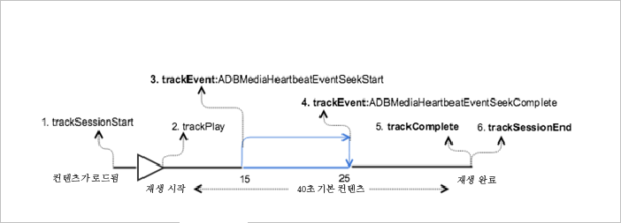

# 주 컨텐츠에서 찾기를 사용하여 VOD 재생{#vod-playback-with-seeking-in-the-main-content}

## 시나리오 {#section_E4B558253AD84ED59256EDB60CED02AE}

이 시나리오는 재생 중 주 컨텐츠에서의 이동으로 구성됩니다.

이 시나리오는 [광고 없이 VOD 재생](/help/sdk-implement/tracking-scenarios/vod-no-intrs-details.md) 시나리오와 동일하지만, 컨텐츠의 일부가 스크러빙되고 주 컨텐츠의 한 지점에서 다른 지점으로 이동이 완료됩니다.

| 트리거   | 하트비트 메서드   | 네트워크 호출   | 참고   |
| --- | --- | --- | --- |
| 사용자가 [!UICONTROL 재생] 클릭 | `trackSessionStart` | Analytics 컨텐츠 시작, 하트비트 컨텐츠 시작 | 측정 라이브러리는 프리롤 광고가 있는지를 인식하지 않으므로, 이러한 네트워크 호출은 [광고 없이 VOD 재생](/help/sdk-implement/tracking-scenarios/vod-no-intrs-details.md) 시나리오와 동일합니다. |
| 컨텐츠의 첫 번째 프레임이 재생됨 | `trackPlay` | 하트비트 컨텐츠 재생 | 챕터 컨텐츠가 주 컨텐츠보다 먼저 재생되는 경우 챕터가 시작될 때 하트비트가 시작됩니다. |
| 컨텐츠 재생 |  | 컨텐츠 하트비트 | 이 네트워크 호출은 [광고 없이 VOD 재생](/help/sdk-implement/tracking-scenarios/vod-no-intrs-details.md) 시나리오와 동일합니다. |
| 사용자가 컨텐츠에서 이동 작업을 시작함 | `trackSeekStart` |  | No heartbeats go out till seek is complete, for example, `trackSeekComplete` |
| 이동 작업이 완료됨 | `trackSeekComplete` |  | 이동이 완료되었으므로 하트비트가 시작됩니다.  팁: 플레이헤드 값은 이동 후 올바른 새 플레이헤드를 나타냅니다. |
| 컨텐츠가 완료됨 | `trackComplete` | 하트비트 컨텐츠 완료 | 이 네트워크 호출은 [광고 없이 VOD 재생](/help/sdk-implement/tracking-scenarios/vod-no-intrs-details.md) 시나리오와 동일합니다. |
| 세션 종료 | `trackSessionEnd` |  | `SessionEnd` |

## 샘플 코드 {#section_q2d_wcj_x2b}

이 시나리오에서는 주 컨텐츠가 재생 중일 때 사용자가 컨텐츠 이동을 합니다.



### Android

Android에서 이 시나리오를 보려면 다음 코드를 설정합니다.

```java
// Set up mediaObject 
MediaObject mediaInfo = MediaHeartbeat.createMediaObject( 
  Configuration.MEDIA_NAME,  
  Configuration.MEDIA_ID,  
  Configuration.MEDIA_LENGTH,  
  MediaHeartbeat.StreamType.VOD 
); 

HashMap<String, String> mediaMetadata = new HashMap<String, String>(); 
mediaMetadata.put(CUSTOM_KEY_1, CUSTOM_VAL_1); 
mediaMetadata.put(CUSTOM_KEY_2, CUSTOM_VAL_2); 

// 1. Call trackSessionStart() when the user clicks Play or if autoplay is used,  
//    i.e., there is an intent to start playback.  
_mediaHeartbeat.trackSessionStart(mediaInfo, mediaMetadata); 

...... 
...... 

// 2. Call trackPlay() when the playback actually starts, i.e., whn the first frame  
//    of the main content is rendered on the screen.  
_mediaHeartbeat.trackPlay(); 

....... 
....... 

// 3. Track the MediaHeartbeat.Event.SeekStart event when the user begins to seek.  
_mediaHeartbeat.trackEvent(MediaHeartbeat.Event.SeekStart, null, null); 

....... 
....... 

// 4. Track the MediaHeartbeat.Event.SeekComplete event when the user completes seeking 
_mediaHeartbeat.trackEvent(MediaHeartbeat.Event.SeekComplete, null, null); 

....... 
....... 

// 5. Call trackComplete() when the playback reaches the end, i.e., when the media 
//    completes and finishes playing. 
_mediaHeartbeat.trackComplete(); 

........ 
........ 

// 6. Call trackSessionEnd() when the playback session is over. This method must be  
//    called even if the user does not watch the media to completion.  
_mediaHeartbeat.trackSessionEnd(); 

........ 
........ 
```

### iOS

iOS에서 이 시나리오를 보려면 다음 코드를 설정합니다.

```
// Set up mediaObject 
ADBMediaObject *mediaObject =  
[ADBMediaHeartbeat createMediaObjectWithName:MEDIA_NAME o 
                   length:MEDIA_LENGTH  
                   streamType:ADBMediaHeartbeatStreamTypeVOD]; 
 
NSMutableDictionary *mediaContextData = [[NSMutableDictionary alloc] init]; 
[mediaContextData setObject:CUSTOM_VAL_1 forKey:CUSTOM_KEY_1]; 
[mediaContextData setObject:CUSTOM_VAL_2 forKey:CUSTOM_KEY_2]; 

// 1. Call trackSessionStart when the user clicks Play or if autoplay is used,  
//    i.e., there is an intent to start playback. 
[_mediaHeartbeat trackSessionStart:mediaObject data:mediaContextData]; 
....... 
....... 

// 2. Call trackPlay when the playback actually starts, i.e., when the 
//    first frame of the main content is rendered on the screen. 
[_mediaHeartbeat trackPlay];  
....... 
....... 

// 3. Track the trackEvent:ADBMediaHeartbeatEventSeekStart event when the user  
//    begins to seek out of the chapter with the intent to skip it. 
[_mediaHeartbeat trackEvent:ADBMediaHeartbeatEventSeekStart  
               mediaObject:nil  
               data:nil]; 
....... 
....... 

// 4. Track the trackEvent:ADBMediaHeartbeatEventSeekComplete event when the  
//    user seeks out of the chapter with the intent to skip it. 
[_mediaHeartbeat trackEvent:ADBMediaHeartbeatEventSeekComplete  
               mediaObject:nil  
               data:nil]; 
....... 
....... 

// 5. Call trackComplete when the playback reaches the end, i.e., completes  
//    and finishes playing. 
[_mediaHeartbeat trackComplete]; 
....... 
....... 

// 6. Call trackSessionEnd when the playback session is over. This method must  
//    be called even if the user does not watch the media to completion. 
[_mediaHeartbeat trackSessionEnd]; 
....... 
....... 
```

### JavaScript

이 시나리오를 보려면 다음 텍스트를 입력하십시오.

```js
// Set up mediaObject 
var mediaInfo = MediaHeartbeat.createMediaObject( 
  Configuration.MEDIA_NAME,  
  Configuration.MEDIA_ID,  
  Configuration.MEDIA_LENGTH,  
  MediaHeartbeat.StreamType.VOD 

); 

var mediaMetadata = { 
  CUSTOM_KEY_1 : CUSTOM_VAL_1,  
  CUSTOM_KEY_2 : CUSTOM_VAL_2,  
  CUSTOM_KEY_3 : CUSTOM_VAL_3 

}; 

// 1. Call trackSessionStart() when Play is clicked or if autoplay is used,  
//    i.e., there's an intent to start playback. 
this._mediaHeartbeat.trackSessionStart(mediaInfo, mediaMetadata); 

...... 
...... 

// 2. Call trackPlay() when the playback actually starts, i.e., when the  
//    first frame of the ad media is rendered on the screen. 
this._mediaHeartbeat.trackPlay(); 

....... 
....... 

// 3. Track the MediaHeartbeat.Event.SeekStart event when the user  
//    begins to seek. 
this._mediaHeartbeat.trackEvent(MediaHeartbeat.Event.SeekStart); 

....... 
....... 

// 4. Track the MediaHeartbeat.Event.SeekComplete event when the user  
//    completes seeking. 
this._mediaHeartbeat.trackEvent(MediaHeartbeat.Event.SeekComplete); 

....... 
....... 

// 5. Call trackComplete() when the playback reaches the end, i.e., when 
//    playback completes and finishes playing. 
this._mediaHeartbeat.trackComplete(); 

........ 
........ 

// 6. Call trackSessionEnd() when the playback session is over. This method must be called  
//    even if the user does not watch the media to completion. 
this._mediaHeartbeat.trackSessionEnd(); 

........ 
........ 
```

