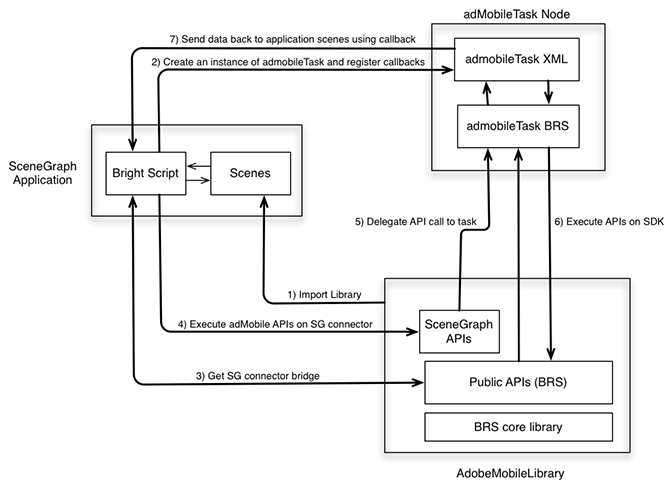

# Roku - SceneGraph에서 추적 {#tracking-in-scenegraph-roku}

## 소개 {#introduction}

Roku SceneGraph XML 프로그래밍 프레임워크를 사용하여 애플리케이션을 개발할 수 있습니다. 이 프레임워크는 다음과 같은 두 가지 주요 개념을 제공합니다.

* 애플리케이션 화면의 SceneGraph 렌더링
* SceneGraph 화면의 XML 구성

Roku용 Adobe Mobile SDK는 BrightScript로 작성됩니다. SDK는 SceneGraph에서 실행되는 앱(예: 스레드)에 사용할 수 없는 많은 구성 요소를 사용합니다. 따라서 SceneGraph 프레임워크를 사용하려는 Roku 앱 개발자는 Adobe Mobile SDK API를 호출할 수 없습니다(후자는 기존 BrightScript 앱에서 사용할 수 있는 것과 비슷함).

## 아키텍처 {#architecture}

AdobeMobile SDK에 SceneGraph 지원을 추가하기 위해 Adobe SDK와 `adbmobileTask` 사이에 커넥터 브리지를 작성하는 새 API가 추가되었습니다. 후자는 SDK의 API 실행에 사용되는 SceneGraph 노드입니다. (`adbmobileTask` 사용 방법은 이 문서의 나머지 부분에서 자세히 설명합니다.)

커넥터 브리지는 다음과 같을 작업을 수행하도록 설계되었습니다.

* 브리지는 AdobeMobile SDK의 SceneGraph 호환 인스턴스를 반환합니다. SceneGraph 호환 SDK에는 기존 SDK가 노출하는 모든 API가 있습니다.
* SceneGraph에서 Adobe Mobile SDK API를 사용하는 방법은 기존 API를 사용한 방법과 매우 유사합니다.
* 또한 브리지는 일부 데이터를 반환하는 API에 대한 콜백을 수신하기 위한 메커니즘을 노출합니다.



## 구성 요소 {#components}

**SceneGraph 애플리케이션:**

* SceneGraph 커넥터 브리지 API를 통해 `AdobeMobileLibrary` API를 이용합니다.
* 예상 출력 데이터 변수에 대한 `adbmobileTask`에 응답 콜백을 등록합니다.

**AdobeMobileLibrary:**

* 커넥터 브리지 API를 비롯한 공개 API(기존) 세트를 노출합니다.
* 모든 기존 공개 API를 래핑하는 SceneGraph 커넥터 인스턴스를 반환합니다.
* API 실행을 위해 `adbmobileTask` SceneGraph 노드와 통신합니다.

**adbmobileTask 노드:**

* 백그라운드 스레드에서 `AdobeMobileLibrary` API를 실행하는 SceneGraph 작업 노드입니다.
* 애플리케이션 화면으로 다시 데이터를 반환하기 위한 위임 역할을 합니다.

## 공개 SceneGraph APIs {#public-scenegraph-apis}

### ADBMobileConnector

| 카테고리 | 메서드 이름 | 설명 |
|---|---|---|
| **상수** |  |  |
|  | `sceneGraphConstants` | `SceneGraphConstants`가 포함된 개체를 반환합니다. 자세한 내용은 위의 테이블을 참조하십시오. |
|  |  |  |
| **디버그 로깅** |  |  |
|  | `setDebugLogging` | ADBMobile SDK에 대한 디버그 로깅을 설정하기 위한 SceneGraph API입니다. |
|  | `getDebugLogging` | ADBMobile SDK에서 디버그 로깅을 가져오기 위한 SceneGraph API입니다. |
|  | 자세한 내용은 레거시 SDK의 디버그 로깅 섹션을 참조하십시오. |  |
|  |  |  |
| **개인 정보 상태/옵트아웃** |  |  |
|  | `setPrivacyStatus` | ADBMobile SDK에 대한 개인 정보 상태를 설정하기 위한 SceneGraph API입니다. |
|  | `getPrivacyStatus` | ADBMobile SDK에서 개인 정보 보호 상태를 가져오기 위한 SceneGraph API입니다. |
|  | 자세한 내용은 레거시 SDK의 옵트아웃/개인 정보 상태 섹션을 참조하십시오. |  |
|  |  |  |
| **Analytics** |  |  |
|  | `trackState` | ADBMobile SDK에서 상태를 추적하기 위한 SceneGraph API입니다. |
|  | `trackAction` | ADBMobile SDK에서 작업을 추적하기 위한 SceneGraph API입니다. |
|  | `trackingIdentifier` | ADBMobile SDK에서 추적 식별자를 가져오기 위한 SceneGraph API입니다. |
|  | `userIdentifier` | ADBMobile SDK에서 사용자 ID를 가져오기 위한 SceneGraph API입니다. |
|  | `setUserIdentifier` | SceneGraph SDK에서 사용자 ID를 설정하기 위한 SceneGraph API입니다. |
|  | `getAllIdentifiers` | SceneGraph API는 Roku SDK에서 인식되고 지속되는 모든 사용자 ID를 검색합니다. |
|  | 자세한 내용은 레거시 SDK의 분석 섹션을 참조하십시오. |  |
|  |  |  |
| **Experience Cloud** |  |  |
|  | `visitorSyncIdentifiers` | ADBMobile SDK에서 Experience Cloud 식별자를 동기화하기 위한 SceneGraph API입니다. |
|  | `visitorMarketingCloudID` | ADBMobile SDK에서 방문자 Experience Cloud ID를 가져오기 위한 SceneGraph API입니다. |
|  | 자세한 내용은 레거시 SDK의 Experience Cloud 섹션을 참조하십시오. |  |
|  |  |  |
| **Audience Manager** |  |  |
|  | `audienceSubmitSignal` | 트레이트를 이용하여 대상자 관리 신호를 전송하기 위한 SceneGraph API입니다. |
|  | `audienceVisitorProfile` | ADBMobile SDK에서 대상자 관리자 방문자 프로필을 가져오기 위한 SceneGraph API입니다. |
|  | `audienceDpid` | ADBMobile SDK에서 대상자 Dpid를 가져오기 위한 SceneGraph API입니다. |
|  | `audienceDpuuid` | ADBMobile SDK에서 대상자 Dpuuid를 가져오기 위한 SceneGraph API입니다. |
|  | `audienceSetDpidAndDpuuid` | ADBMobile SDK에서 대상자 Dpid 및 Dpuuid를 설정하기 위한 SceneGraph API입니다. |
|  | 자세한 내용은 레거시 SDK의 Audience Manager 섹션을 참조하십시오. |  |
|  |  |  |
| **MediaHeartbeat** |  |  |
|  | `mediaTrackLoad` | MediaHeartbeat 추적을 위해 비디오 콘텐츠를 업로드할 SceneGraph API입니다. |
|  | mediaTrackStart | MediaHeartbeat를 사용하여 비디오 추적 세션을 시작할 SceneGraph API입니다. |
|  | `mediaTrackUnload` | MediaHeartbeat 추적에서 비디오 콘텐츠를 업로드하기 위한 SceneGraph API입니다. |
|  | `mediaTrackPlay` | 비디오 콘텐츠 재생을 추적할 SceneGraph API입니다. |
|  | mediaTrackPause | 일시 정지된 비디오 콘텐츠를 추적할 SceneGraph API입니다. |
|  | `mediaTrackComplete` | 비디오 콘텐츠 재생 완료를 추적하기 위한 SceneGraph API입니다. |
|  | `mediaTrackError` | 재생 오류를 추적할 SceneGraph API입니다. |
|  | mediaTrackEvent | 추적 중에 재생 이벤트를 추적할 SceneGraph API입니다. 예: 광고, 챕터. |
|  | `mediaUpdatePlayhead` | 비디오 추적 중에 플레이헤드 업데이트를 MediaHeartbeat로 보내기 위한 SceneGraph API입니다. |
|  | `mediaUpdateQoS` | 비디오 추적 중에 QoS 업데이트를 MediaHeartbeat로 보내기 위한 SceneGraph API입니다. |
|  | 자세한 내용은 레거시 SDK의 MediaHeartbeat 섹션을 참조하십시오. |  |

### SceneGraphConstants

| 상수 이름 | 설명 |
|---|---|
| `API_RESPONSE` | 응답 개체를 `adbmobileTask` 노드의 `adbmobileApiResponse` 필드에서 검색하는 데 사용됩니다. |
| `DEBUG_LOGGING` | 다음 `getDebugLogging`에 `apiName`으로 사용됨 |
| `PRIVACY_STATUS` | 다음 `getPrivacyStatus`에 `apiName`으로 사용됨 |
| `TRACKING_IDENTIFIER` | 다음 `trackingIdentifier`에 `apiName`으로 사용됨 |
| `USER_IDENTIFIER` | 다음 `userIdentifier`에 `apiName`으로 사용됨 |
| `VISITOR_MARKETING_CLOUD_ID` | 다음 `visitorMarketingCloudID`에 `apiName`으로 사용됨 |
| `AUDIENCE_VISITOR_PROFILE` | 다음 `audienceVisitorProfile`에 `apiName`으로 사용됨 |
| `AUDIENCE_DPID` | 다음 `audienceDpid`에 `apiName`으로 사용됨 |
| `AUDIENCE_DPUUID` | 다음 `audienceDpuuid`에 `apiName`으로 사용됨 |

### adbmobileTask 노드

<table>
<thead>
<tr>
<td> 필드 </td><td> 유형 </td><td> 기본값 </td><td> 사용 </td>
</tr>
</thead>
<tbody>
<tr>
<td> adbmobileApiCall </td>
<td> assocarray </td>
<td> 유효하지 않습니다 </td>
<td> 이 필드를 수정하지 않거나, 애플리케이션에서 사용하도록 합니다. 이 필드는 ADBMobile SceneGraphConnector에서 SceneGraph 노드를 통해 API 호출을 라우팅하고 응답을 가져오는 데 사용됩니다. 따라서 이 키/필드는 SceneGraph 호환성을 위해 AdobeMobileSDK용으로 예약되어 있습니다. <b>중요:</b> 이 필드를 수정하면 AdobeMobileSDK가 오작동할 수 있습니다.</td>
</tr>
<tr>
<td> adbmobileApiResponse </td>
<td> assocarray </td>
<td> 유효하지 않습니다 </td>
<td> AdobeMobileSDK에서 실행된 모든 읽기 전용 API는 이 필드에 대한 응답을 반환합니다. 응답 개체를 수신하려면 이 필드에 대한 업데이트를 수신할 콜백을 등록합니다. 다음은 응답 개체에 대한 형식입니다.  
<pre>
response = {
  "apiName" : &lt;SceneGraphConstants.
               API_NAME&gt; 
  "returnValue : &lt;API_RESPONSE&gt;
}</pre>
이 응답 개체의 인스턴스는 API 참조 가이드에 따라 값을 반환해야 하는 AdobeMobileSDK의 API 호출에 대해 전송됩니다. 예를 들어 visitorMarketingCloudID()에 대한 API 호출은 다음 응답 개체를 반환합니다.
<pre>
response = {
  "apiName" : m.
              adbmobileConstants.
              VISITOR_MARKETING_CLOUD_ID  
  "returnValue : "07050x25671x33760x72644x14"  
}
</pre>
또는 응답 데이터도 올바르지 않을 수 있습니다.
<pre>
response = {  
  "apiName" : m.
              adbmobileConstants.
              VISITOR_MARKETING_CLOUD_ID  
  "returnValue : invalid
}
</pre>
</td>
</tr>
</tbody>
</table>

### `adbmobile.brs`

#### `getADBMobileConnectorInstance`

API 서명: `ADBMobile().getADBMobileConnectorInstance()`\
입력: `adbmobileTask`
반환 유형: `ADBMobileConnector`

#### `sgConstants`

API 서명: `ADBMobile().sgConstants()`
입력: 없음\
반환 유형: `SceneGraphConstants`

>[!NOTE]
>자세한 내용은 `ADBMobileConnector` API 참조를 참조하십시오.

### ADBMobile 상수

|  기능  | 상수 이름 | 설명   |
|---|---|---|
| 버전 매기기 | `version` | AdobeMobileLibrary 버전 정보를 검색할 상수 |
| 개인 정보/옵트아웃 | `PRIVACY_STATUS_OPT_IN` | 개인 정보 상태 옵트인에 대한 상수 |
|  | `PRIVACY_STATUS_OPT_OUT` | 개인 정보 상태 옵트아웃에 대한 상수 |
| MediaHeartbeat 상수 | 이 페이지의 상수<br/><br/>[(미디어 하트비트 메서드)를 참조하십시오.](/help/use-cases/track-av-playback/track-core/track-core-roku.md) | MediaHeartbeat API에서 이러한 상수 사용 |
| 표준 메타데이터 | 이 페이지의 상수(<br/><br/>[표준 메타데이터 매개 변수)를 참조하십시오.](/help/use-cases/track-av-playback/impl-std-metadata/impl-std-metadata-roku.md) | 이러한 상수를 사용하여 MediaHeartbeat API에 표준 비디오/광고 메타데이터를 첨부합니다. |


레거시 AdobeMobileLibrary에 전역으로 정의된 유틸리티 `MediaHeartbeat` API는 SceneGraph 노드에서 사용할 수 없는 Brightscript 구성 요소를 사용하지 않으므로 SceneGraph 환경에서 *그대로* 액세스할 수 있습니다. 이러한 메서드에 대한 자세한 내용은 아래 표를 참조하십시오.

### MediaHeartbeat에 대한 전역 메서드

| 메서드 | 설명 |
| --- | --- |
| `adb_media_init_mediainfo` | 이 메서드는 초기화된 미디어 정보 개체를 반환합니다.`Function adb_media_init_mediainfo(name As String, id As String, length As Double, streamType As String) As Object` |
| `adb_media_init_adinfo` | 이 메서드는 초기화된 광고 정보 개체를 반환합니다.`Function adb_media_init_adinfo(name As String, id As String, position As Double, length As Double) As Object` |
| `adb_media_init_chapterinfo` | 이 메서드는 초기화된 챕터 정보 개체를 반환합니다.  `Function adb_media_init_adbreakinfo(name As String, startTime as Double, position as Double) As Object` |
| `adb_media_init_adbreakinfo` | 이 메서드는 초기화된 광고 브레이브 정보 개체를 반환합니다.  `Function adb_media_init_chapterinfo(name As String, position As Double, length As Double, startTime As Double) As Object` |
| `adb_media_init_qosinfo` | 이 메서드는 초기화된 QoS 정보 개체를 반환합니다.  `Function adb_media_init_qosinfo(bitrate As Double, startupTime as Double, fps as Double, droppedFrames as Double) As Object` |

## 구현 {#implementation}

1. **Roku 라이브러리 다운로드 -** [최신 Roku 라이브러리를 다운로드합니다.](https://github.com/Adobe-Marketing-Cloud/media-sdks/releases/tag/roku-v2.2.2)

1. **개발 환경 설정**

   1. `adbmobile.brs`(AdobeMobileLibrary)를 `pkg:/source/` 디렉토리에 복사합니다.

   1. 장면 그래프 지원을 위해 `adbmobileTask.brs` 및 `adbMobileTask.xml`을 `pkg:/components/` 디렉토리에 복사합니다.

1. **초기화**

   1. 장면으로 `adbmobile.brs`을 가져옵니다.

      ```
      <script type="text/brightscript" uri="pkg:/source/adbmobile.brs" />
      ```

   1. 장면에 `adbmobileTask` 노드의 인스턴스를 생성합니다.

      ```
      m.adbmobileTask = createObject("roSGNode", "adbmobileTask")
      ```

   1. `adbmobile` 인스턴스를 사용하여 SceneGraph에 대한 `adbmobileTask` 커넥터의 인스턴스를 가져옵니다.

      ```
      m.adbmobile = ADBMobile().getADBMobileConnectorInstance(m.adbmobileTask)
      ```

   1. SG 상수 `adbmobile`를 가져옵니다.

      ```
      m.adbmobileConstants = m.adbmobile.sceneGraphConstants()
      ```

   1. 모든 `AdbMobile` API 호출에 대한 응답 개체를 수신하기 위해 콜백을 등록합니다.

      ```
      m.adbmobileTask.ObserveField(m.adbmobileConstants.API_RESPONSE,  
                                   "onAdbmobileApiResponse")
      
      ' Sample implementation of the callback
      ' Listen for all the constants for which API calls are made on the SDK
      function onAdbmobileApiResponse() as void
          responseObject = m.adbmobileTask[m.adbmobileConstants.API_RESPONSE]
      
          if responseObject <> invalid
              methodName = responseObject.apiName
              retVal = responseObject.returnValue
      
              if methodName = m.adbmobileConstants.DEBUG_LOGGING
                  if retVal
                      print "API Response: DEBUG LOGGING: " + "True"
                  else
                      print "API Response: DEBUG LOGGING: " + "False"
                  endif
              else if methodName = m.adbmobileConstants.PRIVACY_STATUS
                  print "API Response: PRIVACY STATUS: " + retVal
              else if methodName = m.adbmobileConstants.TRACKING_IDENTIFIER
                  if retVal <> invalid
                      print "API Response: TRACKING IDENTIFIER: " + retVal
                  else
                      print "API Response: TRACKING IDENTIFIER: " + "invalid"
                  endif
              else if methodName = m.adbmobileConstants.USER_IDENTIFIER
                  if retVal <> invalid
                      print "API Response: USER IDENTIFIER: " + retVal
                  else
                      print "API Response: USER IDENTIFIER: " + "invalid"
                  endif
              else if methodName = m.adbmobileConstants.VISITOR_MARKETING_CLOUD_ID
                  if retVal <> invalid
                      print "API Response: MCID: " + retVal
                  else
                      print "API Response: MCID: " + "invalid"
                  endif
              else if methodName = m.adbmobileConstants.AUDIENCE_DPID
                  if retVal <> invalid
                      print "API Response: AUDIENCE DPID: " + retVal
                  else
                      print "API Response: AUDIENCE DPID: " + "invalid"
                  endif
              else if methodName = m.adbmobileConstants.AUDIENCE_DPUUID
                  if retVal <> invalid
                      print "API Response: AUDIENCE DPUUID: " + retVal
                  else
                      print "API Response: AUDIENCE DPUUID: " + "invalid"
                  endif
              else if methodName = m.adbmobileConstants.AUDIENCE_VISITOR_PROFILE
                  if retVal <> invalid
                      print "API Response: AUDIENCE VISITOR PROFILE: Valid Object"
                  else
                      print "API Response: AUDIENCE VISITOR PROFILE: " + "invalid"
                  endif
              endif
          endif
      end function
      ```

## 샘플 구현 {#sample-implementation}

### 레거시 SDK에 대한 샘플 API 호출

```
'get an instance of SDK
m.adbmobile = ADBMobile()

'execute setter APIs
m.adbmobile.setDebugLogging(true)

'execute getter APIs
debugLogging = m.adbmobile.getDebugLogging()
```

### SG SDK에 대한 샘플 API 호출

```
'create adbmobileTask instance
m.adbmobileTask = createObject("roSGNode", "adbmobileTask")

'get an instance of SDK using task instance
m.adbmobile =  
  ADBMobile().getADBMobileConnectorInstace(m.adbmobileTask)
m.adbmobileConstants = m.adbmobile.sceneGraphConstants()
'execute setter APIs
m.adbmobile.setDebugLogging(true)

'execute getter APIs
m.adbmobileTask.ObserverField(m.adbConstants.API_RESPONSE,  
                              "onAdbmobileApiResponse")
m.adbmobile.getDebugLogging()

'listen for return data in registered callbacks
function onAdbmobileApiResponse() as void
    responseObject = m.adbmobileTask[m.adbmobileConstants.API_RESPONSE]

        if responseObject <> invalid
            methodName = responseObject.apiName
            retVal = responseObject.returnValue

        if methodName = m.adbmobileConstants.DEBUG_LOGGING
            if retVal
                print "API Response: DEBUG LOGGING: " + "True"
            else
                print "API Response: DEBUG LOGGING: " + "False"
         endif
    endif
end function
```
