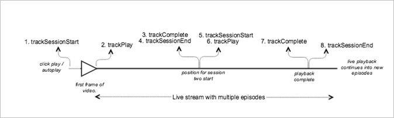

# 순차적 추적을 사용하는 라이브 주요 콘텐츠{#live-main-content-with-sequential-tracking}

## 시나리오 {#scenario}

이 시나리오에는 라이브 스트림에 참여한 후 40초 동안 광고가 재생되지 않은 라이브 에셋이 한 개 있습니다.

이 시나리오는 [광고 없이 VOD 재생](/help/use-cases/tracking-scenarios/vod-no-intrs-details.md) 시나리오와 동일하지만, 컨텐츠의 일부가 스크러빙되고 주 컨텐츠의 한 지점에서 다른 지점으로 찾기가 완료됩니다.

| 트리거 | 하트비트 메서드 |  네트워크 호출  |  참고   |
| --- | --- | --- | --- |
| 사용자가 [!UICONTROL 재생] 클릭 | trackSessionStart | Analytics 컨텐츠 시작, 하트비트 컨텐츠 시작 | 측정 라이브러리는 프리롤 광고가 있는지 모르므로, 이러한 네트워크 호출은 [광고 없이 VOD 재생](/help/use-cases/tracking-scenarios/vod-no-intrs-details.md) 시나리오와 동일합니다. |
| 컨텐츠의 첫 번째 프레임이 재생됩니다. | trackPlay | 하트비트 컨텐츠 재생 | 챕터 컨텐츠가 주 컨텐츠 전에 재생되면 챕터가 시작될 때 하트비트가 시작됩니다. |
| 컨텐츠 재생 |  | 컨텐츠 하트비트 | 이 네트워크 호출은 [광고 없이 VOD 재생](/help/use-cases/tracking-scenarios/vod-no-intrs-details.md) 시나리오와 동일합니다. |
| 세션1 종료(에피소드1이 종료됨) | trackComplete/trackSessionEnd | 하트비트 컨텐츠 완료 | 완료는 첫 번째 에피소드의 세션1에 도달하여 완전히 시청했음을 의미합니다. 다음 에피소드에 대한 세션을 시작하기 전에 이 세션을 종료해야 합니다. |
| 에피소드2가 시작됨(세션2 시작) | trackSessionStart | Analytics 컨텐츠 시작 하트비트 컨텐츠 시작 | 이는 사용자가 첫 번째 에피소드를 시청하고 다른 에피소드를 계속 시청했기 때문입니다. |
| 미디어의 첫 번째 프레임 | trackPlay | 하트비트 컨텐츠 재생 | 이 메서드는 타이머를 트리거하고 이 시점부터 진행되므로 재생이 계속되는 한 10초마다 하트비트가 전송됩니다. |
| 컨텐츠 재생 |  | 컨텐츠 하트비트 |  |
| 세션 종료(에피소드2가 종료됨) | trackComplete/trackSessionEnd | 하트비트 컨텐츠 완료 | 완료는 두 번째 에피소드의 세션2에 도달하여 완전히 시청했음을 의미합니다. 다음 에피소드에 대한 세션을 시작하기 전에 이 세션을 종료해야 합니다. |

## 매개 변수 {#parameters}

### 하트비트 콘텐츠 시작

| 매개 변수 | 값 | 참고 |
|---|---|---|
| `s:sc:rsid` | &lt;Adobe 보고서 세트 ID> |  |
| `s:sc:tracking_serve` | &lt;Analytics 추적 서버 URL> |  |
| `s:user:mid` | `s:user:mid` | Adobe Analytics 컨텐츠 시작 호출 시 mid 값과 일치해야 함 |
| `s:event:type` | `"start"` |  |
| `s:asset:type` | `"main"` |  |
| `s:asset:media_id` | &lt;미디어 이름> |  |
| `s:stream:type` | `live` |  |
| `s:meta:*` | *옵션* | 미디어에서 설정된 사용자 지정 메타데이터 |

## 하트비트 콘텐츠 재생 {#heartbeat-content-play}

이는 하트비트 컨텐츠 시작 호출과 거의 동일하게 보이지만 &quot;의 주요 차이가 있습니다:event:type&quot; 매개 변수입니다. 모든 매개 변수가 여기에 있어야 합니다.

| 매개 변수 | 값 | 참고 |
|---|---|---|
| `s:event:type` | `"play"` |  |
| `s:asset:type` | `"main"` |  |

## 콘텐츠 하트비트 {#content-heartbeats}

미디어 재생 중에 10초마다(기본 컨텐츠의 경우) 또는 1초마다(광고의 경우) 하나 이상의 하트비트를 전송하는 타이머가 있습니다. 이러한 하트비트에 재생, 광고, 버퍼링 및 기타 많은 정보가 포함됩니다. 각 하트비트의 정확한 콘텐츠는 이 문서의 범위를 벗어나며, 유효성을 확인하기 위해 중요한 사항은 재생이 계속되는 동안 하트비트가 일관되게 트리거된다는 것입니다.

콘텐츠 하트비트에서 다음 몇 가지 특정 사항을 찾습니다.

| 매개 변수 | 값 | 참고 |
|---|---|---|
| `s:event:type` | `"play"` |  |
| `l:event:playhead` | &lt;playhead position> 예: 50, 60, 70 | 플레이헤드의 현재 위치를 반영해야 합니다. |

## 하트비트 콘텐츠 완료 {#heartbeat-content-complete}

지정된 에피소드에 대한 재생이 완료되면(플레이헤드가 에피소드 경계를 넘음) 하트비트 컨텐츠 완료 호출이 전송됩니다. 이 호출은 다른 하트비트 호출과 비슷하게 보이지만 다음 두 가지 특정 항목을 포함합니다.

| 매개 변수 | 값 | 참고 |
|---|---|---|
| `s:event:type` | `"complete"` |  |
| `s:asset:type` | `"main"` |  |

## 샘플 코드 {#sample-code}



### Android

다음은 예상 API 호출 순서입니다.

```java
// Set up mediaObject 
MediaObject mediaInfo = MediaHeartbeat.createMediaObject( 
  Configuration.MEDIA_NAME,  
  Configuration.MEDIA_ID,  
  Configuration.MEDIA_LENGTH,  
  MediaHeartbeat.StreamType.LIVE 
); 

HashMap<String, String> mediaMetadata = new HashMap<String, String>(); 
mediaMetadata.put(CUSTOM_VAL_1, CUSTOM_KEY_1); 
mediaMetadata.put(CUSTOM_VAL_2, CUSTOM_KEY_2); 

// 1. Call trackSessionStart() when the user clicks Play or if autoplay is used,  
//    i.e., when there is an intent to start playback.  
_mediaHeartbeat.trackSessionStart(mediaInfo, mediaMetadata); 

...... 
...... 

// 2. Call trackPlay() when the playback actually starts, i.e., when the first  
//    frame of main content is rendered on the screen.  
_mediaHeartbeat.trackPlay(); 

....... 
....... 

// 3. Call trackComplete() when the playback reaches the end of session,  
//    i.e., when the media completes and finishes playing 1st episode/session.  
_mediaHeartbeat.trackComplete(); 

........ 
........ 

// 4. Call trackSessionEnd() to end session 1 
_mediaHeartbeat.trackSessionEnd(); 

........ 
........ 

// Start tracking session 2 /episode 2 of the same live stream.  
// There is no need to reinstantiate a mediaHeartbeat instance for tracking sesison 2. 
// Set up mediaObject 
MediaObject mediaInfo = MediaHeartbeat.createMediaObject( 
  Configuration.MEDIA_NAME,  
  Configuration.MEDIA_ID,  
  Configuration.MEDIA_LENGTH,  
  MediaHeartbeat.StreamType.LIVE 
); 

HashMap<String, String> mediaMetadata = new HashMap<String, String>(); 
mediaMetadata.put(CUSTOM_VAL_1, CUSTOM_KEY_1); 
mediaMetadata.put(CUSTOM_VAL_2, CUSTOM_KEY_2); 

// 5. Call trackSessionStart() when the playhead reaches a point that denotes the 
//    start of session 2 
_mediaHeartbeat.trackSessionStart(mediaInfo, mediaMetadata); 

...... 
...... 

// 6. Call trackPlay() to start tracking session 2 playback  
_mediaHeartbeat.trackPlay(); 

....... 
....... 

// 7. Call trackComplete() when the playback reaches the end of session 2,  
//    i.e., the media completes and finishes playing.  
_mediaHeartbeat.trackComplete(); 

........ 
........ 

// 8. Call trackSessionEnd() to end session 2 
_mediaHeartbeat.trackSessionEnd(); 

........ 
........ 

// Continue similarly tracking further sessions in the live stream if required 
```

### iOS

다음은 예상 API 호출 순서입니다.

```
// Set up mediaObject 
ADBMediaObject *mediaObject =  
[ADBMediaHeartbeat createMediaObjectWithName:MEDIA_NAME  
                   length:MEDIA_LENGTH  
                   streamType:ADBMediaHeartbeatStreamTypeLIVE]; 
  
NSMutableDictionary *mediaContextData = [[NSMutableDictionary alloc] init]; 
[mediaContextData setObject:CUSTOM_VAL_1 forKey:CUSTOM_KEY_1]; 
[mediaContextData setObject:CUSTOM_VAL_2 forKey:CUSTOM_KEY_2]; 
  
// 1. Call trackSessionStart when the user clicks Play or if autoplay is used,  
//    i.e., there is an intent to start playback. 
[_mediaHeartbeat trackSessionStart:mediaObject data:mediaContextData]; 
...... 
...... 
  
// 2. Call trackPlay when the playback actually starts, i.e., when the first  
//    frame of main content is rendered on the screen. 
[_mediaHeartbeat trackPlay]; 
....... 
....... 

// 3. Call trackComplete when the playback reaches the end of session,  
//    i.e., when the media completes and finishes playing the first 
//    episode/session. 
[_mediaHeartbeat trackComplete]; 
....... 
....... 

// 4. Call trackSessionEnd to end session 1 
[_mediaHeartbeat trackSessionEnd]; 
........ 
........ 

// Start tracking session 2 / episode 2 of the same live stream, No need to  
// reinstantiate mediaHeartbeat instance for tracking sesison 2. 

// Set up mediaObject 
ADBMediaObject *mediaObject =  
[ADBMediaHeartbeat createMediaObjectWithName:MEDIA_NAME  
                   length:MEDIA_LENGTH  
                   streamType:ADBMediaHeartbeatStreamTypeLIVE]; 
 
NSMutableDictionary *mediaContextData = [[NSMutableDictionary alloc] init]; 
[mediaContextData setObject:CUSTOM_VAL_1 forKey:CUSTOM_KEY_1]; 
[mediaContextData setObject:CUSTOM_VAL_2 forKey:CUSTOM_KEY_2]; 
 
// 5. Call trackSessionStart when the playhead reaches a point that denotes  
//    start of session 2 
[_mediaHeartbeat trackSessionStart:mediaObject data:mediaContextData]; 
...... 
...... 
 
// 6. Call trackPlay to start tracking session 2 playback 
[_mediaHeartbeat trackPlay]; 
....... 
....... 
 
// 7. Call trackComplete when the playback reaches the end of session 2,  
//    i.e., when the media completes and finishes playing. 
[_mediaHeartbeat trackComplete]; 
........ 
........ 
 
// 8. Call trackSessionEnd to end the session 2 
[_mediaHeartbeat trackSessionEnd]; 
........ 
........ 

// Continue tracking further sessions in live stream similarly if required 
```

### JavaScript

다음은 예상 API 호출 순서입니다.

```js
// Set up mediaObject 

var mediaInfo = MediaHeartbeat.createMediaObject( 
  Configuration.MEDIA_NAME,  
  Configuration.MEDIA_ID,  
  Configuration.MEDIA_LENGTH,  
  MediaHeartbeat.StreamType.VOD 
); 

var mediaMetadata = { 
  CUSTOM_KEY_1 : CUSTOM_VAL_1,  
  CUSTOM_KEY_2 : CUSTOM_VAL_2,  
  CUSTOM_KEY_3 : CUSTOM_VAL_3 
}; 

// 1. Call trackSessionStart() when Play is clicked or if autoplay is used,  
//    i.e., there's an intent to start playback. 
this._mediaHeartbeat.trackSessionStart(mediaInfo, mediaMetadata); 

...... 
...... 

// 2. Call trackPlay() when the playback actually starts, i.e., when the  
//    first frame of media is rendered on the screen. 
this._mediaHeartbeat.trackPlay(); 

....... 
....... 

// 3. Call trackComplete() when the playback reaches the end of a session,  
//    i.e., whn playback completes and finishes playing the 1st episode/session. 
this._mediaHeartbeat.trackComplete(); 

........ 
........ 

// 4. Call trackSessionEnd() to end session 1 
this._mediaHeartbeat.trackSessionEnd(); 

........ 
........ 

// Start tracking session 2/episode 2 of the same live stream. There is no need  
// to reinstantiate a mediaHeartbeat instance for tracking sesison 2. 

// Set up mediaObject 
var mediaInfo2 = MediaHeartbeat.createMediaObject( 
  Configuration.MEDIA_NAME,  
  Configuration.MEDIA_ID,  
  Configuration.MEDIA_LENGTH,  
  MediaHeartbeat.StreamType.LIVE 
); 

var mediaMetadata2 = { 
  CUSTOM_KEY_1 : CUSTOM_VAL_1,  
  CUSTOM_KEY_2 : CUSTOM_VAL_2,  
  CUSTOM_KEY_3 : CUSTOM_VAL_3 
}; 

// 5. Call trackSessionStart() when the playhead reaches a point that denotes  
//    the start of session 2 
this._mediaHeartbeat.trackSessionStart(mediaInfo2, mediaMetadata2); 

...... 
...... 

// 6. Call trackPlay() to start tracking session 2 playback 
this._mediaHeartbeat.trackPlay(); 

....... 
....... 

// 7. Call trackComplete() when the playback reaches the end of session 2,  
//    i.e., playback completes and finishes playing. 
this._mediaHeartbeat.trackComplete(); 

........ 
........ 

// 8. Call trackSessionEnd() to end session 2 
this._mediaHeartbeat.trackSessionEnd(); 

........ 
........ 

// Continue tracking further sessions in live stream similarly if required 
```
