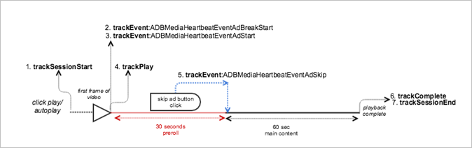

# 건너뛴 광고가 있는 VOD 재생{#vod-playback-with-skipped-ads}

## 시나리오 {#scenario}

이 시나리오는 광고를 건너뛴 VOD 콘텐츠 재생으로 구성됩니다.

### 프리롤 광고를 건너뛴 한 개의 VOD

이 시나리오는 애플리케이션에서 사용자가 건너뛰기 버튼을 클릭하면 광고를 건너뛸 수 있는 기능을 제공한다는 점을 제외하고, [프리롤 광고가 있는 VOD 재생](/help/use-cases/tracking-scenarios/vod-preroll-ads.md) 시나리오와 동일합니다.

| 트리거   | 하트비트 메서드  | 네트워크 호출   | 참고   |
| --- | --- | --- | --- |
| 사용자가 [!UICONTROL 재생] 클릭 | `trackSessionStart()` | Analytics 콘텐츠 시작, 하트비트 콘텐츠 시작 | 측정 라이브러리는 프리롤 광고가 있다는 것을 인식하지 못합니다. 이러한 네트워크 호출은 [광고 없이 VOD 재생](/help/use-cases/tracking-scenarios/vod-no-intrs-details.md)과 동일합니다. |
| 광고가 시작됨. | <ul> <li> `trackEvent:AdBreakStart` </li> <li> `trackEvent:AdStart` </li> </ul> | Analytics 광고 시작, 하트비트 광고 시작 | |
| 광고의 첫 프레임이 재생됩니다. | `trackPlay()` | 하트비트 광고 재생 | 광고 콘텐츠가 주 콘텐츠 전에 재생되면 광고 재생이 시작될 때 하트비트가 시작됩니다. |
| 광고가 재생됩니다. | | 광고 하트비트 | |
| 광고를 건너뜀. | `trackEvent:trackAdSkip` | | 광고 완료 네트워크 호출이 없습니다. |
| 콘텐츠가 재생됩니다. | | 콘텐츠 하트비트 | 이러한 네트워크 호출은 [광고 없이 VOD 재생](/help/use-cases/tracking-scenarios/vod-no-intrs-details.md) 시나리오와 동일합니다. |
| 콘텐츠 재생이 완료됨. | `trackComplete()` | 하트비트 콘텐츠 완료 | 이 네트워크 호출은 [광고 없이 VOD 재생](/help/use-cases/tracking-scenarios/vod-no-intrs-details.md) 시나리오와 동일합니다. |
| 세션이 끝남. | `trackSessionEnd()` | | `SessionEnd` |

## 매개 변수 {#parameters}

매개 변수는 광고 완료가 없고 광고 브레이크 완료 호출이 없다는 점을 제외하고는 [프리롤 광고가 있는 VOD 재생](/help/use-cases/tracking-scenarios/vod-preroll-ads.md) 시나리오의 매개 변수와 동일합니다.

## 샘플 코드 {#sample-code}



### Android

Android에서 이 시나리오를 보려면 다음 코드를 설정합니다.

```java
// Set up mediaObject 
MediaObject mediaInfo = MediaHeartbeat.createMediaObject( 
  Configuration.MEDIA_NAME,  
  Configuration.MEDIA_ID,  
  Configuration.MEDIA_LENGTH,  
  MediaHeartbeat.StreamType.VOD 
); 

HashMap<String, String> mediaMetadata = new HashMap<String, String>(); 
mediaMetadata.put(CUSTOM_KEY_1, CUSTOM_VAL_1); 
mediaMetadata.put(CUSTOM_KEY_2, CUSTOM_VAL_2); 

// 1. Call trackSessionStart() when the user clicks Play or if autoplay is used,  
//    i.e., there is an intent to start playback.  
_mediaHeartbeat.trackSessionStart(mediaInfo, mediaMetadata); 

...... 
...... 

// Pre-roll 
MediaObject adBreakInfo =  
MediaHeartbeat.createAdBreakObject(ADBREAK_NAME,  
                                   ADBREAK_POSITION,  
                                   ADBREAK_START_TIME); 
MediaObject adInfo =  
MediaHeartbeat.createAdObject(AD_NAME,  
                              AD_ID,  
                              AD_POSITION,  
                              AD_LENGTH); 

// Context ad data 
HashMap<String, String> adMetadata = new HashMap<String, String>(); 
adMetadata.put(CUSTOM_KEY_1, CUSTOM_VAL_1); 
adMetadata.put(CUSTOM_KEY_2, CUSTOM_VAL_2); 

// 2. Track the MediaHeartbeat.Event.AdBreakStart event when the pre-roll pod starts to play.  
//    Note that since this is a pre-roll, track the "MediaHeartbeat.Event.AdBreakStart"  
//    event before you call trackPlay().  
_mediaHeartbeat.trackEvent(MediaHeartbeat.Event.AdBreakStart, adBreakInfo, null); 

....... 
....... 

// 3. Track the MediaHeartbeat.Event.AdStart event when the pre-roll pod's ad starts to play.  
//    Note that since this is a pre-roll, track the "MediaHeartbeat.Event.AdStart" event  
//    before you call trackPlay().  
_mediaHeartbeat.trackEvent(MediaHeartbeat.Event.AdStart, adInfo, adMetadata); 

....... 
....... 

// 4. Call trackPlay() when the playback actually starts, i.e. when the first frame of the  
//    main content is rendered on the screen.  
_mediaHeartbeat.trackPlay(); 

....... 
....... 

// 5. Track the MediaHeartbeat.Event.AdSkip event when the user intends to and is able to 
//    skip an ad.  For example, this could be tied to a "Skip Ad" button onClick handler.  
//    The application could have the viewer land in main content post ad.  
_mediaHeartbeat.trackEvent(MediaHeartbeat.Event.AdSkip, null, null); 

....... 
....... 

// 6. Call trackComplete() when the playback reaches the end, i.e., when the media  
//    completes and finishes playing.  
_mediaHeartbeat.trackComplete(); 

........ 
........ 

// 7. Call trackSessionEnd() when the playback session is over. This method must be called  
//    even if the user does not watch the media to completion.  
_mediaHeartbeat.trackSessionEnd(); 

........ 
........ 
```

### iOS

이 시나리오를 보려면 다음 텍스트를 입력하십시오.

```
when the user clicks Play 
ADBMediaObject *mediaObject =  
[ADBMediaHeartbeat createMediaObjectWithName:MEDIA_NAME  
                   length:MEDIA_LENGTH  
                   streamType:ADBMediaHeartbeatStreamTypeVOD]; 
  
NSMutableDictionary *mediaContextData = [[NSMutableDictionary alloc] init]; 
[mediaContextData setObject:CUSTOM_VAL_1 forKey:CUSTOM_KEY_1]; 
[mediaContextData setObject:CUSTOM_VAL_2 forKey:CUSTOM_KEY_2]; 
 
// 1. Call trackSessionStart when the user clicks Play or if autoplay is used,  
//    i.e., there is an intent to start playback. 
[_mediaHeartbeat trackSessionStart:mediaObject data:mediaContextData]; 
....... 
....... 

// Pre-roll 
ADBMediaObject *adBreakInfo =  
[ADBMediaHeartbeat createAdBreakObjectWithName:AD_BREAK_NAME  
                   position:AD_BREAK_POSITION  
                   startTime:AD_BREAK_START_TIME]; 
ADBMediaObject *adInfo =  
[ADBMediaHeartbeat createAdObjectWithName:AD_NAME  
                   adId:AD_ID  
                   position:AD_POSITION  
                   length:AD_LENGTH]; 

// Context ad data 
NSMutableDictionary *adDictionary = [[NSMutableDictionary alloc] init]; 
[adDictionary setObject:@"custom-val1" forKey:@"custom-key1"]; 
[adDictionary setObject:@"custom-val2" forKey:@"custom-key2"]; 

// 2. Track the ADBMediaHeartbeatEventAdBreakStart event when the pre-roll pod  
//    starts to play. Note that since this is a pre-roll, you must track the  
//    ADBMediaHeartbeatEventAdBreakStart event before you call trackPlay. 
[_mediaHeartbeat trackEvent:ADBMediaHeartbeatEventAdBreakStart  
               mediaObject:adBreakObject  
               data:nil]; 
....... 
....... 

// 3. Track the ADBMediaHeartbeatEventAdStart event when the pre-roll pod's ad  
//    starts to play. Note that since this is a pre-roll, track the  
//    ADBMediaHeartbeatEventAdStart event before you call trackPlay. 
[_mediaHeartbeat trackEvent:ADBMediaHeartbeatEventAdStart  
               mediaObject:adObject  
               data:adDictionary]; 
....... 
....... 

// 4. Call trackPlay when the playback actually starts, i.e., when the first  
//    frame of the main content is rendered on the screen. 
[_mediaHeartbeat trackPlay]; 
....... 
....... 

// 5. Track the ADBMediaHeartbeatEventAdSkip event when the user intends to  
//    and is able to skip an ad. For example, this could be tied to a  
//    "skip ad" button onClick handler. The application could have the viewer  
//    land in main content post ad. 
[_mediaHeartbeat trackEvent:ADBMediaHeartbeatEventAdSkip mediaObject:nil data:nil]; 
....... 
....... 

// 6. Call trackComplete when the playback reaches the end, i.e., when the media 
//    completes and finishes playing. 
[_mediaHeartbeat trackComplete]; 
....... 
....... 

// 7. Call trackSessionEnd when the playback session is over. This method must  
//    be called even if the user does not watch the media to completion. 
[_mediaHeartbeat trackSessionEnd]; 
....... 
....... 
```

### JavaScript

JavaScript에서 이 시나리오를 보려면 다음 텍스트를 입력하십시오.

```js
// Set up mediaObject 
var mediaInfo =  
MediaHeartbeat.createMediaObject(Configuration.MEDIA_NAME,  
                                 Configuration.MEDIA_ID,  
                                 Configuration.MEDIA_LENGTH,  
                                 MediaHeartbeat.StreamType.VOD); 

var mediaMetadata = { 
  CUSTOM_KEY_1 : CUSTOM_VAL_1,  
  CUSTOM_KEY_2 : CUSTOM_VAL_2,  
  CUSTOM_KEY_3 : CUSTOM_VAL_3 
}; 

// 1. Call trackSessionStart() when Play is clicked or if autoplay is used,  
//    i.e., there's an intent to start playback. 
this._mediaHeartbeat.trackSessionStart(mediaInfo, mediaMetadata); 

...... 
...... 

// Preroll 
var adBreakInfo =  
MediaHeartbeat.createAdBreakObject(ADBREAK_NAME,  
                                   ADBREAK_POSITION,  
                                   ADBREAK_START_TIME); 
MediaObject adInfo =  
MediaHeartbeat.createAdObject(AD_NAME,  
                              AD_ID,  
                              AD_POSITION,  
                              AD_LENGTH); 

//context ad data 
var adMetadata = { 
  CUSTOM_KEY_1 : CUSTOM_VAL_1,  
  CUSTOM_KEY_2 : CUSTOM_VAL_2 
}; 

// 2. Track the MediaHeartbeat.Event.AdBreakStart event when the preroll pod starts to play.  
//    Since this is a preroll, you must track the MediaHeartbeat.Event.AdBreakStart event  
//    before calling trackPlay(). 
this._mediaHeartbeat.trackEvent(MediaHeartbeat.Event.AdBreakStart, adBreakInfo); 

....... 
....... 

// 3. Track the MediaHeartbeat.Event.AdStart event when the preroll pod's ad starts to play.  
//    Since this is a preroll, you must track the MediaHeartbeat.Event.AdStart event before  
//    calling trackPlay(). 
this._mediaHeartbeat.trackEvent(MediaHeartbeat.Event.AdStart, adInfo, adMetadata); 

....... 
....... 

// 4. Call trackPlay() when the playback actually starts, i.e., when the first frame of  
//    the main content is rendered on the screen. 
this._mediaHeartbeat.trackPlay(); 

....... 
....... 

// 5. Track the MediaHeartbeat.Event.AdSkip event when the user intends to (and can)   
//    skip the ad. For example, this could be tied to a "skip ad" button onClick handler.  
//    The application could have the viewer land in the main content post ad. 
this._mediaHeartbeat.trackEvent(MediaHeartbeat.Event.AdSkip); 

....... 
....... 

// 6. Call trackComplete() when the playback reaches the end, i.e., playback completes  
//    and finishes playing. 
this._mediaHeartbeat.trackComplete(); 

........ 
........ 

// 7. Call trackSessionEnd() when the playback session is over. This method must be called even  
//    if the user does not watch the media to completion. 
this._mediaHeartbeat.trackSessionEnd(); 

........ 
........ 
```
