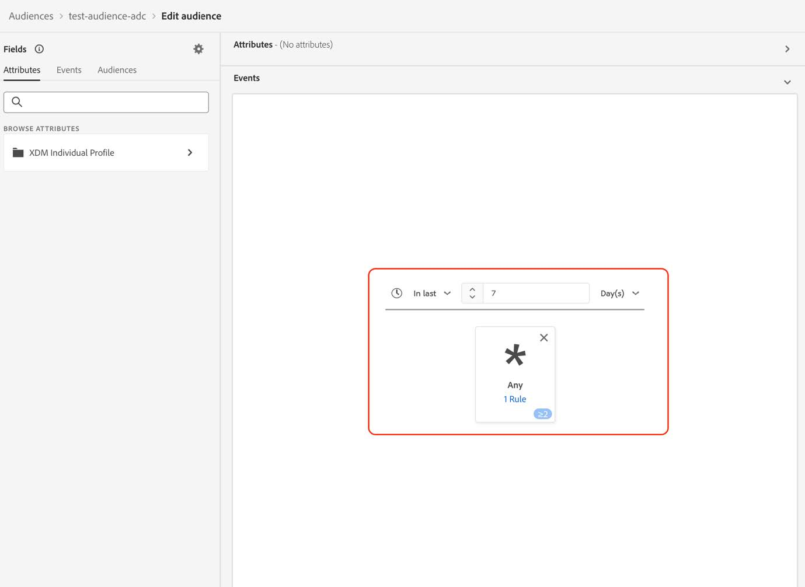
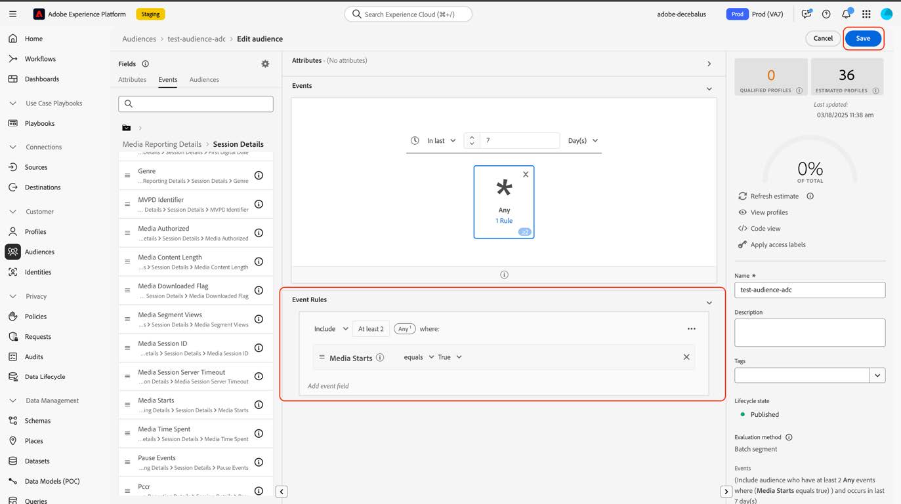

# 대상을 새 스트리밍 미디어 필드로 마이그레이션

이 문서에서는 &quot;Media&quot;라는 Adobe 스트리밍 미디어 컬렉션 데이터 유형의 필드를 사용하는 대상자가 &quot;[미디어 보고 세부 정보](https://experienceleague.adobe.com/en/docs/experience-platform/xdm/data-types/media-reporting-details)&quot;라는 새로운 해당 데이터 유형을 사용하도록 마이그레이션하는 방법에 대해 설명합니다.

## 대상자 마이그레이션

대상을 이전 데이터 형식인 &quot;Media&quot;에서 새 데이터 형식인 &quot;[미디어 보고 세부 정보](https://experienceleague.adobe.com/en/docs/experience-platform/xdm/data-types/media-reporting-details)&quot;(으)로 마이그레이션하려면 대상을 편집해야 하며, 각 규칙에서 더 이상 사용되지 않는 데이터 형식의 이전 필드를 새 데이터 형식의 새 해당 필드로 바꾸어야 합니다.

1. 더 이상 사용되지 않는 &quot;미디어&quot; 데이터 유형에서 필드가 포함된 규칙을 찾습니다. `media.mediaTimed` 경로로 시작하는 모든 필드입니다.

1. 새 &quot;[미디어 보고 세부 정보](https://experienceleague.adobe.com/en/docs/experience-platform/xdm/data-types/media-reporting-details)&quot; 데이터 형식의 필드를 사용하여 이러한 규칙을 복제합니다.

1. 대상자가 예상대로 작동하는지 확인할 때까지 두 규칙을 적절히 유지합니다.

1. 더 이상 사용되지 않는 &quot;미디어&quot; 데이터 유형에서 필드가 포함된 규칙을 제거합니다.

1. 대상이 여전히 예상대로 작동하는지 확인합니다.

이전 필드와 새 필드 간에 매핑하려면 [오디오 및 비디오 매개 변수](https://experienceleague.adobe.com/en/docs/media-analytics/using/implementation/variables/audio-video-parameters#content-id) 페이지에서 [콘텐츠 ID](https://experienceleague.adobe.com/ko/docs/media-analytics/using/implementation/variables/audio-video-parameters) 매개 변수를 참조하십시오. 이전 필드 경로는 &quot;XDM 필드 패스&quot; 속성에서 찾을 수 있고 새 필드 경로는 &quot;보고 XDM 필드 패스&quot; 속성에서 찾을 수 있습니다.

## 예

마이그레이션 지침을 더 쉽게 따르려면 단일 규칙이 있는 대상을 포함하는 다음 예를 고려하십시오. 대상에는 단일 규칙이 있으므로 마이그레이션 지침을 한 번만 적용해야 합니다.

1. 오른쪽 상단에서 [!UICONTROL **대상자 편집**] 단추를 선택합니다.

1. 대상에 대해 구성된 규칙을 찾습니다.

   

   

1. 규칙을 선택하여 구성을 엽니다.

   

1. (선택 사항) 규칙에 사용된 필드의 경로를 보려면 필드 이름 근처에 있는 정보 버튼을 선택합니다.

   

1. 필드 이름을 식별합니다(이 경우 &quot;미디어 시작&quot;).

   

1. 이전 필드 간에 매핑하려면 [오디오 및 비디오 매개 변수](https://experienceleague.adobe.com/ko/docs/media-analytics/using/implementation/variables/audio-video-parameters) 페이지를 참조하세요. 이전 필드 경로는 &quot;XDM 필드 패스&quot; 속성에서 찾을 수 있고 새 필드 경로는 &quot;보고 XDM 필드 패스&quot; 속성에서 찾을 수 있습니다. 예를 들어 [Media Starts](https://experienceleague.adobe.com/en/docs/media-analytics/using/implementation/variables/audio-video-parameters#media-starts) 매개 변수의 경우 `media.mediaTimed.impressions.value`에 대한 대응 항목은 `mediaReporting.sessionDetails.isViewed`입니다.

   

1. 새 필드를 사용하여 기존 규칙과 동일한 규칙을 추가합니다.

   

   

   

1. 대상자를 저장하려면 [!UICONTROL **저장**]&#x200B;을 선택하십시오. 대상자가 여전히 예상대로 작동하는지 확인해야 하는 동안 이 설정을 유지할 수 있습니다.

1. 유효성 검사가 완료되면 이전 필드를 제거한 다음 [!UICONTROL **저장**]&#x200B;을 선택하여 대상자를 저장합니다.

   

1. 대상자의 유효성을 다시 검사합니다.

   대상자 마이그레이션 프로세스가 완료되었습니다.
