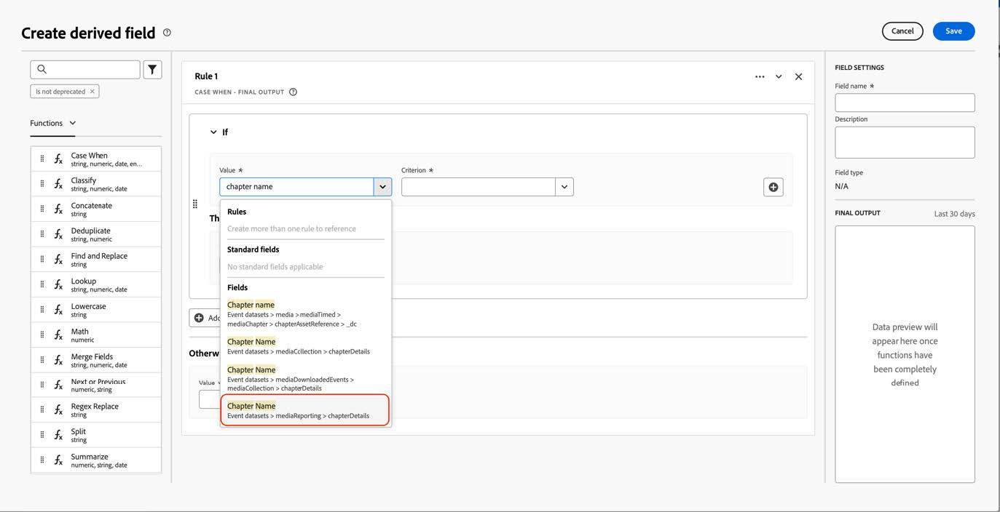
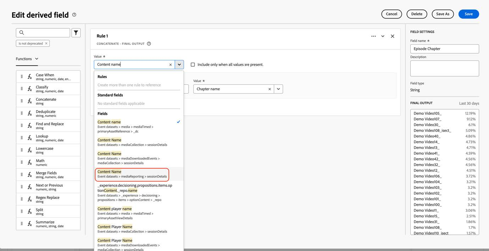

# 새 스트리밍 미디어 필드를 사용하도록 Customer Journey Analytics 마이그레이션

이 문서에서는 &quot;Media&quot;라는 Adobe 스트리밍 미디어 서비스 데이터 유형을 사용하는 Customer Journey Analytics 설치를 업데이트하여 &quot;[미디어 보고 세부 정보](https://experienceleague.adobe.com/en/docs/experience-platform/xdm/data-types/media-reporting-details)&quot;이라는 새로운 해당 데이터 유형을 사용해야 하는 방법에 대해 설명합니다.

## Customer Journey Analytics 마이그레이션

Customer Journey Analytics 설정을 이전 데이터 형식인 &quot;Media&quot;에서 새 데이터 형식인 &quot;[미디어 보고 세부 정보](https://experienceleague.adobe.com/en/docs/experience-platform/xdm/data-types/media-reporting-details)&quot;(으)로 마이그레이션하려면 이전 데이터 형식을 사용하는 다음 설정을 업데이트해야 합니다.

* 데이터 보기

* 파생 필드

### 데이터 보기 마이그레이션

데이터 보기를 새 데이터 유형으로 마이그레이션하려면 다음을 수행합니다.

1. 더 이상 사용되지 않는 &quot;미디어&quot; 데이터 유형을 사용하여 모든 데이터 보기를 찾습니다. 경로가 `media.mediaTimed`(으)로 시작되는 모든 필드입니다.

1. 다음 중 하나를 수행합니다.

   * 이러한 데이터 보기에서 새 &quot;미디어 보고 세부 정보&quot; 데이터 유형의 필드를 삽입합니다.

   * 설정된 경우 새 &quot;미디어 보고 세부 정보&quot; 데이터 유형을 사용하고, &quot;미디어 보고 세부 정보&quot; 데이터 유형이 설정되지 않은 경우 이전 &quot;미디어&quot; 데이터 유형으로 축소되는 파생 필드를 만듭니다.

### 파생 필드 마이그레이션

파생 필드를 새 데이터 유형으로 마이그레이션하려면:

1. 더 이상 사용되지 않는 &quot;미디어&quot; 데이터 유형을 사용하여 파생된 모든 필드를 찾습니다. 경로가 `media.mediaTimed`(으)로 시작하는 필드를 포함하는 모든 파생 필드입니다.

1. 파생된 필드의 모든 이전 필드를 &quot;미디어 보고 세부 정보&quot;의 새 해당 필드로 바꿉니다.

이전 필드와 새 필드 간에 매핑하려면 [오디오 및 비디오 매개 변수](https://experienceleague.adobe.com/en/docs/media-analytics/using/implementation/variables/audio-video-parameters#content-id) 페이지에서 [콘텐츠 ID](https://experienceleague.adobe.com/ko/docs/media-analytics/using/implementation/variables/audio-video-parameters) 매개 변수를 참조하십시오. 이전 필드 경로는 &quot;XDM 필드 패스&quot; 속성에서 찾을 수 있고 새 필드 경로는 &quot;보고 XDM 필드 패스&quot; 속성에서 찾을 수 있습니다.

## 예

마이그레이션 지침을 더 쉽게 따르려면, 더 이상 사용되지 않는 이전 &quot;미디어&quot; 데이터 유형의 필드가 있는 데이터 보기를 포함하는 다음 예를 고려하십시오. 이 데이터 보기에서 새 해당 필드를 추가해야 합니다.

### 데이터 보기 업데이트

다음 옵션 중 하나를 사용하여 데이터 보기를 업데이트할 수 있습니다.

#### 옵션 1

1. 더 이상 사용되지 않는 데이터 유형에서 이전 필드를 사용하는 지표 또는 차원을 찾습니다.

   데이터 보기의 

1. [챕터 매개 변수](https://experienceleague.adobe.com/en/docs/media-analytics/using/implementation/variables/chapter-parameters#chapter-offset) 문서의 [챕터 오프셋](https://experienceleague.adobe.com/ko/docs/media-analytics/using/implementation/variables/chapter-parameters) 섹션에서 해당 새 필드를 확인하십시오.

1. 데이터 보기에서 새 해당 필드를 찾습니다.

   

1. 새 필드를 지표 또는 차원으로 드래그합니다.

1. 더 이상 사용되지 않는 &quot;미디어&quot; 데이터 유형의 필드를 사용하는 모든 지표 및 차원에 대해 이 프로세스를 반복합니다.

#### 옵션 2

이 옵션은 특정 이벤트에 대한 값이 존재하는 기준으로 이전 필드의 값 또는 새 필드의 값을 선택하는 파생 필드를 만듭니다. 이 파생된 필드는 사용 중인 모든 프로젝트의 이전 &quot;미디어&quot; 데이터 유형을 대체합니다.

설정된 경우 새 &quot;미디어 보고 세부 정보&quot; 데이터 유형을 사용하거나, &quot;미디어 보고 세부 정보&quot; 데이터 유형이 설정되지 않은 경우 이전 &quot;미디어&quot; 데이터 유형으로 대체되는 &quot;챕터 이름&quot;에 대해 파생된 필드를 만들려면:

1. &quot;Case When&quot; 절을 파생된 필드로 드래그합니다.

   

1. [!UICONTROL **챕터 매개 변수**] 페이지의 **챕터 이름** 매개 변수에 표시된 대로 [보고 XDM 필드 경로](https://experienceleague.adobe.com/en/docs/media-analytics/using/implementation/variables/chapter-parameters#chapter-name)의 값을 사용하여 [If](https://experienceleague.adobe.com/ko/docs/media-analytics/using/implementation/variables/chapter-parameters) 절을 채웁니다.

   

   

   

   

1. 더 이상 사용되지 않는 &quot;미디어&quot; 데이터 유형의 이전 필드를 사용하여 대체 값을 채웁니다.

   

   

   파생된 필드에 대한 최종 정의입니다.

   

1. 파생된 필드를 업데이트하려면 더 이상 사용되지 않는 이전 필드(`media.mediaTimed`(으)로 시작하는 경로)를 사용하는 파생된 필드를 찾으십시오.

   

1. 업데이트할 파생 필드 위로 마우스를 가져간 다음 [!UICONTROL **편집**] 아이콘을 선택합니다.

1. 이전 데이터 형식(`media.mediaTimed`(으)로 시작하는 경로)에서 모든 필드를 찾아 새 해당 필드로 바꿉니다.

   

1. [스트리밍 미디어 매개 변수](https://experienceleague.adobe.com/en/docs/media-analytics/using/implementation/variables/audio-video-parameters#content-name-variable) 문서의 [콘텐츠 이름(변수)](https://experienceleague.adobe.com/en/docs/media-analytics/using/implementation/variables/audio-video-parameters#content-name-variable) 섹션에서 해당 새 필드를 확인하십시오.

1. 이전 필드를 새 필드로 바꿉니다.

   

1. 더 이상 사용되지 않는 이전 &quot;미디어&quot; 데이터 유형의 필드를 사용하여 파생된 모든 필드에 대해 이 프로세스를 반복합니다.

   CJA 설치 마이그레이션이 완료되었습니다.
