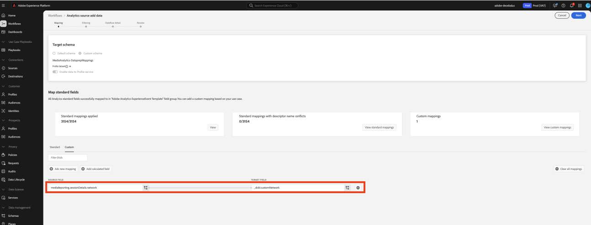

# 사용자 정의 필드에 대한 데이터 준비를 새 스트리밍 미디어 필드로 마이그레이션

이 문서에서는 Adobe 스트리밍 미디어 컬렉션 데이터에 대해 활성화된 Adobe 데이터 컬렉션 흐름 위에 존재하는 데이터 준비 서비스를 마이그레이션하는 프로세스에 대해 설명합니다. 마이그레이션은 &quot;Media&quot;라는 Adobe 스트리밍 미디어 컬렉션 데이터 형식에서 데이터 준비 매핑을 &quot;[미디어 보고 세부 정보](https://experienceleague.adobe.com/en/docs/experience-platform/xdm/data-types/media-reporting-details)&quot;이라는 새로운 해당 데이터 형식을 사용하도록 전환합니다.

## 사용자 정의 필드에 대한 데이터 준비 마이그레이션

데이터 준비 매핑을 이전 데이터 형식인 &quot;Media&quot;에서 새 데이터 형식인 &quot;[미디어 보고 세부 정보](https://experienceleague.adobe.com/en/docs/experience-platform/xdm/data-types/media-reporting-details)&quot;(으)로 마이그레이션하려면 데이터 준비 매핑을 편집해야 합니다.

>[!IMPORTANT]
>
>데이터 손실을 방지하려면 이 섹션의 단계를 완료하기 전에 새 `mediaReporting` 필드를 사용하여 Analytics 소스 커넥터가 배포되었는지 확인하십시오.

1. Adobe Experience Platform의 [!UICONTROL **소스**] 섹션 아래에서 [!UICONTROL **데이터 흐름**] 탭으로 이동합니다.

1. Adobe 데이터 수집을 통해 Adobe Analytics에서 Adobe Experience Platform으로 스트리밍 미디어 데이터를 가져오는 역할을 하는 데이터 흐름을 찾습니다.

1. 더 이상 사용되지 않는 필드가 포함된 모든 사용자 지정 소스 매핑을 새 XDM 개체의 새 해당 필드로 대체하여 데이터 준비 설정을 수정하려면 [!UICONTROL **데이터 흐름 업데이트**]&#x200B;를 선택하십시오.

1. 더 이상 사용되지 않는 &quot;미디어&quot; 개체에서 소스 필드가 포함된 매핑을 찾습니다.

1. 새 &quot;미디어 보고 세부 정보&quot; 오브젝트의 필드를 사용하여 이러한 소스를 바꿉니다.

1. 매핑이 여전히 예상대로 작동하는지 확인합니다.

이전 필드와 새 필드 간에 매핑하려면 [오디오 및 비디오 매개 변수](https://experienceleague.adobe.com/en/docs/media-analytics/using/implementation/variables/audio-video-parameters#content-id) 페이지에서 [콘텐츠 ID](https://experienceleague.adobe.com/ko/docs/media-analytics/using/implementation/variables/audio-video-parameters) 매개 변수를 참조하십시오. 이전 필드 경로는 &quot;XDM 필드 패스&quot; 속성에서 찾을 수 있고 새 필드 경로는 &quot;보고 XDM 필드 패스&quot; 속성에서 찾을 수 있습니다.

## 예

마이그레이션 지침을 더 쉽게 따르려면 단일 매핑이 포함된 다음 예제 데이터 흐름을 고려하십시오. 이 경우 마이그레이션 지침을 한 번만 적용해야 합니다.

1. Adobe Experience Platform의 [!UICONTROL **소스**] 섹션 아래에서 [!UICONTROL **데이터 흐름**] 탭으로 이동합니다.

1. Adobe 데이터 수집을 통해 Adobe Analytics에서 Adobe Experience Platform으로 스트리밍 미디어 데이터를 가져오는 역할을 하는 데이터 흐름을 찾습니다.

1. 아래 이미지에 표시된 대로 편집 UI를 입력하려면 **[!UICONTROL 데이터 흐름 업데이트]**&#x200B;를 선택하십시오.

   

1. **[!UICONTROL 매핑]** 탭에서 **[!UICONTROL 사용자 지정]**&#x200B;을(를) 선택합니다.

1. `media.mediaTimed` 필드를 소스로 사용하는 사용자 지정 매핑을 식별합니다.

   

   이 예제에서는 개발 조직의 스키마에 사용자 지정 필드 그룹을 만들었으므로 대상 필드는 `_dcbl` 아래에 있습니다. 사용자 정의 필드 그룹 경로는 조직 이름에 따라 다릅니다.

1. `media.mediaTimed` 개체를 사용하는 각 매핑의 경우 이 설명서를 사용하여 `mediaReporting` 개체에서 해당 상대 개체를 찾으십시오.

   예를 들어 Network의 경우 `media.mediaTimed.primaryAssetViewDetails`.broadcastNetwork의 통신원은 `mediaReporting.sessionDetails.network`입니다.

   

1. **[!UICONTROL Source 필드]** 필드에서 `media.mediaTimed` 경로를 `mediaReporting` 경로로 바꿉니다. 대상 필드는 변경되지 않습니다.

   

1. **[!UICONTROL 다음]**&#x200B;을(를) 선택하여 변경 내용을 저장합니다.

   상태가 **[!UICONTROL 처리 중]**(으)로 표시됩니다. 변경 사항이 적용되면 상태가 **[!UICONTROL 활성화됨]**(으)로 표시됩니다.

   

## 다른 데이터 유형을 사용하는 예

위의 예에서 관련된 모든 데이터 유형은 문자열이므로 매핑은 직접 대체되었습니다.

원본 필드 데이터 형식이 대상 필드 데이터 형식과 다른 경우 [데이터 준비 문제 해결 안내서](https://experienceleague.adobe.com/en/docs/experience-platform/data-prep/troubleshooting-guide), [데이터 준비로 데이터 형식 처리](https://experienceleague.adobe.com/en/docs/experience-platform/data-prep/data-handling) 및 [데이터 준비 매핑 기능](https://experienceleague.adobe.com/en/docs/experience-platform/data-prep/data-handling)의 지침을 따라야 합니다.

예를 들어 소스 유형이 문자열이고 대상 유형이 부울이면 데이터 준비는 값을 자동으로 구문 분석하고 소스 값을 부울로 변환할 수 있습니다.

소스 유형이 숫자이고 대상 유형이 부울인 경우 데이터 조작 함수를 사용해야 합니다.

사용자 지정 필드에 `media.mediaTimed`을(를) 매핑하는 중입니다.

동일한 사용자 지정 필드에 `mediaReporting`을(를) 사용한 매핑:

